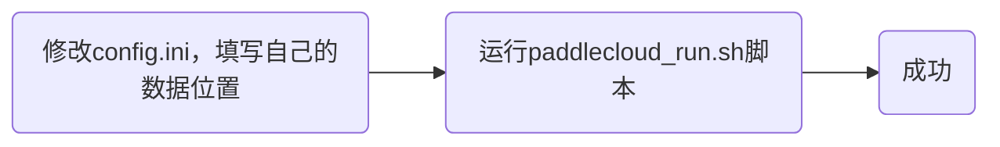

[*PaddleCloud*](http://paddlecloud.baidu-int.com/)是一个面向百度内部所有AI研发者的AI研发平台，但是PaddleCloud客户端功能更加强大与易用，因此根据最新的任务安排，我开始学习使用PaddleCloud客户端。

## 客户端介绍
PaddleCloud客户端没有可视化界面，主要在开发机上使用，通过命令行对任务进行提交、管理等操作，跟我想的不太一样。


---

## 客户端安装
通过mentor发来的压缩包链接🔗，我是用Hadoop从集群上下载下来，然后在work开发机上解压，通过ls命令，我看到了主要包含如下文件：

显然，太显然了，我们要运行`paddlecloud_run.sh`，因此我果断运行命令`./paddlecloud_run.sh`，不出意外的话就出意外了，报错了：

我开始去内网上查询，发现需要配置ak、sk、algo_id等，按照要求配置好后就能运行成功了：

OK了，家人们，客户端配置完成，接下来就要开始学习使用了！

---

## 命令介绍
- `paddlecloud job`：用于本地提交作业、kill、重跑作业、查看作业当前状态等
- `paddlecloud algo`：查看算法列表
- `paddlecloud config`：用于快速配置用户ak、sk、paddlecloud server host与port等
- `paddlecloud cluster`：用于查看当前组所关联的集群资源列表以及集群quota信息等
- `paddlecloud update`：用于客户端升级

#### config子命令介绍
```bash
$ paddlecloud config -h
usage: paddlecloud config [-h] [--ak <ARG>] [--sk <ARG>] [-t] [-s]

optional arguments:
  -h, --help    show this help message and exit
  --ak <ARG>    your access key
  --sk <ARG>    your secret key
  -t, --token   configure user's access key and secret key (deprecated, will
                be removed in next version)
  -s, --server  configure paddlecloud server host, port
```
#### job子命令介绍
job子命令主要提供作业提交、查看、重试、作业运行状态查询、kill作业等功能。具体用法如下：
```bash
$ paddlecloud job -h
usage: paddlecloud job [-h] [--debug] [--server <ARG>] [--port <ARG>]
                       [--ak <ARG>] [--sk <ARG>]
                       <action> [options] ...

optional arguments:
  -h, --help          show this help message and exit
  --debug             debug mode, this will print debug message
  --server <ARG>      specify remote server host
  --port <ARG>        specify remote server port
  --ak <ARG>          your access key
  --sk <ARG>          your secret key

Specific job actions:
  <action> [options]
    train             add a new job for training
    state             return the job state
    list              list available jobs
    rerun             run job once again
    info              display the job info
    kill              kill the running job
    delete            delete the remote job
    replace           replace job 例:${JOB_ID}  --pods "pod=job-x-trainer-1,host=host1.yq01.baidu.com;pod=job-x-trainer-2,host=host2.yq01.baidu.com"
```
- 作业提交时可以通过参数指定集群、作业类型、单机/分布式作业、最大运行时间等数十种模式
> `paddlecloud job train --job-name`

- 当需要杀死正在执行的作业时，可以一次传入多个job_id，且多个id之间用逗号连接
> `paddlecloud job kill job_id_1, job_id_2, ...`

- 我们也可以使用下面的命令查看当前的作业列表，可以查看**提交中**、**调度中**、**排队中**等是一种作业类型
> `paddlecloud job list`

- 当不再需要某个作业时，可以使用如下命令删除作业
> `paddlecloud job delete job_id_1, job_id_2`

- 当某个作业参数不变，需要再次运行时，我们可以选择重跑作业
> `paddlecloud job rerun job_id_1, job_id_2`

以上就是常用的一些指令，其余的需要时在文档中查找即可。

---

## 在客户端提交作业

大致过程就如上所示，其中很多细节不便多讲，总之有了前两天手动部署模型的折磨，我对脚本中很多参数都有了深刻的了解，在客户端实操时简单修改了几次就运行成功了。


---

## 总结
由于刚接触PaddleCloud客户端，并没有深刻体会到mentor口中所说的比网页端功能更强大，说不定等以后逐渐了解后会有所体会吧。这个任务整体来说难度不大，也许是因为我有了前期部署模型的经验，也可能是因为我自身能力有了提升。总之我还要继续加油！！