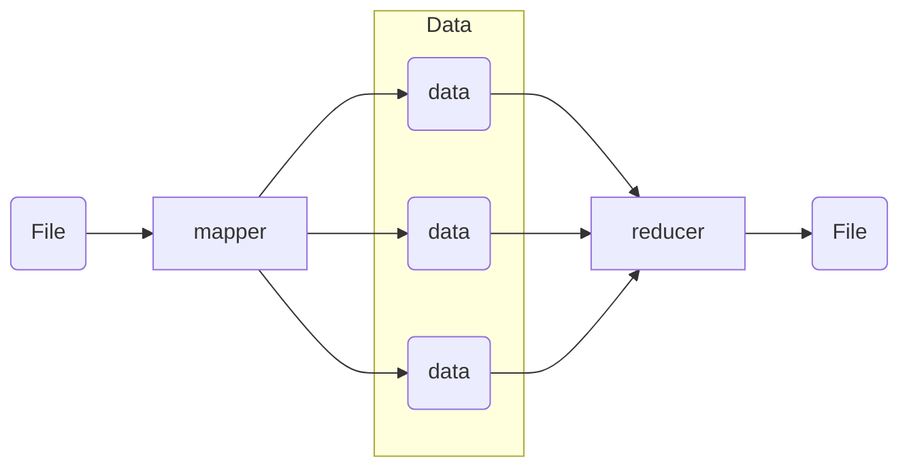

## 学习目标
- Spark 与其他工具的区别
- Spark 的使用方法

--- 

## MapReduce 的局限性
1. 仅支持Map和Reduce两种语义操作
2. 执行效率低，时间开销大
 > 时间开销大的原因：频繁与磁盘进行交互



## Spark 的基本知识
1. Spark 是基于 RDD(弹性分布式数据集) 进行运算的
2. RDD 为只读，每次处理完后需要重新保存为一个 RDD 文件
3. WordCount 示例：
 ```
val rdd1 = sc.textFile("hdfs://node01:9000/data/wc/in/")
val rdd2 = rdd1.flatMap(_.split("\t"))
val rdd3 = rdd2.map((_, 1))
val rdd4 = rdd3.reduceByKey((_+_))
rdd4.saveAsTextFile("hdfs://node01:9000/data/wc/out/")
```
4. RDD 依赖
- 窄依赖：父RDD 中的分区最多只能被一个子 RDD 的一个分区使用；子 RDD 如果有部分分区数据丢失或损坏，只需要从对应的父 RDD 重新计算恢复
- 宽依赖：子 RDD 分区依赖父 RDD 的多个分区；子 RDD 如果部分或全部分区数据丢失或损坏，必须从对应父 RDD 分区重新计算

## Spark 用法学习
> [!NOTE]
在开发机上创建虚拟环境，安装 pyspark 进行学习

1. 读取文件存储为 RDD：`textFile = spark.read.text("file:///home/work/jingyasen/data/train.json")`
2. 对 RDD 进行行数统计：'textFile.count()'
3. 输出 RDD 的第一行：`textFile.first()`

4. Application：Spark 的应用程序，包含一个 Driver program 和若干 Executor
5. SparkContext：Spark 应用程序的入口，负责调度各个运算资源，协调各个 Worker Node 上的 Executor
6. Driver：运行 Application 的 main()  函数并创建 SparkContext
7. Worker：集群中任何可以运行 Application 代码的节点，运行一个或多个 Executor 进程
8. Client：用户提交作业的客户端
9. Executor：是为 Application 运行在 Worker Node 上的一个进程，该进程负责运行 Task，并且负责将数据存在内存或磁盘上，每个 Application 都会申请各自的 Executor 来处理任务
10. Task：运行在 Executor 上的工作单元
11. Job：SparkContext 提交的具体 Action 操作

## Spark实现wordcount
```python
# wordcount.py
from pyspark import SparkConf, SparkContext
conf = SparkConf().setAppName("wordcount").setMaster("local[2]")
sc = SparkContext(conf=conf)
sc.setLogLevel("ERROR")
inputdata = sc.textFile("file:///Users/path/word.txt")
output = inputdata.flatMap(lambda x: x.split(" ")) \
                  .map(lambda x: (x, 1)) \
                  .reduceByKey(lambda a, b: a + b) \
                  .sortBy(lambda x:x[1], ascending=False)

result = output.collect()
for i in result:
    print(i)

sc.stop()
```

## 任务提交
编写好代码后该如何提交呢，提交语法如下（使用 pyspark）：
```python
pyspark\ 
--master yarn\ # 用于指定 Spark 任务的运行模式以及资源管理器
--conf spark.files.ignoreCorruptFiles=true\ # 
--num-executors 100\ # 要启动的executor数量
--executor-memory 4g\ # 每个executor的内存大小
--executor-cores 3\ # 每个 executor 可以使用的 CPU 核心
--driver-memory 8g # driver程序的内存大小
```

<!-- ##{"timestamp":1732972659}## -->