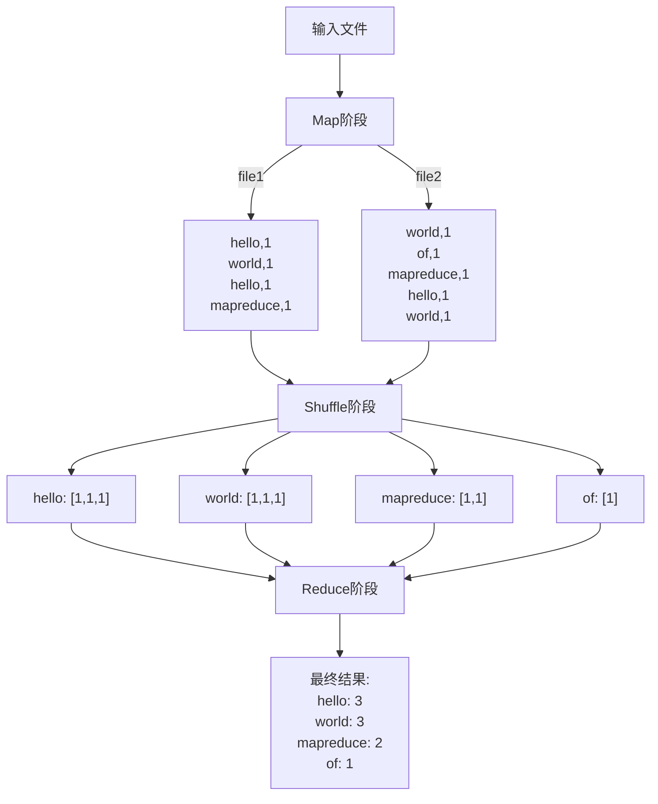

mentor指派的任务中除了知识的学习，还有一条就是**利用Hadoop Streaming写个MR统计词频**。

---

## MR的基础知识
MR(MapReduce)的执行过程包括四个主要步骤：**分割数据**、**Map阶段**、**Shuffle阶段**和**Reduce阶段**。
1. **数据分割(Splitting)**：在MR开始之前，输入数据需要被分割成多个小数据块。这些数据块被分配到各个节点并行处理，每个数据块通常对应一个Mapper任务。
3. **Map阶段**：Map阶段时MapReduce的第一步，主要任务包括：
- 读取输入数据，将每一行或每一个元素作为Map函数的输入
- 将输入数据拆分成键值对(key, value)的形式
- 将生成的键值对输出，作为Reduce阶段的输入
> 举个栗子：假设收入的数据时一篇文章，Map阶段会将每个单词提取出来，并将每个单词的出现次数初始化为1，如：
输入文本为：`hello world hello` 
Map输出为：`(hello, 1), (world, 1), (hello, 1)` 
4. **Shuffle阶段**：在Map和Reduce之间，作用是将所有相同的键分组，方便后续的Reduce操作。这一步骤为MR的核心，用来保证所有键值对都能被适当地汇总和分配。具体操作包括：
- **分区(Partition)**：对Map输出的键值对进行分区，相同的键分到同一分区
- **排序(Sort)**：对每个分区内的键值对进行排序
- **分组(Grouping)**：将相同的键的值放到一起，为每个键生成一个值的列表，作为Reduce的输入。
> 举个栗子：假设Map阶段的输出为`(hello, 1), (world, 1), (hello, 1)`，则Shuffle阶段的输出为`(hello, [1, 1]), (world, [1])`。
5. **Reduce**阶段：Reduce阶段接受来自Shuffle的键值对，按键进行聚合操作，输出最终结果。Reduce阶段的主要任务是将相同键的值进行计算、统计、求和等操作，生成最终输出。
> 举个栗子：假设Shuffle输出为`(hello, [1, 1]), (world, [1])`，则Reduce输出为`(hello, 2), (world, 1)`。

## 使用MR实现wordcount
1. **输入数据**
假设有两个文件：
file1.txt
```plaintext
Hello World
Hello MapReduce
```
file2.txt
```plaintext
World of MapReduce
Hello World
```
2. **Map阶段**：将每一行分割为单词，并输出对应的键值对
- 对于file1.txt：
```python
[
    ("hello", 1),
    ("world", 1),
    ("hello", 1),
    ("mapreduce", 1)
]
```
- 对于file2.txt
```python
[
    ("world", 1),
    ("of", 1),
    ("mapreduce", 1),
    ("hello", 1),
    ("world", 1)
]
```

3. **Shuffle阶段**：对相同的键进行分组，将Map输出的相同单词聚合到一起
```python
{
    "hello": [1, 1, 1],      # 来自两个文件的"hello"
    "world": [1, 1, 1],      # 来自两个文件的"world"
    "mapreduce": [1, 1],     # 来自两个文件的"mapreduce"
    "of": [1]                # 只在file2中出现
}
```
4. **Reduce阶段**：对每个键的值进行求和
```python
[
    ("hello", 3),
    ("world", 3),
    ("mapreduce", 2),
    ("of", 1)
]
```
**更直观来看，过程如下：**

---

## WordCount的编码实现
1. **Mapper**
```python
import sys

def main():
    # 从标准输入读取每一行
    for line in sys.stdin:
        # 将行分割成单词
        words = line.strip().split()
        
        # 对每个单词输出 <word, 1>
        for word in words:
            # 清理单词，只保留字母和数字，转换为小写
            word = ''.join(c for c in word if c.isalnum()).lower()
            if word:  # 确保单词非空
                # Hadoop Streaming 期望键值对用 tab 分隔
                print(f'{word}\t1')

if __name__ == "__main__":
    main()
```
2. **Reduce**
```python
import sys

def main():
    current_word = None
    current_count = 0

    # 从标准输入读取每一行（已按键排序）
    for line in sys.stdin:
        # 解析输入的键值对
        word, count = line.strip().split('\t')
        count = int(count)
        
        # 如果是新单词，输出之前累积的计数
        if current_word and current_word != word:
            print(f'{current_word}\t{current_count}')
            current_count = 0
        
        # 更新当前单词和计数
        current_word = word
        current_count += count
    
    # 输出最后一个单词的计数
    if current_word:
        print(f'{current_word}\t{current_count}')

if __name__ == "__main__":
    main()
```

---

## Hadoop Streaming的基础知识
Hadoop Streaming是一个用于在Hadoop集群上运行MapReduce作业的工具，允许用户使用**支持标准输入输出的编程语言**编写Mapper和Reducer。
1. Hadoop Streaming的工作原理
在Hadoop Streaming中，Map和Reduce都是独立的外部程序，Hadoop将数据传递给这些程序进行处理：
- Hadoop使用标准输入将数据传递给Mapper
- Mapper输出的每一行键值对被传递到Hadoop Streaming的Shuffle阶段，按键分组并排序
- Hadoop再将这些分组的键值对传递给Reducer程序的标准输入
- 最终输出由Hadoop写入到HDFS中
2. Hadoop Streaming命令行格式
运行Hadoop Streaming作业的基本命令格式为：
```bash
hadoop jar $HADOOP_HOME/share/hadoop/tools/lib/hadoop-streaming-*.jar \
    -input /input_path \
    -output /output_path \
    -mapper /path/to/mapper_script \
    -reducer /path/to/reducer_script
```
选项解释如下：
- `-input`：指定输入数据在 HDFS 中的路径，可以是文件或目录
- `-output`：指定输出数据在 HDFS 中的路径
- `-mapper`：指定 Mapper 脚本的路径
- `-reducer`：指定 Reducer 脚本的路径
- `-file`：将 Mapper 和 Reducer 脚本放在节点上（通常需要与 -mapper 和 -reducer 一起使用）
- `-numReduceTasks`：指定 Reducer 的数量。如果设置为 0，则不使用 Reducer

---

## 任务实现
基于**Hadoop Streaming的基础知识**部分知识，在WebRelay直接运行如下命令即可得到结果：
```bash
hadoop jar $HADOOP_HOME/share/hadoop/tools/lib/hadoop-streaming-*.jar \
    -input /input_path \
    -output /output_path \
    -mapper /path/to/mapper_script \
    -reducer /path/to/reducer_script
```
最终运行结果为：
