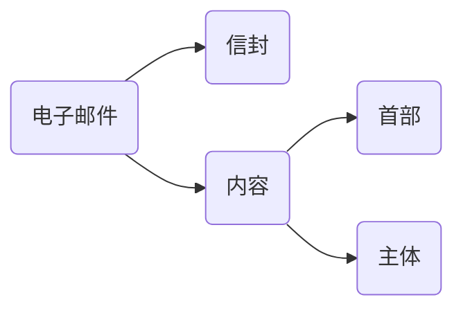

# 应用层

## 网络应用模型

### 客户/服务器模型

1. 在客户/服务器(C/S)模型中，有一个总是打开的主机称为服务器，它服务于许多来自其他称为客户机的主机请求
2. 特点：
   - 网络中各计算机地位不平等，服务器可通过对用户权限的限制来达到管理客户机的目的。整个网络的管理工作由少数服务器担当，因此网络的管理非常集中和方便
   - 客户机相互之间不直接通信
   - 可扩展性不佳，服务器支持的客户机数量有限

### P2P模型

1. P2P模型的思想：整个网络中传输内容不再被保存在中心服务器上，每个节点都同时具有下载、上传功能，其权力和义务大体对等
2. 在P2P模型中，各计算机没有固定的客户和服务器划分，相反，任意一对计算机可以直接通信
3. 特点：
   - 减轻了服务器的计算压力，消除了对某个服务器的完全依赖，可以将任务分配给各个节点，大大提高了系统效率和资源利用率
   - 多个客户机之间可以直接共享文档
   - 可扩展性好
   - 单个节点失效不会影响其他节点

## 域名系统DNS

1. 域名系统用来把便于记忆的主机名转换为便于机器处理的IP地址
2. DNS系统采用客户/服务模型，其协议运行在UDP之上，使用53号端口
3. 从概念上可将DNS分为三部分：层次域名空间、域名服务器、解析器

### 层次域名空间

1. 因特网采用层次树状结构的命名方法
2. 特点：
   - 标号中的英文不区分大小写
   - 每个标号不超过63个字符，多标号组成的完整域名最长不超过255个字符
   - 级别最低的域名写在最左边，级别最高的顶级域名写在最右边
3. 在域名系统中，各级域名由其上一级的域名管理机构管理，顶级域名由ICANN管理

### 域名服务器

1. 域名到IP地址的解析是由运行在域名服务器上的程序完成的，一个服务器所负责管辖的范围称为区，一个区中的所有节点必须能够连通，每个区设置相应的权限域名服务器，用来保存该区中的所有主机的域名到IP地址的映射
2. 每个域名服务器不但能够进行域名到IP地址的解析，还具有连向其他域名服务器的功能
3. 根域名服务器
   - 最高层次的域名服务器，所有根域名服务器都知道所有顶级域名服务器的域名和IP地址
   - 本地域名服务器解析域名时，如果自己无法解析，首先求助根域名服务器
   - 根域名服务器用于管理顶级域，通常并不直接把待查询的域名直接转为IP地址，而是告知本地域名服务器下一步应当去哪个顶级域名服务器进行查询
4. 顶级域名服务器
   - 负责管理在该顶级域名服务器中注册的所有二级域名
   - 收到DNS查询请求时，就给出相应的回答
5. 权限域名服务器
   - 每台主机都必须在权限域名服务器处登记
6. 本地域名服务器
   - 当一台主机发出DNS查询请求时，查询请求报文就发送给主机的本地域名服务器

### 域名解析过程

1. 当客户端需要域名解析时，通过本机的DNS客户端构成DNS请求报文，以UDP数据报方式发往本地域名服务器
2. 域名解析的两种方式：
   - 递归查询：若主机所询问的本地域名服务器不知道被查询域名的IP地址，则本地域名服务器就以DNS客户的身份，向根域名服务器继续发出查询请求报文，而不是让主机自己进行下一步查询
   - 迭代查询：若主机所询问的本地域名服务器不知道被查询域名的IP地址，则主机自己进行下一步查询

### 错题

1. 域名与(  )具有一一对应关系

   A. IP地址

   B. MAC地址

   C. 主机

   D. 以上都不是

2. 假设本地域名服务器只提供递归查询服务，其他域名服务器均只提供迭代查询服务。局域网内主机访问Internet上个服务器的往返时间均为10ms，忽略其他时延。若主机H通过超链接https://www.abc.com/index.html请求浏览纯文本WEB页，则从单击超链接开始到浏览器接收到index.html页面为止，所需的最短时间与最长时间分别是(  )

   A. 10ms, 40ms

   B. 10ms, 50ms

   C. 20ms, 40ms

   D. 20ms, 5

## 文件传输协议FTP

### 工作原理

1. 文件传输协议/FTP提供交互式的访问，允许客户指明文件的类型与格式，并允许文件具有存取权限
2. FTP提供的功能：
   - 提供不同种类主机系统之间的文件传输能力
   - 以用户权限管理的方式提供用户对远程FTP服务器上的文件管理能力
   - 以匿名FTP的方式提供共用文件共享的能力
3. FTP采用C/S的工作方式，使用TCP可靠的传输服务。一个FTP服务器进程可同时为多个客户进程提供服务
4. FTP的服务器进程有两大部分组成
   - 一个主进程：用于接收新的请求
   - 若干个从属进程：用于处理单个请求
5. FTP工作步骤：
   - 打开熟知端口21，使客户进程能够连接上
   - 等待客户进程发起连接
   - 启动从属进程处理客户进程发来的请求。从属进程对客户进程的请求处理完毕后就终止
   - 回到等待状态，继续接受其他客户进程的请求
6. FTP服务器必须在整个会话期间保留用户的状态信息

### 控制连接与数据连接

1. FTP在工作时使用两个并行的TCP链接，一个是控制连接(服务器端口号是21)，一个是数据连接(服务器端口号是20)。使用两个不同的端口号可以使协议更容易实现
2. 控制连接：
   - 服务器监听21号端口，等待客户连接，建立在这个端口上的连接称为控制连接，用来传输控制信息
   - FTP客户发出的传送请求通过控制连接发给服务器的控制进程，控制连接不能用来传送文件
3. 数据连接：
   - 服务器端的控制进程在接收到FTP客户发送来的文件传输请求后，就创建“数据传送进程”和“数据连接”
   - 数据连接用来连接客户端和服务器端的数据传送进程
   - 数据传送进程实际完成文件的传送，在传送完毕后关闭连接
   - 数据连接有两种传输模式：
     - 主动模式PORT：服务器20端口连接客户端端口
     - 被动模式PASV：客户端连接服务器随机端口

### 错题

1. FTP客户发起对FTP服务器连接的第一阶段是建立(  )

   A. 传输连接

   B. 数据连接

   C. 会话连接

   D. 控制连接

## 电子邮件

### 电子邮件系统的组成结构

1. 电子邮件是一种异步通信方式，通信时不需要双方同时在场
2. 一个电子邮件系统应具有三个最主要的组成构件：
   - 用户代理：用户与电子邮件系统的接口
   - 邮件服务器：发送和接收邮件，同时还要向发件人报告邮件发送的情况
   - 邮件发送协议和读取协议：邮件发送协议用于用户代理向邮件服务器发送邮件或在邮件服务器之间发送邮件；邮件读取协议用于用户代理从邮件服务器读取邮件

### 电子邮件格式与MIME

1. 邮件内容的首部部分关键字：
   - To：一个或多个收件人电子邮件地址，必须
   - Subject：主题，可选
2. 多用途因特网邮件扩展/MIME：解决SMTP只能传送7位ASCII码文本邮件的短处
   - 当发送端发送的邮件中包含非ASCII码数据时，不能直接使用SMTP传输
   - MIME对非ASCII码数据进行转换，转为ASCII数据
   - 使用SMTP对邮件进行传输
   - 接收方使用MIME反转换

### SMTP和POP3

1. 简单邮件传输协议/SMTP：一种提供可靠且有效的电子邮件传输的协议，控制两个相互通信的SMTP进程交换信息，使用TCP连接，端口号是25
2. SMTP通信的阶段：
   - 连接建立
     - 发件人的邮件发送到发送方邮箱服务器的邮件缓存后，服务器定时扫描缓存，若有邮件则于接收方SMTP服务器建立TCP连接
     - 连接建立后，接收方服务器发送就绪信息，客户服务器向接收方服务器发送HELO命令，附上发送方的主机名
     - SMTP不适用中间的邮件服务器，发送方与接受方直接连接
   - 邮件传送
     - 连接建立后，开始传送右键
     - 邮件的传送从MAIL命令开始，MAIL后跟随发件人的地址，若服务器准备好接收邮件，返回特定响应信息
     - 客户发送一个或多个RCPT命令，每发送一个RCPT命令，都有相应的信息从服务器返回。RCPT作用是确认接收方系统做好接收邮件的准备，避免浪费通信资源
     - 客户端发送DATA命令，传送邮件的内容
   - 连接释放
     - 邮件发送完毕，客户发送QUIT命令。SMTP服务器返回信息同意释放TCP连接
3. POP3和IMAP
   - POP在传输层使用TCP，端口号为110
   - POP有两种工作方式：
     - 下载并保留：用户从服务器上读取邮件后，邮件依然保留在服务器上
     - 下载并删除：用户从服务器上读取邮件后，邮件被删除
   - 因特网报文存取协议/IMAP：
     - 为用户提供了创建文件夹、在不同文件夹之间移动邮件及在远程文件夹中查询邮件等命令
     - IMAP服务器需要维护会话用户的状态信息

## 万维网WWW

### 概念与组成结构

1. 万维网WWW是一个分布式、联机式的信息存储空间，有用的事物称为资源，并有一个“统一资源定位符”(URL)表示
2. 资源通过超文本传输协议HTTP传送给使用者
3. 万维网的内核部分由三个标准构成：
   - 统一资源定位符URL：负责表示万维网上的各种资源
   - 超文本传输协议HTTP：应用层协议，使用TCP连接进行可靠传输
   - 超文本标记语言HTML
4. URL的一般形式是：URL::=<协议>://<主机>:<端口>/<路径>

### 超长传输协议

1. 每个万维网站点都有一个服务器进程，不断监听TCP的80端口，当监听到连接请求后便于浏览器建立TCP连接
2. 特点：
   - 使用TCP作为传输层协议，保证了数据的可靠传输
   - HTTP是无连接的
   - HTTP是无状态的，同一个客户每次访问同一服务器上的页面时，服务器的响应与第一次被访问时相同
3. HTTP既可以使用非持续连接，也可以使用持续连接
   - 非持续连接：每个网页元素对象的传输都需要单独建立一个TCP连接。请求一个万维网文档所需的时间是该文档的传输时间+2RTT
   - 持续连接：万维网服务器在发送响应后仍然持续保持连接，使同一客户和该服务器可以继续在这个连接上传送后续报文
     - 非流水线方式：客户在收到前一个响应后才能发出下一个请求
     - 流水线：客户可以连续发出对各个对象的请求，服务器连续响应请求
4. HTTP报文分类：
   - 请求报文：从客户向服务器发送的请求报文
   - 响应报文：从服务器到客户的回答
5. 两种报文的结构：开始行+首部行+实体主体
   - 请求报文的开始行：请求行，包含方法、请求资源的URL、HTTP的版本
   - 响应报文的开始行：状态行，包含HTTP的版本、状态码、解释短语

### 错题

1. 假设主机浏览器使用HTTP/1.1协议以持续的非流水线方式工作，向Web服务器请求包含有3个JPEG小图像的demo.html页面，一次请求-响应时间为RTT，则从发出第一个Web请求开始到收到全部内容为止，经过RTT的数量为(  )

   A. 3

   B. 4

   C. 5

   D. 6

2. 假设主机H通过HTTP/1.1请求浏览某Web服务器S上的Web页index.html，index.html引用了同目录下的一副图像，html大小为1MSS，图像大小为3MSS，H访问S的RTT=10ms，忽略HTTP响应报文的首部开销和TCP传输时延。若H已完成域名解析，则从H请求与S建立TCP连接开始，到接受全部内容为止，所需的时间至少是(  )

   A. 30ms

   B. 40ms

   C. 50ms

   D. 60ms