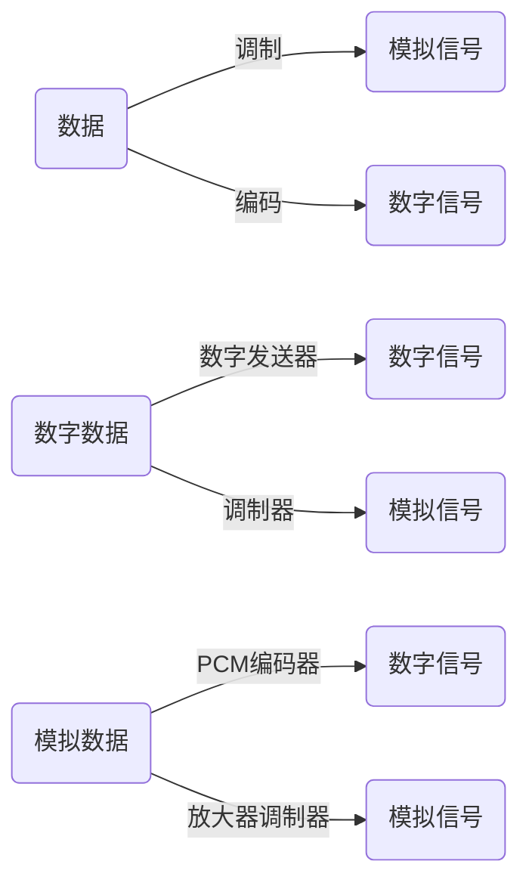
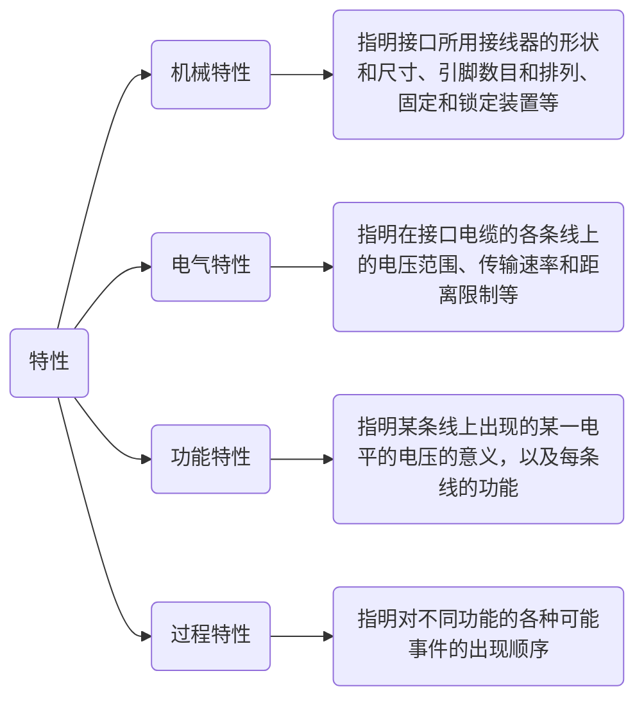

# 物理层

## 通信基础

### 基本概念

1. 数据、信号与码元

   - 数据：传送信息的实体，分为模拟数据与数字数据
   - 信号：数据在传输过程中的存在形式，分为模拟信号与数字信号
   - 码元：在通信系统中，固定时长的代表不同离散数值的基本波形。该时长称为码元宽度

2. 信源、信道与信宿

   - 信源：产生和发送数据的源头

   - 信道

     ```mermaid
     graph LR
     	A(信道分类)
     	A-->B(按传送信号形式)
     	A-->C(按传输介质不同)
     	B-->D(传送模拟信号的模拟信道)
     	B-->E(传送数字信号的数字信道)
     	C-->F(无线信道)
     	C-->G(有线信道)
     ```

     - 信道上传送的信号有基带信号和宽带信号之分。基带信号先将数字信号1/0直接用不同的电压表示，然后送到数字信道上传输(基带传输)；宽带信号首先将基带信号进行调制，形成频分复用模拟信号，然后送到模拟信道上传输(宽带传输)

     ```mermaid
     graph LR
     	A(基带信号)
     	B(宽带信号)
     	C(数字信号)
     	D(模拟信号)
     	C-->|编码|A
     	C-->|调制|B
     	A-->|调制|B
     	D-->|转换|C
     	D-->|调制|B
     ```

     - 通信方式可分为：

     ```mermaid
     graph TB
     	A(通信方式)
     	A-->B(单向通信)
     	A-->C(半双工通信)
     	A-->D(全双工通信)
     ```

   - 信宿：接受数据的终点

   ```mermaid
   graph LR
   	A(信道)
   	B(噪声源)
   	发送端-->信道-->接收端
   	
   	subgraph 发送端
   		direction LR
   		信源-->变换器
   	end
   	
   	subgraph 信道
   		direction BT
   		B-->A
   	end
   	
   	subgraph 接收端
   		direction LR
   		反变换器-->信宿
   	end
   ```

3. 速率、波特与带宽

   - 码元传输速率/波特率：表示单位时间内数字通信系统所传输的码元数，单位是波特Baud
   - 信息传输速率/比特率：表示单位时间内数字通信系统传输的二进制码元数，单位是bit/s

   > 若一个码元携带n比特的信息量，则M Baud = Mn bit/s

   - 带宽用来表示网络的通信线路所能传输数据的能力，即最高数据率，单位是bit/s

### 信道的极限容量

1. 奈奎斯特定理
   - 码间串扰：许多高频分量在信道中传输时由于衰减导致接收端收到的码元波形失去码元之间的界限
   - 奈氏准则：在理想低通信道中，为了避免码间串扰，极限码元传输速率为2W Baud，其中W是信道的频率带宽。若用V表示每个码元的离散电平数目，则极限数据率为2Wlog~2~V(bit/s)
   - 奈氏准则给出了码元传输速率的限制，但是并未限制信息传输速率，即未对一个码元可以对应多少个二进制位给出限制
2. 香农定理
   - 在带宽受限且有高斯噪声干扰的信道中，极限数据传输速率为：Wlog~2~(1+S/N)，其中W为信道的频率带宽(单位为Hz)，S为信道内所传输信号的平均功率，N为信道内的高斯噪声功率。
   - 信噪比的两种表示方式：S/N(无单位)；10log~10~(S/N)(单位为dB)
   - 只要信息传输速率低于信道的极限传输速率，就能找到某种方法实现无差错的传输

### 编码与调制



1. 数字数据编码为数字信号

   - 归零编码RZ：用高/低电平表示1/0(或者相反)，每个码元的中间均跳变到零电平。归零需要占用一部分带宽，传输效率会有影响
   - 非归零编码NRZ：一个时钟全部用来传输数据，编码效率最高，但是存在同步问题
   - 反向非归零编码NRZI：用电平的跳变/不跳变表示0/1。既能传输时钟信号，又能尽量不损失系统带宽
   - 曼彻斯特编码：每个码元的中间都发生电平跳变，电平跳变既作为时钟信号，有作为数据信号。可用向下/上跳变表示1/0，或者相反
   - 差分曼彻斯特编码：每个码元的中间都发生电平跳变，电平的跳变仅表示电平信号，不表示数据。数据的表示在于每个码元开始处是否有电平跳变；有/无跳变表示0/1

   

2. 模拟数据编码为数字信号

   ```mermaid
   graph LR
   	A(采样)-->B(量化)-->C(编码)
   ```

   - 采样：对模拟信号进行周期性扫描，将时间上连续的信号变为时间上离散的信号
   - 量化：将采样得到的电平幅值按照一定的分级标度转换为对应的数值并取整
   - 编码：将量化的得到的离散整数转换为与之对应的二进制编码

   > 采样定理/奈奎斯特定理：在将模拟信号转换成数字信号时，假设原始信号中的最大频率为f，那么采样率f~采样~≥2f，才能保证采样后的数字信号完整保留原模拟信号的信息

3. 数字数据编制为模拟信号

   - 数字数据调制技术在发送端将数字信号转换为模拟信号，而在接收端将模拟信号还原为数字信号，分别对应调制解调器的调制与解调过程
   - 调幅AM/幅移键控ASK：通过改变载波的振幅来表示数字信号的1/0
   - 调频FM/频移键控FSK：通过改变载波的频率来表示数字信号的1/0
   - 调相PM/相移键控PSK：通过改变载波的相位来实现数字信号的1/0
   - 正交幅度调制QAM：在频率相同的前提下，将AM和PM结合起来，形成叠加信号。蛇波特率为B，采用m个相位，每个相位有n种振幅，则该QAm的数据传输速率R=Blog~2~(mn)

### 错题

1. 测得一个以太网的数据波特率是40MBaud，那么其数据率是(  )

   A. 10Mb/s

   B. 20Mb/s

   C. 40Mb/s

   D. 80Mb/s

2. 二进制信号在信噪比为127:1的4kHz信道上传输，最大数据传输速率可以达到(  )

   A. 28000b/s

   B. 8000b/s

   C. 4000b/s

   D. 无限大

3. 一个传输数字信号的模拟信道的信号功率是0.14W，噪声功率是0.02W，频率范围为3.5~3.9MHz，则该信道的最高数据传输速率是(  )

   A. 1.2Mb/s

   B. 2.4Mb/s

   C. 11.7Mb/s

   D. 23.4Mb/s

4. 在下列因素中，不影响信道传输速率的是(  )

   A. 信噪比

   B. 频率带宽

   C. 调制速率

   D. 信号传播速度

## 传输介质

### 介质

1. 传输介质：数据传输系统中发送器和接收器之间的物理通路
   - 导向传输介质：电磁波被导向为沿着固体介质传播
   - 非导向传输介质：自由空间
2. 双绞线
   - 由两根采用一定规则并排绞合、相互绝缘的铜导线组成
   - 屏蔽双绞线STP：双绞线外面有由金属丝编织成的屏蔽层
   - 非屏蔽双绞线UTP：双绞线外面没有由金属丝编织成的屏蔽层
   - 双绞线可用于传输模拟信号和数字信号
     - 对于模拟传输，要用放大器放大衰减的信号
     - 对于数字传输，要用中继器来对失真的信号进行整形
3. 同轴电缆
   - 由内导体、绝缘层、网状编织屏蔽层和塑料外层组成
   - 50Ω同轴电缆：主要用于传输基带数字信号
   - 75Ω同轴电缆：主要用于传送宽带信号
4. 光纤
   - 利用光导纤维传递光脉冲来进行通信
   - 多模光纤：从不同角度入射点多条光纤在一根光纤中传输。光在传输过程中会逐渐展宽，造成失真，适合近距离传输
   - 单模光纤：光纤直径很小，光在光纤中近似直线传播。光的衰减较小，适合远距离传输
5. 无线传输介质
   - 无线电波
     - 无线电波具有较强的穿透能力，可以传输很长的距离，广泛用于通信领域
   - 微博、红外线和激光
     - 红外通信和激光通信将要传输的信号分别转换为各自的信号格式，再直接在空间中传播
     - 微博通信的信号是沿直线传播的，因此在地面上传播的距离有限，超过一定距离后就要使用中继站接力

### 物理层接口的特性




1. 机械特性
   - 指明接口所用接线器的形状和尺寸、引脚数目和排列、固定和锁定装置等
2. 电气特性
   - 
3. 功能特性

## 物理层设备

### 中继器

1. 功能：整形、放大并转发信号，以消除信号经过一长段电缆后产生的失真和衰减，使信号的波形和强度达到所需的要求，进而扩大网络传输的距离
2. 原理：信号再生
3. 中继器两端的网络部分是网段，而不是子网，使用中继器连接的两个网段仍是一个局域网
4. 因为中继器工作在物理层，所以不能连接两个具有不同速率的局域网

> 若某个网络设备有存储转发功能，则认为它能连接两个不同的协议；若该网络设备无存储转发功能，则认为它不能连接两个不同的协议。中继器没有存储转发功能，因此它不能连接两个速率不同的网段，中继器两端的网段一定要使用同一协议

> 放大器和集线器都有放大作用，但是放大器放大的是模拟信号，其原理是放大衰减的信号，而中继器放大的是数字信号

5. 中继器和放大器的对比

   |              |  中继器  |  放大器  |
   | :----------: | :------: | :------: |
   | 放大信号类型 | 数字信号 | 模拟信号 |
   |     原理     | 整形再生 | 放大信号 |

### 集线器

1. 集线器实质是一个多端口的中继器
2. 若同时有两个或多个端口输入，则输出时将发生冲突，致使这些数据无效
3. 作用：扩大网络的传输范围，而不具备信号的定向传送能力
4. 每个端口连接的是同一网络的不同网段，且只能在半双工状态下工作

### 错题

1. 两个网段在物理层进行互联时要求(  )

   A. 数据传输速率和数据链路层协议都可以不同

   B. 数据传输速率和数据链路层协议都要相同

   C. 数据传输速率要相同，但数据链路层协议可以不同

   D. 数据传输速率可以不同，但数据链路层协议要相同