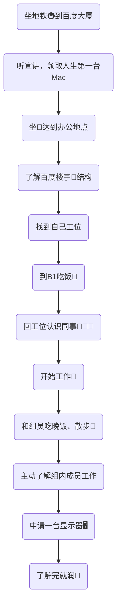

今天是入职百度的第一天，记录一下今天的历程。

## 大致流程

今天没有学习太多东西，学习大纲如下：
- 了解新人培养要求
- 了解一些内部文档（内容不便透露哦）
- 了解多模态

---
接下来一一介绍每个部分：

## 新人培养要求
主要学习一些公司内部对员工的要求，以及相关的标准。

## 内部文档
这个真不方便说哦。

## 多模态
多模态学习（Multimodal Learning）是一种利用来自不同感官或交互方式的数据进行学习的方法，主要技术难点在于如何挖掘模态间的互补性或独立性以表征多模态数据。
- Transformer介绍：对Self-Attention、Multi-head Attention、Positional Encoding、Encoder-Decoder、Residual Connections、Layer Normalization的介绍
- 多模态的结构、目标、训练等

## 其他
- 今天发的水果是一个橙子🍊。

## 总结
第一天学习内容确实不多，所以整体下来相对轻松，但是跟周围人都不熟，所以感觉有些拘束，希望以后熟悉了之后氛围能更加轻松一些。

<!-- ##{"timestamp":1729690031}## -->