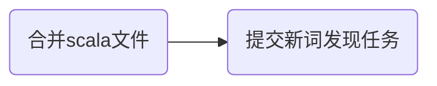

今天是入职百度的第3️⃣7️⃣天，记录一下今天的历程。

## 大致流程



在昨天的基础上将`QueryExtraction`文件和`WordDiscovery`文件进行合并，然后尝试提交任务。

---
接下来一一介绍每个部分：

## 合并文件
昨天成功将新词发现的python文件转化为了scala文件，接下来就是将新词发现文件和query抽取文件进行合并——抽取query后直接传入新词发现部分进行处理，然后将保存query改为保存计算后的新词。
但是在合并过程中发现了问题——我发现我不会🤣。
于是我就直接询问ai，但是合并后一堆bug，后面就开始查找文档自己学习，并结合ai通过以下方法实现了query的传入：
1. 数据获取：通过 SparkSQL 查询获取 query
```scala
val query = s"""
  SELECT DISTINCT query  
  FROM $databaseName.$tableName
  WHERE partition_stat_date = '$date'
  LIMIT $maxRecords
"""

val queriesDf = spark.sql(query)
```
2. 数据转换：将 DataFrame 转换为 Scala 序列
```scala
val batch = queriesDf
  .collect()  // 将分布式 DataFrame 收集到 driver 端
  .map(_.getString(0))  // 获取每行的 query 字符串
```
3. 数据预处理：对query进行预处理
```scala
private def processQueries(queries: Seq[String]): Map[String, (Int, Double, Double)] = {
  // 预处理每个 query:
  // 1. 移除空格
  // 2. 保护英文和数字(将它们转换为特殊标记)
  val processedQueries = queries.map(q => 
    WordDiscovery.protectNonChineseWords(q.replace(" ", "")))
  
  // 分词并过滤标点符号
  val textList = processedQueries.flatMap(q =>
    WordDiscovery.splitStringWithNonChineseTags(q)
      .filter(s => !s.exists(WordDiscovery.puncs.contains))
  )
    
  // 创建新词发现实例并执行分析
  val discovery = new WordDiscovery(ngramSize = 5)
  discovery.parse(
    textList,
    entropyThreshold = 2.0,
    mutualInfoThreshold = 5.0,
    freqThreshold = 10
  )
}
```
4. 新词发现处理：将处理后的结果传入新词发现类中
```scala
def parse(textList: Seq[String], entropyThreshold: Double, mutualInfoThreshold: Double, freqThreshold: Int): Map[String, (Int, Double, Double)] = {
  // 1. 预解析，构建正向和反向 n-gram
  val (chunks, bchunks) = preparse(textList)
  
  // 2. 计算熵值
  val fwEntropy = calcEntropy(chunks, fwNgram)
  val bwEntropy = calcEntropy(bchunks, bwNgram)
  
  // 3. 计算互信息
  val fwMi = calcMutualInfo(chunks, fwNgram)
  val bwMi = calcMutualInfo(bchunks, bwNgram)
  
  // 4. 根据阈值筛选新词
  chunks.map { chunk =>
    val word = chunk.mkString
    val reversedWord = chunk.reverse.mkString
    
    (word, fwMi.get(word), bwMi.get(reversedWord)) match {
      case (w, Some((fmi, ffreq)), Some((bmi, bfreq))) =>
        val miMin = math.min(fmi, bmi)
        val wordProb = math.min(ffreq, bfreq)
        val avgEntropy = (fwEntropy.getOrElse(w, 0.0) + bwEntropy.getOrElse(reversedWord, 0.0)) / 2

        if (miMin >= mutualInfoThreshold && wordProb >= freqThreshold && avgEntropy >= entropyThreshold) {
          Some(w -> (wordProb, miMin, avgEntropy))
        } else None
      case _ => None
    }
  }.flatten.toMap
}
```

总之就是大致完成了合并，但是并不知道是否能正确运行，因此打算提交任务查看运行结果。
## 提交任务
合并文件之后不知道是否正确，想要提交一下任务看看能否正确运行，于是通过脚本提交任务。提交上去之后代码任务被正确接收，然后控制台就没有反应了，我知道是因为后台在进行大量计算操作，所以控制台没有反应，因此尝试添加println语句显示运行进度，然后使用`control+z`终止任务。
修改之后再次提交，发现部分语句能够正常打印，但是依然有部分不太能，因此再次终止任务修改代码……
经过多次反复，感觉代码应该能够正常打印显示进度了，于是再次提交，但是此时控制台却显示队列资源不足，部分任务被拒绝，需要等待，但是最开始接触时我不知道什么原因，终止任务后再次提交，这样反反复复数十次，任务一直提交不上去。
晚饭后跟梁哥讨论问题，梁哥给我推荐了一个新平台——五彩石，用于查看队列相关的spark任务，发现我之前的所有任务都没有被正确kill掉，还在后台运行，数十个任务占用大量资源，导致新的任务无法被分配资源。梁哥告诉我需要使用`sh yarn-client application -kill application_id`命令或者`control+c`终止任务，`control+z`只是在终端中打断任务。
我将多余任务全部kill之后再次提交，果然瞬间就提交上去了，然后程序开始慢慢运行，我也打算直接回学校，等下次来公司再看运行结果。

## 其他
- 提交任务失败的原因找到之后，梁哥跟我说：幸亏只是内部队列，万一你提交到服务队列上，用户请求无法被响应，这就称为安全事故了。羞愧死了，我居然差点引发事故。然后梁哥跟我再三确认所有数据都存在个人路径下，不要轻易删除文件。
- 今天是平安夜，公司发的水果是一个苹果🍎。

## 总结
今天应该是成功合并了两个文件，至少打包成jar包时没有报错，且运行时也没有报错。同时学会了如何kill任务（这个都不该组员教的，应该是自学的），也学会了要多看文档，有问题要及时询问。

<!-- ##{"timestamp":1735050765}## -->