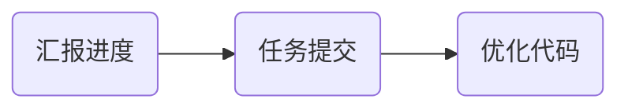

今天是入职百度的第3️⃣5️⃣天，记录一下今天的历程。

## 大致流程



今天跟周二一样，又是半天模型，半天代码。

---
接下来一一介绍每个部分：

## 汇报
原本mentor都不打算让我汇报，他以为我这周只在公司工作两天没有做什么东西，然后十一点十分左右我问mentor：
- 黎明哥，我们今天什么时候汇报啊。
- 啊，你这周有新的进展吗？
- 有的有的🙂‍↕️
- 那好，等我忙完这一点咱们找个会议室汇报一下

然后我把这周的进度简单整理总结一下：
```plaintext
# 本周汇报内容

## 新词挖掘进展

### 前期进度回顾

基于上下文判断相似性，然后计算该候选词的增强互信息


复现时遇到的问题：**分词的准确性本身就依赖于词库的完整性，如果词库中根本没有新词，则信任分词结果无法被信任**

---

如果不依赖词库进行分词，而是自己制定一种方法对文本进行分词，然后将结果与已有词库进行对比，则可筛选出候选词

1. 内部凝聚度：衡量一个词组内部子部分之间关联紧密程度的指标，结果越大说明该候选词越稳定，即是一个新词的可能性越大

   $Agg(w)=min_{1\leqslant l \lt len(w)}\frac{p(w)}{p(w[0:i])p(w[i:lwn(w)])}$

2. 自由度：衡量一个候选词的左邻字集合和右邻字集合的随机性，结果越小说明该词独立存在的可能性越小，即是新词的可能性越小

   Ent(w)=min(- \sum_{c\in N_L(w)}P_L(c|w)logP_L(c|w),- \sum_{c\in N_R(w)}P_R(c|w)logP_R(c|w))

因此综合考虑因素：频数、内部凝聚度、自由度来筛选候选词

## 模型训练

方法：

1. 本机：模型正常加载，但由于配置不足无法继续进行训练

2. Google Colab：模型正常加载，前期可以正常训练，后续训练过程中会出现内存不足问题

   

3. paddlecloud：环境搭建失败，失败原因：

   1. paddlenlp或paddlepaddle版本问题
   2. torch与paddlenlp的混合使用问题
   3. 平台的python版本问题
```
mentor发现我居然实现了新词发现的小demo很开心，夸了我😄，但是也提出了一些改进意见：在新词发现的过程中英文和数字被截断了，从而出现了一些不是单词的候选词，需要改进一下。

## 任务提交
这次在提交任务方面取得了很大的进展——python环境不报错了！
但是这次是其他类型的错误：
> RuntimeError: r.nvmlDeviceGetNvLinkRemoteDeviceType_ INTERNAL ASSERT FAILED at "../c10/cuda/driver_api.cpp":33, please report a bug to PyTorch. Can't find nvmlDeviceGetNvLinkRemoteDeviceType: /home/opt/gpuproxy/lib64/libnvidia-ml.so.1: undefined symbol: nvmlDeviceGetNvLinkRemoteDeviceType

通过询问AI发现可能是CUDA （NVIDIA GPU） 驱动程序或库问题。这个问题就不是我能解决的了，于是我在paddlecloud用于群里提问，但是今天没人回我，等下周一再说吧。

## 代码优化
今天上午mentor提出了改进意见后我就马上开始着手解决了，但是我在修改的过程中遇到了好多问题，在处理文本时我用<EN_XXX>和<NUM_XXX>保护英文和数字，但是此时如何处理下标和长度就成了一个大问题，因为我们经常需要取`[start: end], [::-1], [:-1]`，如果不能讲<EN_XXX>和<NUM_XXX>识别成一个整体的话就会破坏被保护对象，从而出现bug。
我使用re库尝试了好多好多方法，也问了ai好多次，但是ai给我的代码也是一堆bug，每次都破坏被保护对象。
晚上七点半，我想到一个方法，感觉能解决这个问题，但是先不说了，等实现出来再详细介绍，回学校！

## 其他
- 今天发的水果是一个橙子🍊。

## 总结
今天很无聊，很无聊，很无聊！

<!-- ##{"timestamp":1734705165}## -->