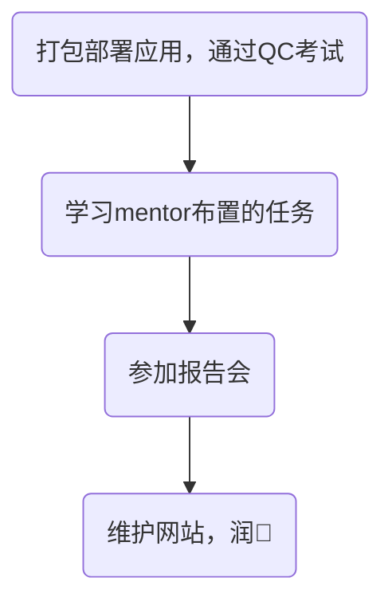

今天是入职百度的第三天，记录一下今天的历程。

## 大致流程

今天学习类别较少，但是知识容量不少，主要学习内容如下：
- iCafe的简单使用
- 集群的学习
- Hadoop的学习

---
接下来一一介绍每个部分：

## iCafe的使用
iCafe是百度内部的任务流卡片，用于标识当前项目进度，属于度学堂学习范围。由于昨天基本全部用于QC考试，所以并没有完成前面部分知识的学习，今天把前面的知识补一下。
对了，由于QC考试最后的任务是今天提交的，所以QC认证今天才发，也是拿到了自己的第二个徽章。

## 集群的学习
虽然百度在当前搜索引擎市场已经没有太大优势，但是瘦死的骆驼比马大，每天的query对于个人来说依然是巨大的，因此我们项目组的很多分析都不可能在单个电脑上完成，所有的操作都会在集群上操作。我简单了解了集群的组成、部署等，在此不过多赘述。而如果我们要进行操作，就需要一个工具，这个工具就是Hadoop。

## Hadoop学习
> Hadoop是一个由Apache基金会所开发的分布式系统基础架构，是一个存储系统+计算框架的软件框架。它主要解决海量数据存储与计算的问题，是大数据技术中的基石。

上面是Hadoop的定义，这些都不重要，我原本是看菜鸟网站上的教程，然后我的mentor告诉我说，你可以多浏览一下family.baidu.com，里面有很多高质量的教程，然后我就转战到百度内部社区，发现确实有很多全面的教程。偷偷说一下，这里面也有很多非度厂人搜不到的数据，感觉确实到了AI时代，很多大厂就把优质数据给藏起来训练自己的大模型了。
我整体上并没有学习很多，也就了解了一下Hadoop的基本命令，打算周末抽些时间再学点。

## 其他
- 今天通过了Comate考试，发现原来国内的AI助手也挺方便的。考试没有次数限制，我刷了七八遍终于刷满分了，Comate有三种徽章，通过考试后就可拿到第一个入门级徽章——探索者。我要在这几个月里加油，要拿好多好多徽章。

- mentor给我发了一个iCafe，整理了我要学的内容，还给了我个人文件夹路径，但是我在开发机上怎么都没找到，索性直接问mentor，他说这个要用Hadoop访问啊。天呐，好尴尬，怎么什么都不会。

- 每周五都要参加一个会，用于汇报各个小组的进度，由于刚来，听得云里雾里，索性最后直接摆烂，坐在最后面玩自己的Mac，然后我突然发现别人说的Mac续航时间长绝非虚言，在那里坐了一个小时才耗了4%的电，要是换成我的Windows，说不定早掉到80%以下了。
- 晚上吃完晚饭回来简单维护了一下当前网站，找了一个好看的主题套上来了，感觉很不错。

- 今天发的水果是一根香蕉🍌。

## 总结
整体来说学了不少，与在学校学习相比有太大不同，在公司里有明确的任务在push我，让我去学习，深入研究某个领域，但是在学校，学的东西很多，但也有些杂，很多东西并不适用于工作，但也有可能只是在我当前职位不常用。但无论怎么说，在公司这两天我很开心，也学了一些东西了，接下来我也会继续努力。

<!-- ##{"timestamp":1729862831}## -->