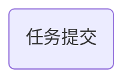

今天是入职百度的第2️⃣9️⃣天，记录一下今天的历程。

## 大致流程



今天想尽一切办法训练模型。

---
接下来一一介绍每个部分：

## 代码编写
其实没啥好说的，就是各种问题，各种报错，原因应有尽有，只有你想不到，没有他做不到。
改改改……改改改……改改改……改改改……改改改……改改改……改改改……改改改……改改改……改改改……改改改……改改改……
改了十多次，包括后面要提到的Google Colab。
老天爷呀，可怜可怜我吧！

## 任务提交
先看一下我的战果吧：

哈哈哈哈哈哈哈啊啊啊啊啊啊啊呜呜呜呜呜呜呜……
虽然任务提交我不需要一直等着，但是这一个小时的代码让我每次看到失败都很难受啊！
我到底什么时候才能成功啊！
我再不做出来点东西跟mentor都没什么汇报的了，好焦虑啊！

## 切换平台
往队列上提交任务太难了，提交了好多了，一直失败一直失败，不是环境问题，就是python包版本问题，不是代码问题，就是数据处理问题。在本地解决提到的问题后还要花一个小时提交任务，因此我就在想，有没有更方便的方法呢？💡想到了：Google Colab。
于是我登录Google Colab，然后将自己的数据集上传到huggingface，这样就可以直接通过huggingface访问了。
……
……
中间过程就简单说一下吧，也是遇到了很多问题，比如数据处理啊，python库选择啊，loss计算啊等等等等……最终也是敲定了一版代码：
```python
!pip install datasets evaluate transformers

from datasets import load_dataset
from transformers import AutoTokenizer, AutoModelForSequenceClassification, TrainingArguments, Trainer
import torch
import evaluate

# 加载数据集
dataset = load_dataset("wlkla/query-classification")

# 加载分词器
tokenizer = AutoTokenizer.from_pretrained("THUDM/chatglm3-6b", trust_remote_code=True)

# 创建标签映射
unique_labels = list(set(dataset['train']['Label']))
label2id = {label: idx for idx, label in enumerate(unique_labels)}
id2label = {idx: label for label, idx in label2id.items()}

# 分词函数
def tokenize_function(examples):
    return tokenizer(
        examples["Query"],
        padding="max_length",
        truncation=True,
        max_length=64
    )

# 转换标签并分词
def preprocess_labels(example):
    example["labels"] = label2id[example["Label"]]  # 转换标签为数字
    return example

tokenized_datasets = dataset.map(tokenize_function, batched=True, remove_columns=["Query"])
tokenized_datasets = tokenized_datasets.map(preprocess_labels)

# 设置数据格式为 PyTorch
tokenized_datasets.set_format("torch")

# 加载模型
model = AutoModelForSequenceClassification.from_pretrained(
    "THUDM/chatglm3-6b",
    num_labels=len(label2id),
    id2label=id2label,
    label2id=label2id,
    trust_remote_code=True
)

# 加载评估指标
metric = evaluate.load("accuracy")

# 定义评估函数
def compute_metrics(eval_pred):
    logits, labels = eval_pred
    predictions = torch.argmax(torch.tensor(logits), dim=-1).numpy()
    return metric.compute(predictions=predictions, references=labels)

# 定义训练参数
training_args = TrainingArguments(
    output_dir="./query_classification_results",
    num_train_epochs=3,
    per_device_train_batch_size=1,
    per_device_eval_batch_size=1,
    gradient_accumulation_steps=8,
    warmup_steps=500,
    weight_decay=0.01,
    logging_dir='./logs',
    logging_steps=10,
    evaluation_strategy="epoch",
    fp16=True
)

# 定义 Trainer
trainer = Trainer(
    model=model,
    args=training_args,
    train_dataset=tokenized_datasets['train'],
    eval_dataset=tokenized_datasets['test'],
    compute_metrics=compute_metrics,
)

# 开始训练
trainer.train()
```
但是运行报错啦😭：

我现在已经不想抱怨了，搞了一下午，还是一直失败，我现在内心毫无波澜，已经失望了😞。

## 其他
- 小结一下，今天改了一天代码，提了一天任务，全失败了，我现在很痛苦💔！
- 今天发的水果是一个橘子🍊。

## 总结
啊啊啊啊啊，痛苦啊，我只是想训练一个模型，为什么那么难，任务提交好麻烦啊，给我一台高配电脑多好啊，我就不用考虑到底怎么提交任务了，怎么在远程配置环境了，分明思路很明确的事，却由于环境一直不成功，痛，太痛啦！！

<!-- ##{"timestamp":1733747162}## -->