今天是入职百度的第2️⃣8️⃣天，记录一下今天的历程。

## 大致流程

```mermaid
graph LR
    A(本地部署)
    B(参数学习)
    C(任务提交)
    A --> B --> C
```



今天想尽一切办法想把模型在本地搭建起来。

---
接下来一一介绍每个部分：

## 本地部署
好事并没有发生，今天起来看到昨晚跑的程序报错了，说没有`model_state.pdparams`文件，这又是怎么回事啊，好奇怪哦。不管了，先去公司。
到公司后我尝试在开发机上再次运行代码看看能不能正常运行，但是显而易见，报错的原因是文件缺失，而不是配置不足，看来我由于配置不足导致中间文件无法生成的臆想破碎了。
但是文件中有一个`lora_model_state.pdparams`，我知道可能有问题，但是我还是决定将文件拷贝并重命名一份试试，在本地又报错了，但是错误原因是内存不足，因此我在开发机上再次尝试，这次居然成功了：

但是在接下来的询问过程中出现了问题：

CPU 版本的 paddle 无法处理 float16 格式的数据。由于是虚拟环境，我原计划打算直接修改调用的库文件，但是改了一个又一个，根本改不完，我决定还是提交到资源队列上运行吧。

## 参数学习
由于我们目前的主要任务是获取模型的 softmax 层输出，因此最近我都在尝试编写代码获取模型的底层输出，在四处查询后，我查找到了这篇文章：[Generation](https://huggingface.co/docs/transformers/v4.47.0/zh/main_classes/text_generation#transformers.GenerationConfig.output_scores)，通过了解大模型输出时的各个参数，我发现了这个：
> [!NOTE]
**output_scores** (bool, optional, defaults to False) — Whether or not to return the prediction scores. See scores under returned tensors for more details.
**output_logits** (bool, optional) — Whether or not to return the unprocessed prediction logit scores. See logits under returned tensors for more details.

因此我在尝试了多次之后也是成功编写了一个小 demo：
```python
import torch
import torch.nn.functional as F
from transformers import AutoModelForCausalLM, AutoTokenizer

# 加载模型和tokenizer
model = AutoModelForCausalLM.from_pretrained('Models/Gemma')
tokenizer = AutoTokenizer.from_pretrained('Models/Gemma')


def generate_text_with_probabilities(model, tokenizer, input_text, max_length=50):
    # 编码输入文本
    input_ids = tokenizer.encode(input_text, return_tensors='pt')

    # 关闭梯度计算以提高效率
    with torch.no_grad():
        # 生成文本
        outputs = model.generate(
            input_ids,
            max_length=max_length,
            num_return_sequences=1,
            return_dict_in_generate=True,
            output_scores=True
        )

        # 存储每个生成token的概率信息
        generated_token_probs = []

        # 遍历生成的token序列
        for step, logits in enumerate(outputs.scores):
            # 使用softmax将logits转换为概率
            probs = F.softmax(logits, dim=-1)

            # 获取概率最高的前20个token
            top_k_probs, top_k_indices = torch.topk(probs[0], k=20)

            # 归一化top-k概率
            normalized_top_k_probs = top_k_probs / top_k_probs.sum()

            # 将token及其概率存储为字典
            token_prob_dict = {
                'step': step,
                'tokens': [tokenizer.decode(idx) for idx in top_k_indices],
                'probabilities': normalized_top_k_probs.tolist(),
                'selected_token': tokenizer.decode(outputs.sequences[0][input_ids.shape[1] + step])
            }

            generated_token_probs.append(token_prob_dict)

        # 解码生成的文本
        generated_text = tokenizer.decode(outputs.sequences[0])

        return {
            'generated_text': generated_text,
            'token_probabilities': generated_token_probs
        }


# 测试函数
input_text = ('The input query is "what is the price of cabbage today?" Please determine whether the query belongs to '
              '"goods" or "life". Just reply "goods" or "life" without any redundant explanations.')
result = generate_text_with_probabilities(model, tokenizer, input_text)

# 打印结果
print("Generated Text:", result['generated_text'])
print("\nToken Probabilities:")
for token_info in result['token_probabilities']:
    print(
        f"\nStep {token_info['step']}, Selected Token: {token_info['selected_token']}, Top 20 Tokens and Probabilities:")
    for token, prob in zip(token_info['tokens'], token_info['probabilities']):
        print(f"{token}: {prob:.4f}")
```
但是这个模型是我从 huggingface 上下载下来的，并不是我们部门需要的，但是理论能行，接下来只要我们能成功部署我们的模型就可以达成我们的目标了！

## 任务提交
当我们前置工作已经完成，即模型可以实例化，softmax 输出可以打印，那么接下来我们就尝试解决目前遇到的一个问题：解决 float16 数据类型，根据查询，这个问题应该是由于版本为 CPU 的问题，用 GPU 应该可以解决，因此我们就使用 paddlecloud 提交任务。
在之前的文章[PaddleCloud客户端学习](https://onebuaaer.us.kg/post/PaddleCloud-ke-hu-duan-xue-xi.html)中已经介绍过提交流程，但是我忘记了🤣，因此我又花了一段时间熟悉操作，然后提交了任务。
提交任务后我就一直等，发现任务始终处于排队状态，因此我就决定回学校，下次来公司肯定就能出结果了，希望是好结果吧，求求了。

## 其他
- 今天发的水果是一根香蕉🍌。

## 总结
今天真是脑子要炸了，一直在配环境，调参数提交任务，真是太煎熬了，我什么时候能把模型部署完成啊🙀！

<!-- ##{"timestamp":1733487962}## -->