今天是入职百度的第2️⃣8️⃣天，记录一下今天的历程。

## 大致流程

```mermaid
graph LR
    A(汇报进度)
    B(模型下载)
    C(任务提交)
    A --> B --> C
```



今天想尽一切办法想把任务提交到队列上并且成功运行。

---
接下来一一介绍每个部分：

## 进度汇报
今天早上跟mentor汇报进度，主要进展如下：
- 对于我们之前训练的模型，我已下载到本地，但是模型文件跟大模型常规结构不同，缺少很多关键的文件（比如`config.json`与`model_state.pdparams`），虽然目前已经解决（大致解决方法👉[第二十六天](https://onebuaaer.us.kg/post/bai-du-shi-xi-di-er-shi-liu-tian.html)和[第二十七天](https://onebuaaer.us.kg/post/bai-du-shi-xi-di-er-shi-qi-tian.html)），但是并没有完成测试，不能保证模型文件的完整性与可用性，周三已经提交任务，但是任务报错了，主要是因为我配置的参数错误，打算再次尝试：

- 与此同时打算从huggingface上下载一个ChatGLM3-6B模型，自己进行训练，可以保证模型文件的完整性与可用性
- 新词挖掘任务方面，论文并没有新的进展😅

## 开源模型测试
之前就注册过huggingface账户，因此直接登录找到模型开始下载，模型好大哦，下了一下午：


然后简单编写了一个小demo测试模型的可用性与是否符合我们的需求：
```python
import torch
import torch.nn.functional as F
from transformers import AutoModelForCausalLM, AutoTokenizer

# 加载模型和tokenizer
model = AutoModelForCausalLM.from_pretrained('ChatGLM3-6B', trust_remote_code=True)
tokenizer = AutoTokenizer.from_pretrained('ChatGLM3-6B', trust_remote_code=True)


def generate_text_with_probabilities(model, tokenizer, input_text, max_length=100):
    # 编码输入文本
    input_ids = tokenizer.encode(input_text, return_tensors='pt')

    # 关闭梯度计算以提高效率
    with torch.no_grad():
        # 生成文本
        outputs = model.generate(
            input_ids,
            max_length=max_length,
            num_return_sequences=1,
            return_dict_in_generate=True,
            output_scores=True
        )

        # 存储每个生成token的概率信息
        generated_token_probs = []

        # 遍历生成的token序列
        for step, logits in enumerate(outputs.scores):
            # 使用softmax将logits转换为概率
            probs = F.softmax(logits, dim=-1)

            # 获取概率最高的前20个token
            top_k_probs, top_k_indices = torch.topk(probs[0], k=20)

            # 归一化top-k概率
            normalized_top_k_probs = top_k_probs / top_k_probs.sum()

            # 将token及其概率存储为字典
            token_prob_dict = {
                'step': step,
                'tokens': [tokenizer.decode(idx) for idx in top_k_indices],
                'probabilities': normalized_top_k_probs.tolist(),
                'selected_token': tokenizer.decode(outputs.sequences[0][input_ids.shape[1] + step])
            }
            print(token_prob_dict)

            generated_token_probs.append(token_prob_dict)

        # 解码生成的文本
        generated_text = tokenizer.decode(outputs.sequences[0])

        return {
            'generated_text': generated_text,
            'token_probabilities': generated_token_probs
        }


# 测试函数
input_text = ('The input query is "what is the price of cabbage today?" Please determine whether the query belongs to '
              '"goods" or "life". Just reply "goods" or "life" without any redundant explanations.')
result = generate_text_with_probabilities(model, tokenizer, input_text)

# 打印结果
print("Generated Text:", result['generated_text'])
print("\nToken Probabilities:")
for token_info in result['token_probabilities']:
    print(
        f"\nStep {token_info['step']}, Selected Token: {token_info['selected_token']}, Top 20 Tokens and Probabilities:")
    for token, prob in zip(token_info['tokens'], token_info['probabilities']):
        print(f"{token}: {prob:.4f}")
```
模型也是有了理想的输出：
```plaintext
Step 5, Selected Token: life, Top 20 Tokens and Probabilities:
life: 0.8956
good: 0.1021
food: 0.0011
life: 0.0006
Life: 0.0002
goods: 0.0001
lif: 0.0001
books: 0.0001
生命: 0.0000
Good: 0.0000
gro: 0.0000
live: 0.0000
good: 0.0000
culture: 0.0000
business: 0.0000
li: 0.0000
loss: 0.0000
family: 0.0000
生活: 0.0000
生命的: 0.0000
```
接下来我们就要编写训练模型的代码了。
我从huggingface官网找到模型微调相关文章[微调预训练模型](https://huggingface.co/docs/transformers/zh/training)，然后简单编写了一个训练代码，在自己电脑上先运行测试，前面加在模型与处理输入都能正常运行，但是在训练阶段就卡住了，这也正常，电脑配置不行，于是就准备提交到队列上运行。

## 任务提交
由于之前的参数设置错误，因此这次我把所有需要设置的参数前前后后检查了多次，保证每条路径的存在，然后将模型打包上传。由于模型实在太大了，任务上传就要花一个小时左右，这要是运行错误，代价就太大了。
任务上传之后已经很晚了，我就回家了，希望周一来了之后能成功。

## 其他
- 今天发的水果是一个苹果🍎。

## 总结
模型训练好麻烦啊，单是环境配置就把我搞的晕头转向。继续加油！

<!-- ##{"timestamp":1733487962}## -->