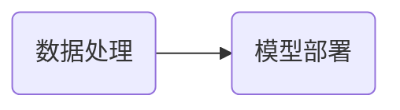

今天是入职百度的第2️⃣6️⃣天，记录一下今天的历程。

## 大致流程

今天又是波澜不惊的一天。

---
接下来一一介绍每个部分：

## 数据处理
今天

## 模型部署
今天上午十一点左右，群里消息收到回复，说相关问题请到另外一个群询问：

因此我在文心一言群里又问了一遍，到了下午没人回复我，头像是小猫咪的管理员（上图中那个人）就问我问题解决没有，我说还没，没人回复我，她就拉了一个群，让相关部门的帮我解决：

然后这个人说他也不会：

然后新建来的这个人说这个问题得问另一个人：

然后又一个人被拉进来了（我们的群聊正在逐渐壮大💪）：

但是目前他还没回我，可能要等明天了。

## 其他
- 今天发的水果是一个橘子🍊。

## 总结
