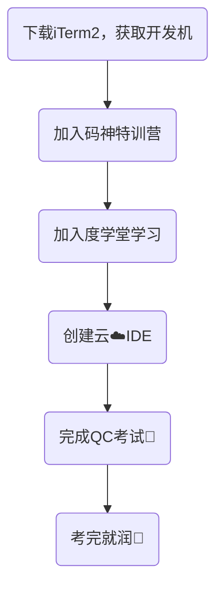

今天是入职百度的第二天，记录一下今天的历程。

## 大致流程

今天知识开始进脑子🧠里，太痛苦😣了，主要学习内容如下：
- 开发机申请
- 百度开发规范
- 云IDE创建
- 百度辅助开发工具comate的使用
- Git在项目中的实际运用
- Git merge时冲突的解决方案
- 使用CNAP部署一个生产环境

---
接下来一一介绍每个部分：

## 开发机申请
通过相关网址向负责人提出申请后即可拿到自己的账号密码，挺简单，我的mentor直接发给我了。

## 云IDE创建
一开始我还傻傻的去下载了一个PyCharm，后面通过阅读文档我了解了如何在一个代码仓库中创建一个云IDE，并且可以用百度内部编辑器iCoding进行代码的编辑。

## 百度辅助开发工具comate的使用
comate是百度的智能编码工具，可以进行代码补全、代码注释等一系列功能。整体上手难度简单，对着官方文档学习很快就能够掌握。

## Git在项目中的实际运用
虽然在学校中我也简单用过git，但最多不过是一些git add、git commit、git push、git pull，我并没有使用git合并过分支以及解决分支合并过程中的冲突问题，因此整个学习过程时间较长，接触了很多新知识，大致包含：
- git命令的学习
- 版本的回滚
- 分支的创建、切换与删除
- 分支的合并
- 合并过程中冲突的解决

## QC考试
QC为得Qualified Coder的缩写。在百度只有获得QC认证后才能在iCode提交代码，因此对于技术部的同学入职不久就要进行培训，且要进行QC考试。考试内容分为四部分，在测试代码库上创建一个云IDE、使用Comate生成并采纳一段注释、合并一个Git分支并解决相关冲突、使用CNAP发布项目并查看结果。
我在没有学习相关内容的情况下提前打开链接看了一下，之后才看到要求：

> 代码库创建即开始计时，完成考试任务后，获得QC勋章结束计时。按考试耗时进行排名。

我只能赶紧边学边做，从下午五点多做到晚上八点，组里的人都走光了，我才离开（真正提交并通过是第二天，任务4.1与4.2选做）。

## 其他
- 第一次直接到百度科技园（昨天是到百度大厦，离地铁站🚇特别近），我八点就坐上了地铁，八点半就到了西二旗地铁站，然后我按照导航🧭找到了附近一个公交车站🚏，等了一二十分钟（此时大约八点五十）突然想到公司有免费班车的呀。然后我马上导航到百度大厦，赶紧坐上了班车（此时大约九点十分）。然后等车到站随着车上的人下车发现我被带到了方舟大厦，不是百度科技园（此时大约九点十五）。我意识到坐错车了，赶紧扫了一辆共享单车按着导航骑到了百度科技园（此时大约九点半）。我当时就想，坏了九点半了，要迟到了，火急火燎跑到工位，发现都没人（内心OS：不是说好的996吗）。
- 今天是1024程序员节，免费在餐厅领了一块蛋糕，全场几千人去分那一块蛋糕，问了阿姨有多贵，说得要好几个千呢。

- 我的mentor给我布置了一些任务，什么word count，什么Hadoop，我都听不懂，还得好好学啊。

## 总结
虽然说整体上内容不多，但是对我来说全是新知识，导致我整体上推进速度并不快。不过对我来说能学到新东西就很开心😄，明天继续努力，加油！

<!-- ##{"timestamp":1729776431}## -->