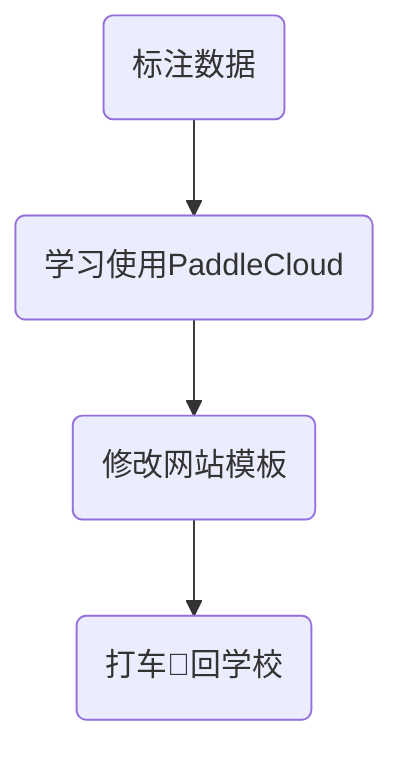

今天是入职百度的第五天，记录一下今天的历程。

## 大致流程

今天主要学习内容如下：
- 继续昨天的数据标注任务，深入了解行业标准
- 继续码神计划的学习
- 学习使用paddlecloud平台，学习任务的创建
- 对网站模板进行修改，给网页设置密码
---
接下来一一介绍每个部分：

## 标注数据
mentor规定的自己标注300条数据与人工标注结果进行对比。昨天我标注了七八十条，今天继续标注🖊️。
……
今天一上午又标注了几十条，拿着所有的标注的结果向组内成员咨询，通过了解，我主要学到了以下的一些规则：
- 有一些英文，虽说可能是某个公司或者某个专有名词，但是由于人工标注时并未一一查询，因此默认一并标注为语言学习
- 一些query标注时，当其可以归属到多个垂类中时，就要考虑其利益价值，将其分类到能给公司带来最大经济效益的类别中
- 很多人工标签也有错误，得好好跟外包那边沟通💬一下

三百条我感觉我标注不了，简单标记一百多条就结束，反正我的主要任务不是数据标注。

## 码神计划
好久没有学习码神计划的相关课程了，今天又刷了四五节课，当然了，挂着就行，没有听，感觉好无聊🥱，我来细数一下这些课程的缺点：
- 授课人员非专业讲师🧑‍🏫，授课不专业
- 授课过程中存在大量读PPT内容
- 拍摄不专业，镜头晃动，画质粗糙，收音炸裂……
- ……

经过我一个多小时的挂机，我也是来到了六十分了，不错不错😌

## PaddleCloud

PaddleCloud是由百度研发的开源深度学习平台，集成了训练、部署、管理等全栈功能。
根据如流知识库的相关文档，我了解学习了如何创建自己的作业，包含普通任务和NLP任务（毕竟我做的就是NLP实习生嘛）。
中间有一个问题，就是填写集群UGI，我自己查了好久好久，尝试了好多内容，结果都显示错误❌，索性直接问mentor，他告诉我说这个是小组密码，不得外泄。原来UGI是这样子的呀，我以为这些都是公开的呢。
填上之后任务也是顺利创建并运行起来了。

## 网站修改
根据同学的建议，我决定给当前网站添加密码，限制人员的随意访问，经过我数小时的艰苦奋战，终于是成功修改了模板，然后全局部署一下就完成了。整体来说不是特别麻烦。

## 其他
所有工作结束的时候已经晚上九点二十了，我想反正公司晚上十点打车🚖免费，索性等到九点五十下楼。根据组员的建议，我十点准时下单，觉得十多分钟应该就能打到车了。

我当时特别希望世界上有后悔药，我就会早早坐上班车🚌，挤上地铁🚇，然后走回学校。当时真的给我等出脾气来了，等了四十多分钟没有等到车，我直接取消约车，自己打了一辆车打回学校，回到学校都已经十一点半了。我真傻，真的。
一辈子都不会再贪百度出行的小便宜了，反正回去之后我骂了好久。

## 总结
总体来说学了不少，特别是paddlecloud，感觉是我未来实习常用到的平台。还有就是百度出行，避雷！避雷！避雷！