今天是入职百度的第1️⃣7️⃣天，记录一下今天的历程。

## 大致流程

```mermaid
graph LR
    A(模型优化)
    B(模型部署)
    C(模型测试)
    A --> B --> C
```

有了可视化软件的加持，效果果然好了不少，但是主要任务还是老样子。

---
接下来一一介绍每个部分：

## 模型优化
之前申请了ERNIE模型的使用，今天打算尝试一下用这个模型训练怎么样，我选择的模型是ERNIE-Speed-128K-Base-0529，这个模型的参数设置与之前的模型略有不同，经过一番研究调整，我也是成功提交。但是由于数据不便调整，我将路径输入直接填写为文件的详细路径，而不是文件夹的路径。最终模型的训练也是失败，不知道是不是因为数据路径的问题，但是我暂时不打算研究，想先将ChatGLM训练到极致再说。
接下来依旧是对ChatGLM参数的调整，这么多天以来，我已经训练了太多模型：

整体来说是越来越好的，我也是十分满意。

## 模型部署

相比而言，部署的模型就少很多了，因为模型不一定都能训练成功，其次就是很多模型参数调整并不大，仅挑选了若干有代表性的进行部署测试。
流程依然是：

```mermaid
graph LR
    A(创建demo)
    B(准备数据)
    C(测试效果)
    A --> B --> C
```

## 其他
- 今天公司免费发福利，每个人都能领一包暖宝宝和一盒蒸汽眼罩，说实话我感觉我用不到：

- 今天路过一个工位，好多玩偶🧸，请忽略图中假发：

- 今天发的水果是一个橙子🍊。

## 总结
回归了主线任务，没有什么好总结的🥱～

<!-- ##{"timestamp":1731933215}## -->