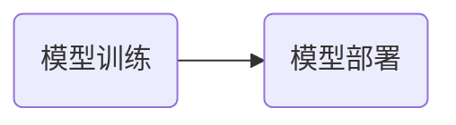

今天是入职百度的第1️⃣2️⃣天，记录一下今天的历程。

## 大致流程

昨天的效果很不错，但是实际正确率并未在原有基础上有突破性进展，接下来可能要继续努力了。
mentor又给我布置了一个小任务，创建一个品牌实体抽取模型，先不用着重考虑正确率。

---
接下来一一介绍每个部分：

## 模型训练
略过⏭️。

## 品牌实体抽取
原始数据是一个包含200条数据的txt文件，通过一个已有的品牌实体抽取模型获得答案，保存为模型训练所需格式。
> 说明：为什么已经有品牌实体抽取模型还要继续训练呢？
已有的模型有使用次数限制，自己训练的模型可以无限使用。

然后直接克隆之前的模型即可，一点参数都不用修改，只需要在集群上替换训练数据集即可。
但是实际运行下来一直不成功：
- 模型训练始终无法结束
- 模型训练结束，但是output文件夹为空，即模型并未保存，导致部署失败

我暂时不明白为什么错误。
多次实验总结出以上两点时已经晚上八点多了，我决定将问题解决放在周末，希望能成功。

## 其他
- 今天下午开周会，原本是坐在后排的，然后一个感觉级别挺高的员工说，这次座位够，往前坐。结果三个实习生中就我一个做到前面了。过了两三分钟，leader进来径直坐到了我旁边的仅剩的一个空位上😅，我为什么要做到前面呢。
- 还是上面这个leader请了我们所有人喝喜茶，我点了一杯多肉莓莓桃。

- 今天发的不是水果，是一盒酸奶。

## 总结
目前模型训练与部署对我来说已经没有任何问题了，接下来我要做的就是如何优化模型参数让正确率不断提高，但这也是最难的，最枯燥的部分，加油加油加油！！。

<!-- ##{"timestamp":1731073951}## -->