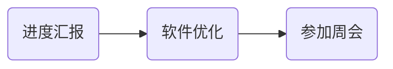

今天是入职百度的第1️⃣6️⃣天，记录一下今天的历程。

## 大致流程

今天有了一些新的东西，可以说一说。

---
接下来一一介绍每个部分：

## 进度汇报
今天刚到公司没多久，mentor问我最近这一段时间任务的进度如何，然后我们预约了一个会议室进行汇报。
> 我是现场预约的会议室，应该也可以线上预约。现场预约时我人脸识别登陆，识别时发现居然有特效，是一个粉色的猫耳。我超，我成猫耳娘了。

在汇报时我向mentor展示了我的软件的功能，然后介绍了我通过可视化测试模型后发现的一些结论（此处不做描述），并汇报了我的模型的正确率：70% $\rightarrow$ 73% $\rightarrow$ 75% $\rightarrow$ 76%。
mentor也是给予了我肯定，然后说以后你可以读读论文，这样在模型训练的时候就不用闲着没事做了，主要研究一下新词的发现与分类。
叮咚🔔：发现新任务，读论文📑。空闲时间没有了，要开始学新东西了！

## 软件优化
之前的软件由于要绘制图像，因此要保存相关label各个时间对应的数据，因此当数据量较大时，就可能由于内存不足导致进程崩溃😫。接下来就是如何解决这一问题。
虽然我有一些比较成熟的想法，但是感觉实现起来比较难，因此索性简单一下，添加功能，可以选择数据测试范围：

这样jiu就在一定程度上限制了数据量的过大，同时我还添加一个柱形图显示各个label的数量：

现在整个代码十分臃肿，我都快分不清结构了，但是我也懒得模块化，*代码和人有一个能跑就行*。

## 其他
- 晚上去吃饭时再次去心愿墙旁边看了一下：

其中点赞量最多的是麦当劳🍔和烤冷面。
- 今天发的水果是一盒枣。

## 总结
开发软件、训练模型、测试模型……日复一日

<!-- ##{"timestamp":1731678231}## -->