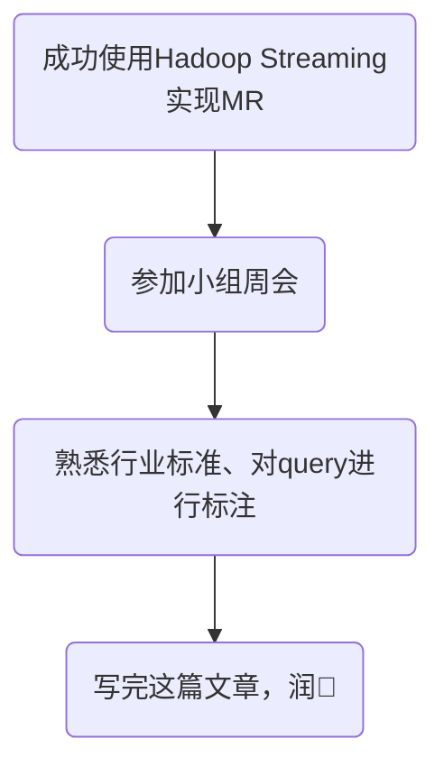

今天是入职百度的第四天，记录一下今天的历程。

## 大致流程

今天基本没有了解什么知识性内容，主要就是一些实操，主要学习内容如下：
- 成功实现WordCount
- 参加小组周会
- 对query的分类标准进行系统学习

---
接下来一一介绍每个部分：

## WordCount的实现
具体内容可前往该篇文章了解👉🏻[_使用MR实现WordCount_](https://onebuaaer.us.kg/post/shi-yong-MR-shi-xian-WordCount.html)，此处着重讲述一下自己的心得：
- 通过本次的学习了解到了MR给大数据并行处理带来了巨大的影响，且刚学习时其“分而治之”的思想确实让我眼前一亮🤯。
- 虽然不明白为什么将命令封装到一个文件中就运行成功了，但是确实让我了解到像这种较长的命令，最好不要在命令行输入，写入文件运行会显著提高工作效率，且方便修改。
- 终端输出的内容是十分重要的，千万不要轻视，说不定你就能找到一个链接指向你的具体错误。

## 参加小组周会
通过跟梁哥交流，了解到小组周会是不定期的，任何人学到任何有用的东西都可以召开小组周会进行分享（如果本周已开过就等下周吧）。
本次参加周会的仅有四个人，上来首先让我做个自我介绍，虽然大家都已经认识我了，但是我还是大致介绍了一下。然后leader问我之前做过的项目有没有可以直接拿来落地的（内心OS：啊！？😰），我说我目前对百度项目不是特别了解，之前做过的的项目中可能会有一些闪光点能应用，但是可能得过一段时间等我了解项目之后才能知道如何应用。
leader说我认为实习生的工作主要分为三种：
- 没有主动的请求，完全按照领导的要求做
- 在工作过程中产生的新的idea💡
- 之前的项目中能直接拿来落地的

我：嗯嗯嗯嗯，是是是💦💦💦💦💦

之后就是leader投屏给我们展示他的学习成果，他向我们推荐了TDA平台，可以直观展示数据的分析结果（我听的迷迷糊糊的😴），还展示了好多好多实例。通过他的展示我发现query中有好多瑟瑟的内容，但是我的leader和mentor都免疫了，还直接拿来展示，反正我挺不好意思的😳。
好像整个会议只持续了一个小时，leader还没分享完后面就有人敲门了，后一个会议要开始了，我们的分享就结束了。整个会议下来我学到了两件事：
- 这个TDA好厉害啊，能直接根据搜索条件生成SQL语句便于我们运行
- 果然浏览器里永远不会缺少瑟瑟的东西

## 任务布置
参加完周会之后，mentor给我发了一个iCafe卡片，记录了我接下来的工作任务：
- 了解行业标准
- 申请资源队列
- 熟悉使用paddlecloud平台

行业标准一会就会讲到，先不细说。我按照mentor的指导登陆了paddlecloud算力管理平台，申请了相关的资源队列，很快就完成了，等待leader通过即可。
今天主要任务就是学习行业标准，因此对paddlecloud平台的使用主要安排到了明天，详细内容请了解该篇文章👉🏻[*百度实习第五天*](https://onebuaaer.us.kg/post/bai-du-shi-xi-di-wu-tian.html)。

## 行业标准
由于我们主要任务就是对用户的query进行分类，因此我们要对分类标准进行严格的设置。
周会后，mentor给我布置了一些任务：
- 了解query分类标准
- 对excel中query进行分类，并与正确标签进行对比，巩固标准

大致浏览了一下发送的文件，更加巩固了我的认知：瑟瑟的东西无处不在，内容不便描述。
通过实践，我发现好多query我并未正确标注，但是我认为我没错，以下是一些小例子，看到的朋友可以看看哪个更合理：
<html xmlns:v="urn:schemas-microsoft-com:vml" xmlns:o="urn:schemas-microsoft-com:office:office" xmlns:x="urn:schemas-microsoft-com:office:excel" xmlns="http://www.w3.org/TR/REC-html40">

<body>
<!--StartFragment-->

query | 正确标签 | 错误标签
-- | -- | --
黑龙江原副省长被决定逮捕 | 人物-领域内知名人物 | 新闻-新闻事件
SharpEye | 教育培训-语言培训 | 企业及企业招聘-企业
公共场合去电影院看电影的规则 | 书籍文档-文档资料 | 生活服务-休闲娱乐

<!--EndFragment-->
</body>

</html>

## 其他
我在标注label时发现了很多有趣的、恶趣味的query，摘出来一些分享一下：
- 穿舞蹈服跳舞尿出来了怎么办（个人建议找个地缝钻进去）
- 红楼梦读后感10字~20字（确定不是100～200）
- 姐夫与本人关系怎么填写（难道不就是姐夫吗）
- 十二胎肠术后吃流食一半流食得有十天能不能吃点炖豆角（没读懂）
- 梦见自己屁股下面黄乎乎的💩（手动帮你们屏蔽一些不好的词）
- ……

## 总结
今天没有很多东西需要总结，希望所有看到文章的UU开心快乐🎉。
