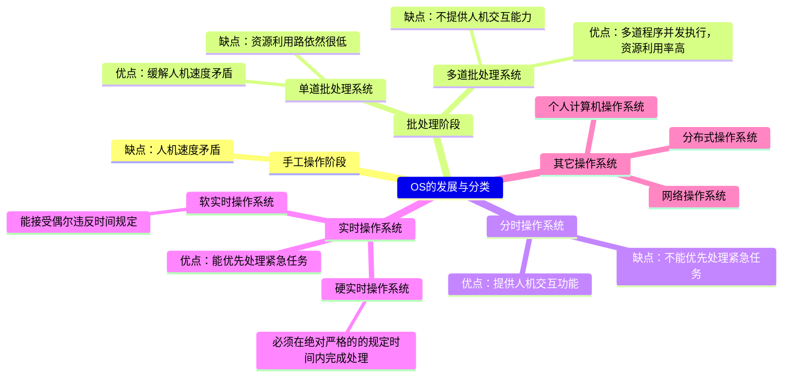
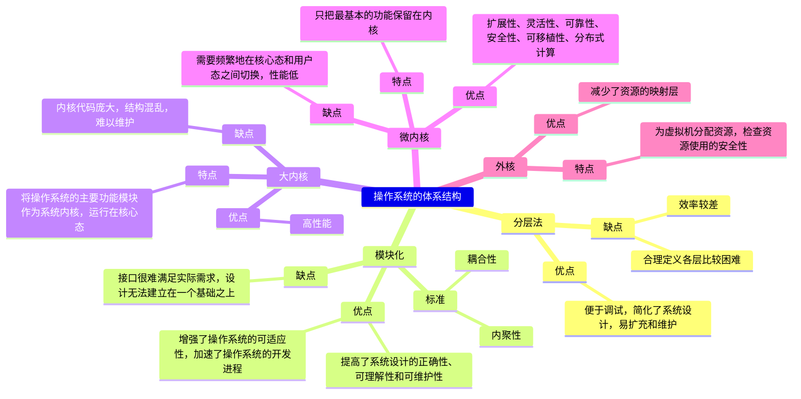

# 计算机系统概述

[TOC]

## 操作系统的基本概念

### 操作系统的概念

1. 计算机系统自上而下可以大致分为四部分：

   ```mermaid
   graph BT
   	A(硬件)
   	B(操作系统)
   	C(应用程序)
   	D(用户)
   	A<-->B
   	B<-->C
   	C<-->D
   ```

   - 硬件：提供基本的计算资源
   - 应用程序：规定按何种方式使用这些资源来解决用户的计算问题
   - 操作系统：控制和协调各用户的应用程序对硬件的分配和使用
2. 操作系统：指控制和管理整个计算机系统的硬件和软件资源，合理地组织、调度计算机的工作与资源的分配，进而为用户和其他软件提供方便接口和环境的程序集合。
3. 系统调用又被称为广义指令。
4. 操作系统向上层提供的服务：

   ```mermaid
   graph TD
       A(操作系统提供的服务)
       B(直接给用户使用的)
       C(给软件/程序员使用的)
       D(GUI)
       E(命令接口)
       F(联机命令接口)
       G(脱机命令接口)
       H(程序接口)
       A-->B
       A-->C
       B-->D
       B-->E
       E-->F
       E-->G
       C-->H
   ```

5. 小节总结：

   ```mermaid
   mindmap
     操作系统
     	概念
     		负责管理协调硬件、软件等计算机资源的工作
     		为上层用户、应用程序提供简单易用的服务
     		是一种系统软件
     	功能和目标
     		资源的管理者
     			处理机管理
     			存储器管理
     			文件管理
     			设备管理
     		向上层提供服务
     			给普通用户
     				GUI
     				命令接口
     					联机命令接口
     					脱机命令接口
     			给软件/程序员
     				程序接口
     		对硬件机器的扩展
     			扩充机器
   ```

### 操作系统的特征

1. 操作系统的基本特征包括并发、共享、虚拟和异步。
2. 并发：
   - 指两个或多个事件在同一时间间隔内发生。
   - 并行性：系统具有同时进行运算或操作的特性，在同一时刻能完成两种或以上的工作。
   - 操作系统的并发性是通过分时实现的。
3. 共享：
   - 系统中的资源可供内存中多个并发执行的进程共同使用。
   - 资源共享的两种方式：
     ```mermaid
     graph LR
     	A(两种资源共享方式)
     	B(互斥共享方式)
     	C(同时共享方式)
     	A-->B
     	A-->C
     ```

> [!IMPORTANT]
>
> 并发和共享是操作系统两个**最基本**的特征，两者之间互为存在条件：
>
> - 资源共享是以程序的并发为条件，若系统不允许程序并发执行，则自然不存在资源共享问题
> - 若系统不能对资源共享实施有效的管理，则必将影响程序的并发执行，甚至根本无法并发执行

4. 虚拟：
   - 指将一个物理上的实体变为若干逻辑上的对应物。
   - 操作系统的虚拟技术：
     
     ```mermaid
     graph LR
     	A(虚拟技术)
     	B(时分复用技术)
     	C(空分复用技术)
     	D(利用多道程序设计技术将一个物理上的CPU虚拟为多个逻辑上的CPU)
     	E(将一台机器的物理存储器变为虚拟存储器，以便从逻辑上扩充存储器的容量)
     	A-->B
     	A-->C
     	B-.->D
     	C-.->E
     ```
5. 异步：
   - 多道程序环境允许多个程序并发执行，但由于资源有限，进程的执行并不是一贯到底的，它以不可预知的速度向前推进
   
6. 小节总结：

   ```mermaid
   mindmap
   	操作系统的特征
   		并发
   			✨并发与并行的区别
   		共享
   			互斥共享方式
   			同时共享方式
   		虚拟
   			空分复用技术
   			时分复用技术
   		异步
   ```

### 操作系统的目标和功能

1. 操作系统应具有以下几个方面的功能：
   - 处理机管理
     - 在多道程序环境下，处理机的分配和运行都以**进程**为基本单位，因而对处理机的管理可归结为对进程的管理
     - 进程管理的主要功能包括进程控制、进程同步、进程通信、死锁处理、处理机调度等
   - 存储器管理
     - 为了给多道程序的运行提供良好的环境，方便用户使用及提高内存的利用率
     - 主要包括内存分配与回收、地址映射、内存保护与共享、内存扩充等
   - 文件管理
     - 计算机中的信息都是以文件的形式存在的，操作系统中负责文件管理的部分称为文件系统
     - 文件管理包括文件存储空间的管理、目录管理及文件读写管理和保护等
   - 设备管理
     - 完成用户的I/O请求，方便用户使用各种设备并提高设备的利用率
     - 主要包括缓冲管理、设备分配、设备处理、虚拟设备等
2. 操作系统提供的接口主要分为两类：
   - 命令接口：按作业控制方式的不同，可将命令接口分为：
     - 联机命令接口/交互式命令接口：适用于分时或实时系统的接口
     - 脱机命令接口/批处理命令接口：适用于批处理系统
   - 程序接口
     - 由一组系统调用组成
     - 用户通过在程序中使用这些系统调用来请求操作系统为其提供服务
3. 没有任何软件支持的计算机称为裸机；将覆盖了软件的机器成为扩充机器或虚拟机。

## 操作系统发展历程

### 手工操作阶段

1. 主要缺点：
   - 用户独占全机，资源利用率低
   - CPU等待手工操作，CPU的利用不充分

### 单道批处理阶段

1. 主要特征：
   - 自动性：磁带上的一批作业能自动地逐个运行，而无需人工干预
   - 顺序性：磁带上的各道作业顺序地进入内存，先调入内存的作业先完成
   - 单道性：内存中仅有一道程序运行
2. 问题：每次主机内存中仅存放一道作业，每当它在运行期间发出输入/输出请求后，高速的CPU便处于等待低速的I/O完成的状态。

### 多道批处理系统

1. 用户所提交的作业都先存放在外存上并排成一个队列，作业调度程序按一定的算法从后备队列中选择若干作业调入内存，它们在管理程序的控制线相互穿插地运行，共享系统中的各种硬/软件资源。
2. 多道批处理系统与操作系统一同诞生。
3. 特点：
   - 多道：计算机内存中同时存放多道相互独立的程序
   - 宏观上并行：同时进入系统的多道程序都处于运行过程中，但都未运行完毕
   - 微观上串行：内存中的多道程序轮流占用CPU，交替执行
4. 优缺点：
   - 优点：资源利用率高，多道程序共享计算机资源，从而使各种资源得到充分利用；系统吞吐率大，CPU和其他资源保持忙碌状态
   - 缺点：用户响应的时间较长，不提供人机交互能力，用户既不能了解自己程序的运行状态，也不能控制计算机

### 分时操作系统

1. 分时：将处理器的运行时间分成很短的时间片，按时间片轮流将处理器分配给各联机作业使用
2. 分时操作系统是指多个用户通过终端同时共享一台主机，这些终端连接在主机上，用户可以同时与主机进行交互操作而互不干扰
3. 主要特征：
   - 同时性/多路性：允许多个终端用户同时使用一台计算机
   - 交互性：用户通过终端采用人机对话的方式直接控制程序运行，与同程序进行交互
   - 独立性：系统中多个用户可以独立地进行操作，互不干扰
   - 及时性：用户请求能在很短时间内获得响应

### 实时操作系统

1. 为了能在某个时间限制内完成某些紧急任务而不需要时间片排队，诞生了实时操作系统
2. 实时操作系统的分类：
   
   ```mermaid
   graph LR
   	A(实时操作系统)
   	B(硬实时系统)
   	C(软实时系统)
   	D(必须在绝对严格的规定时间内完成处理)
   	E(能接收偶尔违反时间规定)
   	A-->B
   	A-->C
   	B-.->D
   	C-.->E
   ```
3. 主要特点：
   - 及时性
   - 可靠性

### 网络操作系统和分布式计算机系统

1. 网络操作系统：将计算机网络中的各台计算机有机地结合起来，提供一种统一、经济而有效的使用各台计算机的方法，实现各台计算机之间数据的互相传送。
2. 网络操作系统的主要特点：网络中各种资源的共享以及各台计算机之间的通信。
3. 分布式计算机系统：
   - 系统中任意两台计算机通过通信方式交换信息
   - 系统中的每台计算机都具有相等的地位
   - 每台计算机上的资源为所有用户共享
   - 系统中的任意台计算机都可以构成一个子系统，并且还能重构
   - 任何工作都可以分布在机台计算机上，由它们并行工作、协同完成
4. 分布式计算机系统的特点：分布性和并行性。

### 总结



### 错题

1. 下列选项中，不属于多道程序设计的基本特征的是(  )

   A. 制约性

   B. 间断性

   C. 顺序性

   D. 共享性

2. 下列关于多道程序系统的叙述中，不正确的是(  )

   A. 支持进程的并发执行

   B. 不必支持虚拟存储系统

   C. 需要实现对共享资源的管理

   D. 进程数越多CPU利用率越高

## 操作系统的运行环境

### 处理器运行模式

1. CPU执行两种不同性质的程序：
   - 操作系统内核程序
   - 用户自编程序
2. 指令的分类：
   - 特权指令：不允许用户直接使用的指令
   - 非特权指令：允许用户直接使用的指令
3. 处理器的运行模式：将CPU的运行模式划分为用户态(目态)和内核态(管态)
4. 应用程序运行在用户态，操作系统内核程序运行在核心态
5. 如何在用户态和内核态之间相互转变：

   ```mermaid
   graph LR
   	A(内核态)
   	B(用户态)
   	A-->|一条修改PSW的特权指令|B
   	B-->|由中断引起，硬件自动完成|A
   ```
6. 大多数操作系统的内核包括四方面的内容：
   - 时钟管理：
     - 适中的第一功能是计时；通过时钟中断的管理，可以实现进程的切换
   - 中断机制：
     - 引入中断技术的初衷是提高多道程序运行时的CPU利用率
     - 中断机制中，只有一小部分功能属于内核，他们负责保护和恢复中断线程的信息，转移控制权到相关的处理程序
   - 原语：
     - 按层次结构设计的操作系统，底层必然是一些可被调用的共用小程序，他们各自完成一个规定的操作，将具有这些特点的程序称为原语
     - 原语的特点为：
       - 处于操作系统的底层，是最接近硬件的部分
       - 这些程序的运行具有原子性，其操作是连续的
       - 这些程序的运行时间都较短，而且调用频繁
   - 系统控制的数据结构及处理：
     - 系统中用来登记状态信息的数据结构很多，为了实现有效的管理，系统需要一些基本的操作，一般包括：
       - 进程管理：进程状态管理、进程调度和分派、创建与撤销进程控制块等
       - 存储器管理：存储器的空间分配和回收、内存信息保护程序、代码对换程序等
       - 设备管理：缓冲区管理、设备分配和回收等

### 中断和异常的概念

1. 发生中断或异常时，运行用户态的CPU会立即进入核心态，这是通过硬件实现的。

   - 中断也称为外中断，是指来自CPU执行指令外部的事件，通常用于信息的输入/输出

   - 异常也称为内中断，是指来自CPU执行指令内部的事件。异常不能被屏蔽，一旦出现，就应立即处理

   - 中断与异常的分类：

     ```mermaid
     graph LR
     	A(中断)
     	B(内部异常)
     	C(外部中断)
     	D(故障fault)
     	E(自陷trap)
     	F(终止abort)
     	G(软件中断)
     	H(硬件中断)
     	I(可屏蔽中断)
     	J(不可屏蔽中断)
     	A-->B
     	A-->C
     	B-->D
     	B-->E
     	B-->F
     	C-->I
     	C-->J
     	D-.->G
     	E-.->G
     	F-.->H
     	I-.->H
     	J-.->H
     ```

2. 中断处理和子程序调用的区别：

   - 中断处理程序与被中断的程序是相互独立的，而子程序和主程序是同一个程序的两部分
   - 中断的产生是随机的，而子程序的调用是通过程序设计者事先设计的CALL指令引起的
   - 调用子程序的过程完全属于软件处理过程，而中断处理的过程需要专门的硬件电路实现
   - 中断处理程序的入口地址可由中断向量法给出，而子程序的入口地址由CALL指令直接给出
   - 两者都需要保护PC的内容，前者由中断隐指令完成，后者由CALL指令完成
   - 响应中断时，需要同时检测到多个中断请求进行裁决，而调用子程序不需要
   
3. 外部中断处理过程中，PC的值由中断隐指令自动保存，而通用寄存器内容由操作系统保存。TLB和Cache中的内容则由硬件机构保存

### 系统调用

1. 系统调用是指用户在程序中调用操作系统所提供的一些子程序，它可被视为特殊的公共子程序。
2. 系统中各种共享资源都有操作系统统一掌管，因此在用户程序中，凡是与资源有关的操作都需要通过系统调用方式向操作系统提出服务请求，并由操作系统代为完成
3. 系统调用按功能大致可分为如下几类：
   - 设备管理：完成设备的请求获释放，以及设备启动等功能
   - 文件管理：完成文件读、写、创建、删除等功能
   - 进程控制：完成进程的创建、撤销、阻塞、唤醒等功能
   - 进程通信：完成进程之间的消息传递或信号传递等功能
   - 内存管理：完成内存的分配、回收以及获取作业占用内存区大小和起始地址等功能
4. 系统调用处理过程：
   - 将系统调用号和所需的参数压入堆栈
   - 调用实际的调用指令，执行陷入指令，将CPU状态转为核心态
   - 保护被中断进程的现场
   - 分析系统调用类型，转入相应的系统调用处理子程序
   - 执行结束后，恢复现场，返回被中断进程，继续执行

### 错题

1. 下列关于操作系统的说法，错误的是(  )

   I. 在通用操作系统管理的计算机上运行程序，需要向操作系统预定运行时间

   II. 在通用操作系统管理的计算机上运行程序，需要确定起始地址，并从这个地址开始执行

   III. 操作系统需要提供高级程序设计语言的编译器

   IV. 管理计算机系统资源是操作系统关心的主要问题

   A. I

   B. I、III

   C. II、III

   D. I、II、III、IV

2. (  )是操作系统必须提供的功能。

   A. GUI

   B. 为进程提供系统调用命令

   C. 中断处理

   D. 编译源程序

3. 用户程序在用户态下要使用特权指令引起的中断属于(  )

   A. 故障异常

   B. 终止异常

   C. 外部中断

   D. 陷入中断

4. “访管”指令(  )使用

   A. 仅在用户态下

   B. 仅在核心态下

   C. 在规定时间内

   D. 在调入时间内

5. 在操作系统中，只能在核心态下执行的指令是(  )

   A. 读时钟

   B. 取数

   C. 系统调用命令

   D. 寄存器清零

6. 下列选项中，必须在核心态下执行的指令是(  )

   A. 从内存中取数

   B. 将运算结果装入内存

   C. 算术运算

   D. 输入/输出

7. 下列关于库函数和系统调用的说法中，不正确的是(  )

   A. 库函数运行在用户态，系统调用运行在内核态

   B. 使用库函数时开销较小，使用系统调用时开销较大

   C. 库函数不方便替换，系统调用通常很方便被替换

   D. 库函数可以很方便地调试，而系统调用很麻烦

8. 下列关于系统调用和一般过程调用的说法中，正确的是(  )

   A. 两者都需要将当前CPU中的PSW和PC的值压栈，以保存现场信息

   B. 系统调用的被调用过程一定运行在内核态

   C. 一般过程调用的被调用过程一定运行在用户态

   D. 两者的调用过程与被调用过程一定都运行在用户态

9. 下列选项中，不可能在用户态发生的事件是(  )

   A. 系统调用

   B. 外部中断

   C. 进程切换

   D. 缺页

10. 中断处理和子程序调用都需要压栈，中断处理一定会保存而子程序调用不需要保存的内容是(  )

    A. 程序计数器
    
    B. 程序状态字寄存器

    C. 通用数据寄存器

    D. 通用地址寄存器

11. 处理外部中断时，应该由操作系统保存的是(  )

    A. PC的内容

    B. 通用寄存器的内容

    C. TLB的内容

    D. Cache的内容

12. 定时器产生时钟中断后，由时钟中断服务程序更新的部分内容是(  )

    I. 内核中时钟变量的值

    II. 当前进程占用CPU的时间

    III. 当前进程在时间片内的剩余执行时间

    A. 仅I、II

    B. 仅II、III

    C. 仅I、III

    D. I、II、III

13. 下列关于系统调用的叙述中，正确的是(  )

    I. 在执行系统调用服务程序的过程中，CPU处于内核态

    II. 操作系统通过提供系统调用避免用户程序直接访问外设

    III. 不同的操作系统为应用程序提供统一的系统调用接口

    IV. 系统调用是操作系统内核为应用程序提供服务的接口

    A. 仅I、IV

    B. 仅II、III

    C. 仅I、II、IV

    D. 仅I、III、IV

14. 下列与中断相关的操作中，由操作系统完成的是(  )

    I. 保存被中断程序的中断点

    II. 提供中断服务

    III. 初始化中断向量表

    IV. 保存中断屏蔽字

    A. 仅I、II

    B. 仅I、II、IV

    C. 仅III、IV

    D. 仅II、III、IV

15. 下列指令中，只能在内核态执行的是(  )

    A. trap指令

    B. I/O指令

    C. 数据传送指令

    D. 设置断点指令

16. 下列选项中，通过系统调用完成的操作是(  )

    A. 页置换

    B. 进程调度

    C. 创建新进程

    D. 生成随机数

17. 执行系统调用涉及下列操作，其中由操作系统完成的是(  )

    I. 保存断点和程序状态字

    II. 保存通用寄存器的内容

    III. 执行系统调用服务例程

    IV. 将CPU模式改为内核态

    A. 仅I、III

    B. 仅II、III

    C. 仅II、IV

    D. 仅II、III、IV

## 操作系统结构

### 分层法

1. 将操作系统分为若干层，底层(层0)为硬件，顶层(层N)为用户接口，每层只能调用紧邻它的低层的功能和服务。

2. 分层法的优缺点：

   ```mermaid
   graph LR
   	A(分层法)
   	B(优点)
   	C(缺点)
   	D(便于系统的调试和验证，简化了系统的设计和实现)
   	E(易扩充和易维护)
   	F(合理定义各层比较困难)
   	G(效率较差)
   	A-->B
   	A-->C
   	B-->D
   	B-->E
   	C-->F
   	C-->G
   ```

### 模块化

1. 将操作系统按功能划分为若干具有一定独立性的模块。

2. 每个模块具有某方面的管理功能，并规定好各模块间的接口，使各模块之间通过接口进行通信。

3. 还可以将模块进一步细分为若干具有一定功能的子模块，同样也规定好各子模块之间的接口。

4. 结构模型举例：

   ```mermaid
   graph TB
   	A(操作系统)
   	B(进程管理)
   	C(内存管理)
   	D(文件管理)
   	E(进程控制)
   	F(……)
   	G(内存分配)
   	H(……)
   	I(磁盘管理)
   	J(……)
   	A-->B
   	A-->C
   	A-->D
   	B-->E
   	B-->F
   	C-->G
   	C-->H
   	D-->I
   	D-->J
   ```

5. 衡量模块的独立性主要有两个标准：

   - 内聚性：模块内部各部分间联系的紧密程度。
   - 耦合度：模块间相互联系和相互影响的程度。

6. 模块化的优缺点：

   ```mermaid
   graph LR
   	A(模块化)
   	B(优点)
   	C(缺点)
   	D(提高了操作系统设计的正确性、可理解性和可维护性)
   	E(增强了操作系统的可适应性)
   	F(加速了操作系统的开发进程)
   	G(模块间的接口规定很难满足对接口的实际要求)
   	H(各模块设计无法找到一个可靠的决定顺序)
   	A-->B
   	A-->C
   	B-->D
   	B-->E
   	B-->F
   	C-->G
   	C-->H
   ```

### 宏内核

1. 宏内核/单内核/大内核：将系统的主要功能模块都作为一个紧密联系的整体运行在核心态，从而为用户程序提供高性能的系统服务

### 微内核

1. 微内核架构：将内核中最基本的功能保留在内核，而将那些不需要在核心态执行的功能移到用户态执行，从而降低内核的设计复杂性
2. 移出内核的操作系统代码的执行相互独立，交互借助于微内核进行通信
3. 微内核将操作系统分为两大部分：**微内核**和**多个服务器**
4. 微内核包括：
   - 与硬件处理紧密相关的部分
   - 一些较基本的功能
   - 客户和服务器之间的通信
5. 在微内核结构中，为了实现可靠性，只有微内核运行在内核态，其余模块都运行在用户态
7. 微内核的基本功能：
   - 进程管理
   - 低级存储器管理
   - 中断和陷入处理
8. 微内核的特点：
   - 扩展性和灵活性
   - 可靠性和安全性
   - 可移植性
   - 分布式计算

### 外核

1. 外核的任务：为虚拟机分配资源，并检查这些资源使用的安全性，以确保没有机器会使用他人的资源。
2. 外核机制的优点：
   - 减少了资源的“映射层”：外核只需要记录已分配给各个虚拟机的有关资源即可
   - 将多道程序与用户操作系统代码加以分离

### 小节



## 操作系统引导

1. 操作系统引导是指计算机利用CPU运行特定程序，通过程序识别硬盘，识别硬盘分区，识别硬盘分区上的操作系统，最后通过程序启动操作系统。
2. 操作系统引导流程如下：
   - 激活CPU：跳转至BIOS第一条指令，然后依次执行
   - 硬件自检：先创建中断向量表，再进行通电自检
   - 加载带有操作系统的硬盘：BIOS读取Boot Sequence，将控制权交给启动顺序排在第一位的存储设备，然后CPU将该存储设备引导扇区的内容加载到内存中
   - 加载主引导记录(MBR)：主引导记录MBR的作用就是告诉CPU去哪个主分区去找操作系统。
   - 扫描硬盘分区表，并加载硬盘活动分区：MBR扫描并识别含有操作系统的硬盘分区/活动分区，加载并将控制权交给硬盘活动分区。
   - 加载分区引导记录(PBR)：寻找并激活分区根目录下用于引导操作系统的程序。
   - 加载启动管理器
   - 加载操作系统
   
3. 流程图

   ```mermaid
   graph TB
   	激活CPU-->硬件自检-->加载带有操作系统的硬盘-->加载主引导记录MBR-->扫描硬盘分区表并加载硬盘活动分区-->加载分区引导记录PBR-->加载启动管理器-->加载操作系统
   
       subgraph 激活CPU
           direction LR
           A(CPU)
           B(ROM中的boot程序)
           C(准备执行)
           A-->|读取|B-->|加载至指令寄存器|C
       end
       style 激活CPU fill:none,stroke:black
   
       subgraph 硬件自检
           direction LR
           D(BIOS构建中断向量表)
           E(通电自检)
           D-->E
       end
       style 硬件自检 fill:none,stroke:black
   
       subgraph 加载带有操作系统的硬盘
           direction LR
           F(BIOS)
           G(Boot Sequence)
           H(存储设备获取控制权)
           I(CPU将引导内容加载至内存)
           F-->|读取|G-->H-->I
       end
       style 加载带有操作系统的硬盘 fill:none,stroke:black
       
       subgraph 加载主引导记录MBR
       	direction LR
       	J{引导硬盘？}
       	K(加载硬盘中的MBR)
       	L(加载下一块硬盘)
       	J-->|是|K
       	J-->|否|L
       	L-->J
       end
       style 加载主引导记录MBR fill:none,stroke:black
       
       subgraph 扫描硬盘分区表并加载硬盘活动分区
       	direction LR
       	M(MBR)
       	N(硬盘分区表)
       	O(活动分区)
       	M-->|扫描|N-->|识别并加载|O
       end
       style 扫描硬盘分区表并加载硬盘活动分区 fill:none,stroke:black
   ```

## 虚拟机

### 第一类虚拟机/裸金属架构

1. 虚拟机作为用户的一个进程运行，不允许执行敏感指令。
2. 虚拟机上的操作系统认为自己运行在内核态，称为**虚拟内核态**。
3. 虚拟机结构：
   
   <svg width="680" height="454" xmlns="http://www.w3.org/2000/svg" xmlns:xlink="http://www.w3.org/1999/xlink" overflow="hidden"><g><rect x="0" y="0" width="680" height="453.722" fill="#FFFFFF" fill-opacity="0"/><rect x="66" y="51.0812" width="183" height="117.186" stroke="#042433" stroke-width="1.66585" stroke-miterlimit="8" fill="#AEAEAE"/><text font-family="Aptos,Aptos_MSFontService,sans-serif" font-weight="400" font-size="24" transform="matrix(1 0 0 1.00159 109.555 117)">Windows</text><rect x="249" y="51.0812" width="182" height="117.186" stroke="#042433" stroke-width="1.66585" stroke-miterlimit="8" fill="#D1D1D1"/><text font-family="Aptos,Aptos_MSFontService,sans-serif" font-weight="400" font-size="24" transform="matrix(1 0 0 1.00159 312.597 117)">Linux</text><rect x="431" y="51.0812" width="183" height="117.186" stroke="#042433" stroke-width="1.66585" stroke-miterlimit="8" fill="none"/><text font-family="DengXian,DengXian_MSFontService,sans-serif" font-weight="400" font-size="24" transform="matrix(1 0 0 1.00159 486.756 117)">控制域</text><rect x="66" y="168.268" width="548" height="117.186" stroke="#042433" stroke-width="1.66585" stroke-miterlimit="8" fill="none"/><text font-family="DengXian,DengXian_MSFontService,sans-serif" font-weight="400" font-size="24" transform="matrix(1 0 0 1.00159 232.053 235)">第一类虚拟管理程序</text><rect x="66" y="285.454" width="548" height="118.188" stroke="#042433" stroke-width="1.66585" stroke-miterlimit="8" fill="none"/><text font-family="DengXian,DengXian_MSFontService,sans-serif" font-weight="400" font-size="24" transform="matrix(1 0 0 1.00159 148.677 353)">硬件（CPU、硬盘、网络、中断等）</text></g></svg>

### 第二类虚拟机/寄居架构

1. 运行在两类虚拟机管理程序上的操作系统都称为**客户操作系统**。
2. 对于第二类虚拟机管理程序，运行在底层硬件上的操作系统称为**宿主操作系统**。
3. 虚拟机结构：
   <svg width="680" height="454" xmlns="http://www.w3.org/2000/svg" xmlns:xlink="http://www.w3.org/1999/xlink" overflow="hidden"><g><rect x="0" y="0" width="680" height="453.722" fill="#FFFFFF" fill-opacity="0"/><rect x="66" y="52.0829" width="183" height="58.0924" stroke="#042433" stroke-width="1.66585" stroke-miterlimit="8" fill="#AEAEAE"/><rect x="66" y="227.362" width="548" height="58.0924" stroke="#042433" stroke-width="1.66585" stroke-miterlimit="8" fill="none"/><text font-family="DengXian,DengXian_MSFontService,sans-serif" font-weight="400" font-size="21" transform="matrix(1 0 0 1.00159 219.476 264)">宿主操作系统（如Linux）</text><rect x="66" y="285.454" width="548" height="118.188" stroke="#042433" stroke-width="1.66585" stroke-miterlimit="8" fill="none"/><text font-family="DengXian,DengXian_MSFontService,sans-serif" font-weight="400" font-size="21" transform="matrix(1 0 0 1.00159 169.917 352)">硬件（CPU、硬盘、网络、中断等）</text><rect x="66" y="168.268" width="426" height="59.0941" stroke="#042433" stroke-width="1.66585" stroke-miterlimit="8" fill="none"/><text font-family="DengXian,DengXian_MSFontService,sans-serif" font-weight="400" font-size="21" transform="matrix(1 0 0 1.00159 182.987 205)">第二类虚拟管理程序</text><rect x="492" y="168.268" width="122" height="59.0941" stroke="#042433" stroke-width="1.66585" stroke-miterlimit="8" fill="#D1D1D1"/><rect x="66" y="110.175" width="183" height="58.0923" stroke="#042433" stroke-width="1.66585" stroke-miterlimit="8" fill="#AEAEAE"/><text font-family="DengXian,DengXian_MSFontService,sans-serif" font-weight="400" font-size="21" transform="matrix(1 0 0 1.00159 93.2894 134)">客户操作系统</text><text font-family="DengXian,DengXian_MSFontService,sans-serif" font-weight="400" font-size="21" transform="matrix(1 0 0 1.00159 82.7146 159)">（如Windows）</text><path d="M89 81.1291C89 71.7253 96.6112 64.102 106 64.102 115.389 64.102 123 71.7253 123 81.1291 123 90.5329 115.389 98.1562 106 98.1562 96.6112 98.1562 89 90.5329 89 81.1291Z" stroke="#042433" stroke-width="1.66585" stroke-miterlimit="8" fill="none" fill-rule="evenodd"/><path d="M140 81.1291C140 71.7253 147.611 64.102 157 64.102 166.389 64.102 174 71.7253 174 81.1291 174 90.5329 166.389 98.1562 157 98.1562 147.611 98.1562 140 90.5329 140 81.1291Z" stroke="#042433" stroke-width="1.66585" stroke-miterlimit="8" fill="none" fill-rule="evenodd"/><path d="M192 81.1291C192 71.7253 199.611 64.102 209 64.102 218.389 64.102 226 71.7253 226 81.1291 226 90.5329 218.389 98.1562 209 98.1562 199.611 98.1562 192 90.5329 192 81.1291Z" stroke="#042433" stroke-width="1.66585" stroke-miterlimit="8" fill="none" fill-rule="evenodd"/><path d="M511 197.314C511 187.91 518.611 180.287 528 180.287 537.389 180.287 545 187.91 545 197.314 545 206.718 537.389 214.341 528 214.341 518.611 214.341 511 206.718 511 197.314Z" stroke="#042433" stroke-width="1.66585" stroke-miterlimit="8" fill="none" fill-rule="evenodd"/><path d="M561 197.314C561 187.91 568.611 180.287 578 180.287 587.389 180.287 595 187.91 595 197.314 595 206.718 587.389 214.341 578 214.341 568.611 214.341 561 206.718 561 197.314Z" stroke="#042433" stroke-width="1.66585" stroke-miterlimit="8" fill="none" fill-rule="evenodd"/><text font-family="DengXian,DengXian_MSFontService,sans-serif" font-weight="400" font-size="19" transform="matrix(1 0 0 1.00159 288.535 76)">客户操作</text><text font-family="DengXian,DengXian_MSFontService,sans-serif" font-weight="400" font-size="19" transform="matrix(1 0 0 1.00159 288.535 99)">系统进程</text><path d="M1.96692e-06-0.99951 46.6606-0.999418 46.6606 0.999602-1.96692e-06 0.99951ZM45.3279-3.99795 53.324 0.000104935 45.3279 3.99813Z" transform="matrix(-1 0 0 1.00159 279.324 81.129)"/><text font-family="DengXian,DengXian_MSFontService,sans-serif" font-weight="400" font-size="19" transform="matrix(1 0 0 1.00159 515.274 102)">宿主操作</text><text font-family="DengXian,DengXian_MSFontService,sans-serif" font-weight="400" font-size="19" transform="matrix(1 0 0 1.00159 515.274 125)">系统进程</text><path d="M0.877659-0.478262 22.4415 39.0937 20.6862 40.0502-0.877659 0.478262ZM24.4368 36.4887 24.7523 45.423 17.4155 40.3148Z" transform="matrix(-1 0 0 1.00159 552.752 135.215)"/></g></svg>

### 错题

1. 下列选项中，(  )不属于模块化操作系统的特点

   A. 很多模块化的操作系统，可以支持动态加载新模块到内核，适应性强

   B. 内核中的某个功能模块出错不会导致整个系统崩溃，可靠性高

   C. 内核中的各个模块可以相互调用，无需通过消息传递进行通信，效率高

   D. 各模块间相互依赖，相比于分层式操作系统，模块化操作系统更难调试和验证

2. 存放操作系统自举程序的芯片是(  )

   A. SRAM

   B. DRAM

   C. ROM

   D. CMOS

3. 计算机操作系统的引导程序位于(  )

   A. 主板BIOS

   B. 片外Cache

   C. 主存ROM区

   D. 硬盘

4. 计算机的启动过程是(  )。

   I. CPU加电，CS:IP指向FFFF0H

   II. 进行操作系统引导

   III. 执行JMP指令跳转到BIOS

   IV. 登记BIOS中断程序入口地址

   V. 硬件自检

   A. I、II、III、IV、V

   B. I、III、V、IV、II

   C. I、III、IV、V、II

   D. I、V、III、IV、II
