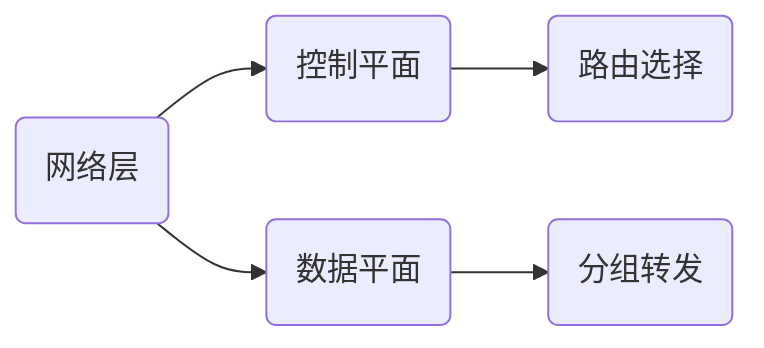

# 网络层

## 网络层的功能

1. 网络层提供主机到主机的通信服务，主要任务是将分组从源主机到经过多个网络和多段链路传输到目的主机

### 异构网络互连

1. 网络互连将两个以上的计算机网络，通过一定的方法用一些中继系统相互连接起来，以构成更大的网络系统
2. 根据所在的层次，中继系统分为以下几种：
   - 物理层中继系统：转发器，集线器
   - 数据链路层中继系统：网桥或交换机
   - 网络层中继系统：路由器
   - 网络层以上的中继系统：网关
3. TCP/IP在网络互连上采用的做法是在网络层采用标准化协议，但相连的网络可以是异构的
4. IP网络：使用IP协议的虚拟互联网络

### 路由与转发

1. 路由器主要完成两个功能：路由选择和分组转发
   - 路由选择：根据路由协议构造路由表，同时经常或定期地与相邻路由器交换信息，获取网络最新拓扑，动态更新维护路由表，以决定分组到达目的节点的最优路径
   - 分组转发：路由器根据转发表将分组从合适的端口转发出去

### 网络层提供的两种服务

1. 分组交换网提供的服务：
   - 面向连接的虚电路服务
   - 无连接的数据报服务
2. 虚电路
   - 当两台计算机进行通信时，应当先建立网络层的连接，即建立一条逻辑上的虚电路(VC)，连接一旦建立，就固定了虚电路对应的物理路径
   - 通信过程：虚电路建立$\rightarrow$数据传输$\rightarrow$虚电路释放
   - 每次建立虚电路时，将一个未用过的虚电路号VCID分配给该虚电路，以区别于本系统中的其他虚电路
   - 分组的首部仅在连接建立时使用完整的目的地址，之后每个分组的首部只需携带虚电路的编号即可
   - 在虚电路网络中的每个节点上都维持一张虚电路表，表中每项记录一个打开的虚电路信息，包括在接受链路和发送链路上的虚电路号、前一节点和下一节点的标识
   - 虚电路服务的特点：
     - 虚电路通信链路的建立和拆除需要时间开销，不利于交互式应用和少量的短分组情况
     - 虚电路的路由选择体现在连接建立阶段
     - 虚电路提供了可靠的通信功能，能保证每个分组正确有序到达。此外还能对两个端点的流量进行控制，当接收方来不及接收数据时，可以通知发送方暂缓发送
     - 当网络中的某个节点或某条链路出现故障而彻底失效时，所有经过该节点或该链路的虚电路将遭到破坏
     - 分组首部不包含目的地址，只包含虚电路号
3. 数据报
   - 源主机的高层协议将报文拆分成较小的数据段，并加上地址等控制信息后构成分组。中间节点短暂存储分组，找到最佳路由后，尽快转发每个分组
   - 数据报服务的特点：
     - 发送分组前不需要建立连接。发送方可随时发送分组，网络中的节点可随时接受分组
     - 网络尽最大努力交付，传输不保证可靠性，所以分组可能出错或丢失；网络为每个分组独立地选择路由，转发的路径可能不同，因此分组不一定按序到达目的节点
     - 发送的分组中要包括发送方和接收方的完整地址，以便可以独立传传输
     - 当分组在交换节点存储转发时，需要排队等候处理，这会带来一定的时延。当网络发生拥塞时，这种时延会大大增加，交换节点还可根据情况丢弃部分分组
     - 网络具有冗余路径，当某个交换节点或一条链路出现故障时，可相应地更新转发表，寻找另一条路径转发分组，对故障的适应能力强
     - 接收双方不独占某条链路，资源利用率高

### SDN的基本概念



1. 软件定义网络(SDN)采用集中式的控制平面和分布式的数据平面，两个平面相互分离，控制平面利用控制-数据接口对数据平面上的路由器进行集中式控制，方便软件来控制网络

2. 在网络的控制平面有一个逻辑上的远程控制器，掌握各主机和整个网络的状态，为每个分组计算出最佳路由，通过Openflow协议将转发表下发给路由器

3. 路由器的作用：收到分组、查找转发表、转发分组

4. SDN提供的接口：

   ```mermaid
   graph LR
   	A(SDN提供的接口)
   	A-->B(北向接口)-->C(上层开发者用于编程)
   	A-->D(南向接口)-->E(SDN控制器和转发设备建立双向会话)
   	A-->F(东西向接口)-->G(增强整个控制平面的可靠性和可拓展性)
   ```

5. SDN的问题：

   - 集中管理容易受到攻击，若崩溃，则整个网络受到影响
   - 随着网络规模扩大，控制器可能变成网络性能的瓶颈

### 拥塞控制

1. 拥塞：因出现过量的分组而引起网络性能下降的现象
2. 若随着网络负载的增加，网络的吞吐量明显小于正常的吞吐量，则网络可能进入轻度拥塞状态
3. 若网络的吞吐量随着网络负载的增加而下降，则网络就可能进入拥塞状态
4. 拥塞控制的方法：
   - 开环控制：静态方法，在设计网络时将有关发生拥塞的因素考虑周到，力求网络在工作时不产生拥塞
   - 闭环控制：动态方法，实现不考虑有关发生拥塞的各种因素，采用检测网络系统去监视，即使检测哪里发生拥塞，然后将拥塞信息传到合适的地方，以便调整网络系统的运行，并解决出现的问题

### 错题

1. 在路由器互联的多个局域网的结构中，要求每个局域网(  )

   A. 物理层协议可以不同，而数据链路层及以上的高层协议必须相同

   B. 物理层、数据链路层协议可以不同，但数据链路层以上的高层协议必须相同

   C. 物理层、数据链路层、网络层协议可以不同，但网络层以上的高层协议必须相同

   D. 物理层、数据链路层、网络层及高层协议都可以不同

## IPV4

### 分组


1. 一个IP分组由首部和数据部分组成，首部前一部分长度固定，共20B，是所有IP分组必须具有的
2. IPv4首部的部分重要字段含义：
   - 版本：4bit，指IP的版本，IPv4数据报中该字段的值是4
   - 首部长度：4bit，以4B为单位，最大可表示的首部长度为60B。最常用的首部长度是20B
   - 总长度：16bit，指首部和数据之和的长度，单位为B。以太网帧的最大传送单元MTU为1500B，因此当一个IP数据报封装成帧时，数据报的总长度不能超过下层数据链路层的MTU
   - 标识：16bit，是一个计时器，每产生一个数据报就+1，并赋值给标识字段，当一个数据报的长度超过网络的MTU时，必须分片，此时每个数据报片都复制一次标识号，以便能正确地重装成原来的数据报
   - 标志：3bit，/-DF-MF。MF=1表示后面还有分片，MF=0表示最后一个分片。DF=0表示允许分片
   - 片偏移：13bit，指出较长的数据报在分片后，某片在原数据报中的相对位置，片偏移以8B为偏移单位。除最后一个分片后，每个分片的长度一定是8B的整数倍
   - 生存时间：TTL，8bit，数据报在网络中可通过的路由器数的最大值，标识数据报在网络中的寿命，以确保数据报不会永远在网络中循环。路由器在转发数据报前，先将TTL-1，若TTL被减为零，则该数据报必须丢弃
   - 协议：8bit，指出该数据报携带的数据使用何种协议，即数据报的数据部分应交给哪个协议处理
   - 首部校验和：16bit，只检验数据报的首部，不包含数据部分
   - 源地址字段：32bit，标识发送方的IP地址
   - 目的地址字段：32bit，标识接收方的IP地址
3. IP数据报分片
   - 一个链路层数据帧能承受的最大数据量称为最大传送单元MTU
   - 当IP数据报的总长度大于MTU、时，就需要将IP数据报中的数据分装在多个较小的IP数据报中，这些较小的数据报称为片
   - 片在目的地的网络层被重新组装。目的主机使用IP首部中的标识、标志和片偏移字段来完成对片的重组
   - 当目的主机收到来自同一发送主机的一批数据报时，它可通过检查数据报的标识号来确定哪些数据报属于同一个原始数据报的片；只有当DF=0时，该IP数据报才能被分片；MF=1时，表示相应的原始数据报还有后续的片，当MF=0时，表示该数据报是原始数据报的最后一篇；目的主机在对片进行重组时，使用片偏移来确定片应放在原始IP数据报的哪个位置

### IPV4地址与NAT

1. IP地址是互联网上的每台主机或路由器的每个接口分配的一个在全球范围内唯一的32位标识符
   - A类：0xxxxxxx|……
   - B类：10xxxxxx|……
   - C类：110xxxxx|……
   - D类：1110xxxx|……
   - E类：1111xxxx|……
2. 无论哪类IP地址，都由网络号和主机号两部分组成，即IP地址::={<网络号>, <主机号>}
3. 特殊的IP地址：
   - 主机号全为0表示本网络
   - 主机号全为1表示本网络的广播地址
   - 127.x.x.x保留为环回自检地址，此地址表示任意主机本身，目的地址为环回地址的IP数据报永远不会出现在任何网络上
   - 0.0.0.0表示本网络上的本主机
   - 255.255.255.255，表示整个TCP/IP网络的广播地址，因为路由器对广播域的隔离，等效为本网络的广播地址
4. IP地址的特点：
   - 每个IP地址都有网络号和主机号两部分组成
   - IP地址是标志一台主机或路由器和一条链路的接口
   - 用转发器或桥接器连接的若干LAN仍然是同一网络，因此该LAN中所有主机的IP地址的网络号必须相同，但主机号必须不同
   - 在同一局域网上的主机或路由器接口的IP地址的网络号必须是相同的
5. 网络地址转换NAT：将专用网络地址转换为公用地址，从而对外隐藏内部管理的IP地址
6. 私有IP地址/可重用地址只能用于LAN，且可以被LAN重复利用
   - A类：10.0.0.0~10.255.255.255
   - B类：172.16.0.0~172.21.255.255
   - C类：192.168.0.0~192.168.255.255
7. 在互联网的所有路由器，对目的地址是私有IP的数据报一律不进行转发，这种采用私有IP地址的互联网络称为专用互联网或本地互联网
8. NAT路由器的工作原理：
   - 假设用户主机为10.0.0.1，端口3345像Web服务器128.119.40.186，端口80发送请求
   - NAT路由器收到IP分组后，为该IP分组生成一个新端口号5001，将IP分组的源地址改为138.76.29.7(路由器的地址)，生成一个新端口号5001.NAT路由器在NAT转换表中增加一个表项
   - Web服务器响应IP分组
   - 响应分组到达NAT路由器后，通过NAT转换表将IP分组的目的IP地址改为10.0.0.1，将目的端口号改为3345
9. 普通路由器仅工作在网络层，而NAT路由器转发数据报时需要查看和转换传输层的端口号

### 划分子网与路由聚合

1. 两级IP地址的缺点：

   - IP地址空间的利用率有时很低
   - 给每个物理网络分配一个网络号会使路由表变得很大，从而降低网络性能

2. 划分子网：将两级IP地址划分为三级IP地址，IP地址结构：IP::={<网络号>, <子网号>, <主机号>}

3. 划分子网基本思路：

   - 划分子网属于一个单位内部事情，单位对外仍表现为没有划分子网的一个网络
   - 划分子网的方法是从网络的主机号借用若干位作为子网号，主机号相应减少了相应位数
   - 路由器转发分组仍然根据IP数据报的目的网络号，本单位的路由器收到IP数据报后，再按目的网络号和子网号找到目的子网

   > 子网中的主机号全0和全1的地址不能被指派

4. 子网掩码可用来指明分类IP地址的主机号部分被借用了多少位作为子网号

5. 子网掩码是一个与IP地址相对应的、长32位的二进制串，由一串1和一串0组成。1对应IP地址中的网络号及子网号，而0对应主机号

6. 默认网关是子网与外部网络连接的设备，也就是连接本机或子网的路由器接口的IP地址、当主机发送数据时，根据所发送数据的目的IP地址，通过子网掩码来判断目的主机是否在子网中，如果在，则直接发送，否则将数据报发送到默认网关，由网关将其转发到其他网络，进一步寻找目的主机

7. 所有网络都必须使用子网掩码，若一个网络未划分子网，则使用默认子网掩码。A、B、C类地址的默认子网掩码分别为255.0.0.0、255.255.0.0、255.255.255.0

8. 使用子网掩码时：

   - 一台主机在设置IP地址信息的同时，必须设置子网掩码
   - 同属于一个子网的主机及路由器的相应端口，必须设置相同的子网掩码
   - 路由器的路由表所包含的信息主要内容有目的网络地址、子网掩码、下一跳地址

9. 无分类编址CIDR

   - 无分类域间路由选择CIDR是在变长子网掩码的基础上，提出的一种消除传统A、B、C类地址及划分子网的概念
   - CIDR使用网络前缀的概念代替网络的概念，与传统分类IP最大的区别是网络前缀的位数不是固定的，可以任意选取，记法为：IP地址::={<网络前缀>, <主机号>}
   - CIDR还是用斜线记法/CIDR记法，即记为“IP地址/网络前缀所占的位数”
   - CIDR将网络前缀都相同的连续IP地址组成一个CIDR地址块，只要知道CIDR地址块中的任一个地址，就能知道这个地址的最小地址和最大地址，以及地址块中的地址数
   - CIDR地址块中的地址数一定是2^N^，实际可指派的地址数为2^N^-2

10. 路由聚合

    - 因为CIDR地址块中的有很多地址，所以在路由表中就可利用CIDR地址块来查找目的网络，路由表中的一个项目就可以表示多个原来传统分类地址的路由，有利于减少路由器之间的信息交换，提高网络性能
    - 最长前缀匹配：使用CIDR时，路由表中的个项中由“网络前缀”和“下一跳地址组成”。在查找路由表时可能会得到不止一个匹配结果。此时应当从匹配结果中选择具有最长网络前缀的路由

11. 子网划分：通常有两类划分子网的方法：定长的子网掩码、变长的子网掩码

    - 采用定长的子网掩码划分子网时，所划分的每个子网使用相同的子网掩码，每个子网所分配的IP地址数量也相同，因此容易造成地址资源的浪费
    - 采用变长的子网掩码划分子网时，所划分的每个子网使用不同的子网掩码，每个子网所分配的IP地址数量可以不同，可以减少对地址资源的浪费

### 网络层转发分组的过程

1. 分组转发都是基于目的主机所在网络，当分组到达路由器后，路由器根据目的IP地址的网络前缀来查找转发表，确定下一跳。采用CIDR编址时，若一个分组在转发表中可以找到多个匹配的前缀，则应当使用最长前缀匹配
2. 路由表中可以增加两种特殊的路由：
   - 特定主机路由：对特定目的主机的IP地址专门指明一个路由，以方便管理员控制可测试网络
   - 默认路由：用特殊前缀0.0.0.0/0表示。只要目的网络是其他网络，就一律选择默认路由，通常用于路由器到互联网的路由
3. 分组转发过程：
   1. 从收到的IP分组首部提取目的主机的IP地址D
   2. 若查找到特定主机路由，则按照这条路由对应的下一跳转发分组；否则从转发表中的下一条开始检查
   3. 将这一行的子网掩码与目的地址D逐位与。若运算结果与本行的前缀匹配，则查找结束，按照下一跳指出的进行处理；若不匹配，则继续查找
   4. 若路由表中无匹配项且有一个默认路由，则把分组传送给默认路由；否则报告转发分组出错

### 地址解析协议ARP

1. IP地址放在IP数据报的首部，而MAC地址放在MAC帧的首部。把IP数据报封装成MAC帧后，数据链路层看不到IP数据报中的IP地址
2. 地址解析协议：完成IP地址到MAC地址的映射
3. 每台主机都设有一个ARP高速缓存，用来存放本局域网上各主机和路由器的IP地址到MAC地址的映射表，称为ARP表
4. 工作原理
   - 主机A欲向本局域网上的某台主机B发送IP数据报时，先在其ARP高速缓存中查看有无主机B的IP地址
   - 若有，则可以查出其对应的硬件地址，再将此硬件地址写入MAC帧，然后通过局域网将该MAC帧发往此硬件地址
   - 若没有，则通过使用目的MAC地址FF-FF-FF-FF-FF-FF的帧来封装并广播ARP请求分组，使同一局域网里的所有主机都收到此ARP请求
   - 主机B收到该ARP请求后，向主机A发送ARP相应分组，分组包含B的IP地址与MAC地址的映射关系
   - 主机A收到ARP响应分组后将此映射写入ARP缓存，然后按查询到的硬件地址发送MAC帧

### 动态主机配置协议DHCP

1. DHCP常用于给主机动态地分配IP地址，提供了即插即用的联网机制

2. 工作步骤：

   |   发送方   | 消息类型 |   源地址   |    目的地址     |
   | :--------: | :------: | :--------: | :-------------: |
   |  DHCP客户  | DHCP发现 |  0.0.0.0   | 255.255.255.255 |
   | DHCP服务器 | DHCP提供 | 服务器地址 | 255.255.255.255 |
   |  DHCP客户  | DHCP请求 |  0.0.0.0   | 255.255.255.255 |
   | DHCP服务器 | DHCP确认 | 服务器地址 | 255.255.255.255 |

3. 租用期：DHCP服务器分配给DHCP客户的IP地址是临时的，因此DHCP客户只能在一段有限的时间内使用这个IP地址，这段时间被称为租用期

### 网络控制报文协议ICMP

1. ICMP让主机或路由器报告差错和异常情况
2. ICMP报文有两种：ICMP差错报告报文和ICMP询问报文
   - ICMP差错报文通常用于目标主机或到目标主机路径上的路由器，向源主机报告差错和异常情况
     - 终点不可达：路由器或主机不能交付数据报
     - 源点抑制：路由器或主机因为拥塞而丢弃数据报
     - 时间超过：路由器收到生存时间为零的数据报或者终点在预先规定时间内未收到全部数据报
     - 参数问题：路由器或目的主机收到的数据报首部中有字段值不正确
     - 改变路由：路由器把改变路由报文发送给主机，让主机下次将数据报发送给另外的路由器
   - 以下情况不发送ICMP差错报文
     - 发送的报文为ICMP差错报文
     - 对第一个分片的数据报片的所有后续数据报片
     - 对具有多播地址的数据报
     - 对具有特殊地址的数据报

## IPV6

### 特点

1. IPv6首部是固定的，其选项放在有效载荷中，选项是灵活可变的；而IPv4所规定的选项是固定不变的，且放在首部的可变部分中
2. 支持即插即用，不需要使用DHCP
3. IPv6只有源主机能分片，是端到端的，不允许类似IPv4传输路径中的路由分片
4. IPv6首部长度是固定的40B，而IPv4首部长度是可变的

### 基本首部


1. IPv6数据报由两部分组成：基本首部和有效载荷。有效载荷由零个或多个扩展首部及其后面的数据部分组成
2. IPv6基本首部各字段含义：
   - 版本：4bit，指明协议的版本，对于IPv6该字段是6
   - 通信量类：8bit，用来区分不同IPv6数据报的类别或优先级
   - 流标号：20bit。流是指互联网上从指定源点到指定终点的一系列数据报，而在这个流所经过的路径上的路由器都保证知名的服务质量。所有属于同一个流的数据报都具有相同的流标号
   - 有效载荷长度：16bit，指明IPv6数据报除基本首部外的字节数
   - 下一个首部：8bit，相当于IPv4首部中的协议字段或可选字段。当没有扩展首部时，指明数据报中数据对应的协议；当有扩展首部时，表示第一个扩展首部的类型
   - 跳数限制：8bit，类似于IPv4的TTL
   - 源地址和目的地址：各128bit，数据报的发送端/接收端的IP地址

### 地址

1. IPv6数据报的目的地址有三种类型：

   - 单播：传统的点对点通信
   - 多播：一对多的通信
   - 任播：终点是一组计算机，但数据报只交付给其中的一台计算机

2. IPv6标准使用冒号十六进制记法

   - 地址中每4位用一个十六进制数表示，并用冒号分隔每16位。例如：`4BF5:0000:0000:0000:BA5F:039A:005A:0217`
   - 当16位域的开头有一些0时，可以采用缩写表示法，但在域中必须至少有一个数字。例如：`4BF5:0:0:0:BA5F:39A:5A:217`
   - 当有连续的0值域时，可以用双冒号缩写，但是双冒号只能出现一次。例如：`4BF5::BA5F:39A:5A:217`

3. IPv6地址的分类：

   |     地址类型     |            二进制前缀             |
   | :--------------: | :-------------------------------: |
   |    未指明地址    |   00...00(128位)，可记为::/128    |
   |     环回地址     |   00...01(128位)，可记为::1/128   |
   |     多播地址     |   11111111(8位)，可记为FF00::/8   |
   | 本地链路单播地址 | 1111111010(10位)，可记为FE80::/10 |
   |   全球单播地址   |   除上述四种地址以外的所有地址    |

### 从IPV4到IPV6的过渡

1. 双协议栈：一台设备同时装有IPv4和IPv6两个协议栈，分别配置一个IPv4和IPv6地址
2. 隧道技术：在IPv6数据报要进入IPv4网络时，要把整个IPv6数据报封装成IPv4数据报的数据部分

### 错题

1. 若一个路由器收到IPv6数据报因为太大而不能转发到链路上，则路由器将该数据报(  )

   A. 丢弃

   B. 暂存

   C. 分片

   D. 转发至能支持该数据报的链路上

## 路由算法与路由协议

### 路由算法

1. 静态路由和动态路由
   - 静态路由算法：由管理员手工配置每一条路由
     - 优点：简单，开销较小
     - 缺点：不能及时适应网络状态的变化
     - 适用性：简单的小型网络
   - 动态路由算法：根据网络流量负载和拓扑结构的变化来动态调整自身的路由表
     - 优点：能较好的适应网络状态的变化
     - 缺点：实现复杂，开销较大
     - 适用性：较复杂的大网络
     - 两类算法：距离-向量路由算法和链路状态路由算法
2. 距离-向量路由算法
   - 基本原理：假设d~x~(y)表示从结点x到结点y的带权最短路径的费用，则有d~x~(y)=min{c(x, v) + d~v~(y)}，其中v是x的邻居
   - 每个结点x维护的路由信息：
     - 从x到每个直接相连邻居v的链路费用c(x, v)
     - 结点x的距离向量，即x到网络中其他结点的费用。这是一组距离，因此称为距离向量
     - 它收到的每个邻居的距离向量，即x的每个邻居到网络中其他结点的费用
   - 每个节点定期地向它的每个邻居发送它的距离向量，然后使用计算公式更新自己的距离向量。若结点x的距离向量因这个更新步骤而改变，则结点x接下来继续向它的每个邻居发送更新后的距离向量
   - 更新报文的大小与网中的结点数量成正比，大型网络将导致很大的更新报文
3. 链路状态路由算法
   - 链路状态指本路由器都和哪些路由器相连，以及相应链路的代价
   - 链路状态算法要求每个结点都有全网拓扑结构图
     - 主动测试所有相邻结点的状态
     - 定期地将链路状态传播给其他所有结点
   - 一个结点的链路状态只涉及相邻节点的联通状态，而与整个互联网的规模无关，因此链路状态算法适用于大型的或路由信息变化聚敛的互联网环境
4. 两种路由算法的比较：
   - 距离-向量算法中，每个结点仅与它的直接邻居交谈，向它的邻居发送自己的路由表，其大小取决于网络中的结点数目，代价较大
   - 链路状态算法中，每个节点通过广播的方式与其他结点交谈，但它只告知与它直接相连的链路的费用

### 分层次的路由选择协议

1. 把整个互联网划分为许多较小的自治系统(AS)。自治系统是在单一技术管理下的一组服务器，这些路由器使用一种AS内部的路由选择协议和共同的度量
2. 一个AS对其他AS表现出的是一个单一的和一致的路由选择策略
3. 路由选择协议：
   - 内部网关协议IGP
     - 在一个自治系统内部使用的路由选择协议，它与在互联网中的其他自治系统选用协议无关
     - 常用协议：RIP、OSPF
   - 外部网关协议EGP
     - 若源主机和目的主机处在不同的自治系统中，则当数据报传到一个自治系统的边界时，就需要使用一种协议将路由选择信息传递到另一个自治系统中。这样的协议就是外部网关协议
     - 常用协议：BGP-4

### 路由信息协议RIP

1. RIP是一种分布式的基于距离向量的路由选择协议

2. RIP的规定

   - 网络中的每个路由器都要维护从它本身到其他每个目的网络的距离记录，即距离向量
   - RIP使用跳数来衡量到达目的网络的距离
   - RIP认为好的路由是距离短或跳数少
   - RIP允许一条路径最多只能包含15各路由器
   - 每个路由表项都有三个关键字段：<目的网络N， 距离d， 下一跳路由器地址X>

3. RIP的每个路由器都要不断和其他路由器交换信息

   - 仅和直接相邻的路由器交换信息
   - 交换的信息是本路由器的路由表
   - 按固定的时间间隔交换路由信息。当网络拓扑发生变化时，路由器也及时向相邻路由器通告拓扑变化后的路由信息

4. 经过若干次交换和更新后，所有的路由器都知道本自治系统内任何网络的最短距离和下一跳路由器的地址，称为收敛

5. RIP是应用层协议，使用UDP传送数据。RIP选择的路径不一定时间最短，但跳数一定最少

6. RIP距离-向量算法

   1. 对地址为X的相邻路由器发来的RIP报文，先修改此报文中所有下一跳地址为X，距离全+1

   2. 对修改后的RIP报文中的每个项目，执行步骤：

      ```c++
      if (原来路由表中没有目的网络N)
          将项目添加到路由表
      else if (原来路由表中有目的网络N，且下一跳地址是X)
          用收到的项目替换原来路由表中的项目
      else if (原来路由表中有目的网络N，下一跳地址不是X，且收到的距离d小于源路由表中的距离)
          用收到的项目替换原来路由表中的项目
      else
          pass
      ```

   3. 若180s还没有收到相邻路由器的更新路由表，则把该路由器记为不可达路由器

7. 优点：

   - 实现简单、开销小、收敛过程较快
   - 若一个路由器发现了更短的路由，则这种更新信息在短时间内能传到所有路由器

8. 缺点：

   - RIP限制了网络的规模，它能使用的最大距离为15
   - 路由器之间交换的是路由器中的完整路由表，因此网络规模越大，开销越大
   - 当网络出现故障，路由器之间需要反复多次交换信息才能完成收敛，出现慢收敛现象

### 开放最短路径优先协议OSPF

1. OSPF与RIP的主要区别：

   - OSPF向本自治系统中所有路由器发送信息，使用的方法是洪泛法；RIP仅向相邻路由器发送信息

   - 发送的信息是与本路由器相邻的所有路由器的链路状态；RIP发送的信息是整个路由表

   - 只有当链路状态发生变化时，路由器才能洪泛向所有路由器发送此信息，并且更新过程收敛很快；RIP不管网络拓扑是否变化，定时交换信息

   - OSPF是网络层协议，不使用UDP或TCP，而直接用IP数据报传送；RIP是应用层协议，在传输层使用UDP

2. OSPF的特点：

   - OSPF允许对每条路由设置成不同的代价，对于不同类型的业务可以计算出不同的路由
   - 若到同一个目的网络有多条相同代价的路径，则可将通信量分配给这几条路径
   - OSPF分组具有鉴别功能，从而保证仅在可信赖的路由器之间交换链路状态信息
   - OSPF支持可变长度子网划分和CIDR
   - 每条链路都带上一个32位的序号，序号越大，状态就越新

3. 工作原理：各路由器之间频繁交换链路状态信息，最终建立一个全网的拓扑结构图，然后每个路由器利用Dijkstra算法计算出到达各目的网络的最优路径，构造出自己的路由表

4. OSPF可将一个自治系统在划分为若干更小的范围，称为区域。好处是将利用洪泛法交换链路状态信息的范围局限在每个区域，减少了整个网络上的通信量

5. OSPF分组类型：

   ```mermaid
   graph LR
   	A(分组类型)
   	A-->B(问候分组)-->C(用来发现和维持邻站的可达性)
   	A-->D(数据库描述分组)-->E(向邻站给出自己的链路状态数据库中的所有链路状态项目的信息)
   	A-->F(链路状态请求分组)-->G(向对方请求发送某些链路状态项目的详细信息)
   	A-->H(链路状态更新分组)-->I(用洪泛法对全网更新链路状态)
   	A-->J(链路状态确认分组)-->K(对链路更新分组的确认)
   ```

   两个相邻路由器通常每隔10s交换一次问候分组；若有40s没有收到某相邻路由器发来的问候分组，应立即修改链路状态数据库，并重新计算路由表

6. 在网络运行的过程中，只要一个路由器的状态发生变化，该路由器就要使用链路状态更新分组，用洪泛法向全网更新链路状态，其他路由器收到更新分组后要发送确认

### 边界网关协议BGP

1. BGP是不同自治系统AS的路由器之间交换路由信息的协议，是一种外部网关协议

2. BGP只能力求寻找一条能够到达目的网络且比较好的路由，而非寻找最佳路由

3. BGP采用的是路径向量路由选择协议，属于应用层协议，基于TCP

4. 工作原理：

   - 配置BGP时，每个AS的管理员要选择至少一个路由器作为该AS的“BGP发言人”，往往是边界路由器
   - 一个BGP发言人与其他AS中的BGP发言人要交换路由信息，就要先建立TCP连接，然后在此连接上交换BGP报文以建立BGP会话，再利用BGP会话交换路由信息。使用TCP连接交换路由信息的两个BGP发言人彼此称为对方的邻站。每个BGP发言人除了必须运行BGP外，还要运行该AS所用的内部网关协议
   - BGP所交换的网络可达性的信息，就是要达到某个网络所要经过的一系列自治系统。当BGP发言人互相交换网络可达性信息后，各BGP发言人就要根据所用的策略从收到的路由信息中找出到达个自治系统的较好路由

5. 特点

   - BGP交换路由信息的结点数量是AS的个数
   - BGP支持CIDR，因此路由表中也就应当包含当前目的网络前缀、下一跳路由器以及到达该网络要经过的各个自治系统序列
   - 当BGP刚运行时，BGP的邻站交换整个BGP路由表，以后只需要在发生变化时更新有变化的部分

6. BGP-4的四种报文

   ```mermaid
   graph LR
   	A(报文类型)
   	A-->B(打开报文)-->C(用来与相邻的另一个BGP发言人建立联系，初始化通信)
   	A-->D(更新报文)-->E(用来通知某一路由的信息，以及列出要撤销的多条路由)
   	A-->F(保活报文)-->G(用来周期性地证实邻站的连通性)
   	A-->H(通知报文)-->I(用来发送检测到的差错)
   ```

7. RIP、OSPF和BGP的对比

   |   协议   |      RIP       |         OSPF         |                  BGP                   |
   | :------: | :------------: | :------------------: | :------------------------------------: |
   |   类型   |      内部      |         内部         |                  外部                  |
   | 路由算法 |   距离-向量    |       两路状态       |                路径向量                |
   | 传递协议 |      UDP       |          IP          |                  TCP                   |
   | 路径选择 |    跳数最少    |       代价最低       |              较好，非最佳              |
   | 交换节点 | 和相邻的路由器 |      所有路由器      |             和相邻的路由器             |
   | 交换内容 |   整个路由表   | 与自己相连的链路状态 | 首次：整个路由表<br />其余：有变化部分 |

## IP多播

### 概念

1. 多播：让源主机一次发送的单个分组可以抵达用一个组地址标识的若干目的主机，即一对多的通信
2. IP多播：互联网上进行的多播
3. 多播需要路由器的支持才能实现，能够运行多播协议的路由器称为多播路由器

### IP多播地址

1. 多播数据报的源地址是源主机的IP地址，目的地址是IP多播地址。IP多播地址是IPv4中的D类地址
2. 多播数据报和一般IP数据报的区别：前者是用D类IP地址作为目的地址，且使用的是IGMP协议
3. 多播特点：
   - 多播数据报不提供可靠交付
   - 多播地址只能用于目的地址，而不能用于源地址
   - 对多播数据报不产生ICMP差错报文
4. IP多播的分类：
   - 在本局域网上进行的硬件多播
   - 在互联网上进行的多播
5. 多播机制仅用于UDP，它能将报文同时发送给多个接收者

### 在局域网上进行硬件多播

1. 因为局域网支持硬件多播，所以只要把IP多播地址映射成多播MAC地址，即可将IP多播数据报封装在局域网的MAC帧中，而MAC帧首部的目的MAC地址字段就设置为由IP多播地址映射成的多播MAC地址

2. 映射关系：

   

   - IP地址固定部分为：1110
   - MAC地址固定部分为：00000001-00000000-01011110-0

3. 因为多播IP地址与以太网MAC地址的映射关系不是唯一的，所以收到多播数据报的主机还要在IP层利用软件进行过滤

### IGMP与多播路由协议

1. IGMP是让连接到本地局域网上的多播路由器，知道本局域网上是由有主机参加或退出了某个多播组
2. IGMP的工作阶段：
   - 当某台主机加入新的多播组时，该主机应向多播组的多播地址发送一个IGMP报文。本地的多播路由器收到IGMP报文后，还要利用多播路由选择协议把这种组成员关系转发给互联网上其他的多播路由器
   - 组成员关系是动态地。本地多播路由器要周期性探询本地局域网上的主机，以便知道这些主机的组成员关系。只要有一台主机响应，路由器就认为这个组是活跃的。但一个组经过若干次探询后仍没有收到响应，路由器就认为本网络上的主机均不是组成员，因此就不再把这个组的成员关系转发给其他的多播路由器

## 移动IP

### 概念

1. 移动IP技术：移动站以固定IP地址实现跨越不同网络的漫游功能，并保证基于IP的网络权限在漫游过程中不发生任何改变
2. 移动IP定义的三种功能实体：
   - 移动结点：具有永久IP地址的移动主机
   - 本地代理：通常就是连接在归属网络上的路由器
   - 外地代理：通常就是连接在被访网络上的路由器

### 通信过程

1. 在移动IP中，每个移动站都有一个原始地址，即永久地址，移动站原始连接的网络称为归属网络。永久地址和归属网络的关联是不变的。归属代理通常是连接在归属网络上的路由器。

2. 当移动站移动到另一个地点，所接入的外地网络被称为被访网络。被访网络中使用的代理称为外地代理。外地代理的功能：

   - 要为移动站创建一个临时地址，称为转交地址
   - 及时把移动站的转交地址告诉其归属代理

   > 转交地址是供移动站、归属代理和外地代理使用的。外地代理要向移动站发送IP分组时，直接使用移动站的MAC地址

3. B向移动站A通信的流程：
   - 移动站A在归属网络时，按传统的TCP/IP方式进行通信
   - 移动站A漫游到被访网络时，向外地代理登记，以获得一个临时的转交地址。外地代理要向A的归属代理登记A的转交地址
   - 归属代理知道A的转交地址后，会构建一条通向转交地址的隧道，将截获的发送给A的IP分组进行封装，并通过隧道发送给被访网络的外地代理
   - 外地代理将收到的IP分组进行拆封，恢复成原始的IP分组，然后发送给A
   - A在被访网络对外发送IP分组时，仍然使用自己的永久地址作为IP分组的源地址，此时直接通过外部代理转发
   - A移动到另一个被访网络时，在新外地代理登记后，新外地代理将A的新转交地址告诉其归属代理
   - A回到归属网络时，向归属代理注销转交地址

### 错题

1. 一台主机移动到另一个LAN中，若一个分组到达了它原来所在的LAN中，则分组会被转发给(  )

   A. 移动IP的本地代理

   B. 移动IP的外部代理

   C. 主机

   D. 丢弃

## 网络层设备

### 冲突域和广播域

1. 冲突域：连接到同一物理介质上的所有节点的集合，这些节点之间会出现介质争用的现象
2. 广播域：接收同样广播消息的结点集合

### 路由器的组成和功能

1. 路由器是一种具有多个输入/输出端口的专用计算机，其任务是连接不同的网络并完成分组转发

2. 当源主机向目的主机发送数据报时，路由器先检查源主机和目的主机是否连接在同一个网络上。若在，则直接交付无须路由器；若不在，则路由器按照转发表指出下一跳路由

3. 若一个存储转发设备实现了某个层次的功能，则它可以互联两个在该层次上使用不同协议的网段

4. 路由器主要由路由选择和分组转发两部分组成：

   - 路由选择部分/控制部分：核心构件是路由选择处理机，其任务是根据选定的路由选择协议构造路由表，同时定期更新维护路由表

   - 分组转发：由交换结构、输入端口、输出端口三部分组成

     交换结构也称为交换组织，作用是根据转发表对分组进行处理，将某个输入端口进入的分组从一个合适的输出端口转发出去

### 路由表与分组转发

1. 标准的路由表组成：目的网络IP地址-子网掩码-下一跳IP地址-接口
2. 在转发表中，为了减少转发表的重复项目，可以使用一个默认路由代替所有具有相同“下一跳”的项目，并为默认路由设置较低优先级
3. 路由表总是用软件实现的；转发表可以用软件实现，也可以用硬件实现

### 错题

1. 一个路由器的路由表通常包含(  )

   A. 达到所有主机的完整路径信息

   B. 所有到达目的网络的完整路径信息

   C. 到达目的网络的下一跳路径信息

   D. 到达所有主机的下一跳路径信息

2. 在路由表中设置一条默认路由，则其目的网络和子网掩码应分别置为(  )

   A. 192.168.1.1 255.255.255.0

   B. 127.0.0.0 255.0.0.0

   C. 0.0.0.0 0.0.0.0

   D. 0.0.0.0 255.255.255.255

3. 路由器转发分组(在路由表中已找到匹配的条目)时，会根据路由表中的(  )字段来确定输出端口

   A. 目的网络地址

   B. 下一跳地址

   C. 距离度量值

   D. 接口标识符