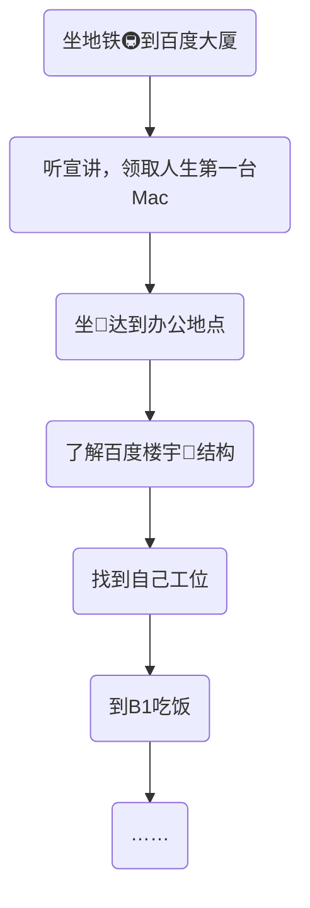

# 百度实习第一天

今天入职百度了，记录一下今天的流程

```mermaid
graph TB
    A(坐地铁🚇到百度大厦)
    B(听宣讲，领取人生第一台Mac)
    C(坐🚌达到办公地点)
    D(了解百度楼宇🏢结构)
    E(找到自己工位)
    F(到B1吃饭)
    G(……)
    A --> B --> C --> D --> E --> F --> G
```

今天没有学习太多东西，主要学习内容如下：
- 了解新人培养要求
- 了解一些内部文档（内容不便透露哦）