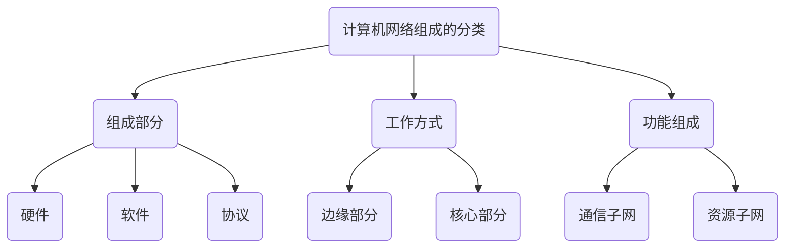
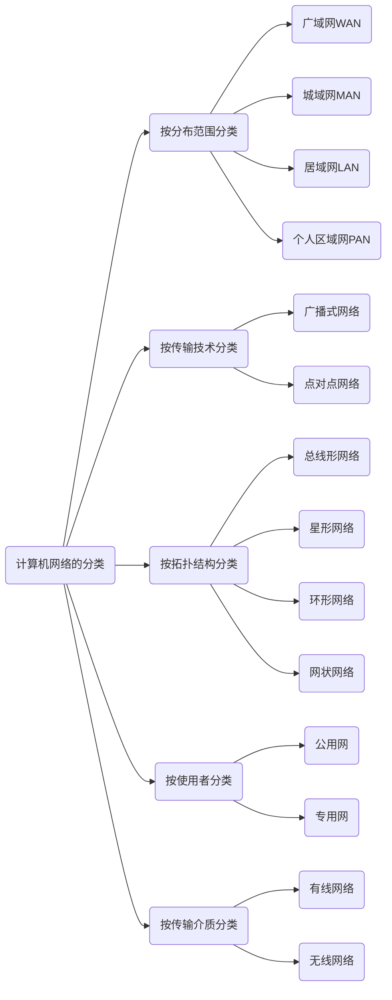

# 计算机网络体系结构

## 计算机网络概述

### 计算机网络的概念

1. 计算机网络由若干结点和连接这些结点的链路组成
2. 网络之间通过路由器互连，构成一个覆盖范围更广的计算机网络

### 计算机网络的组成



### 计算机网络的功能

1. 数据通信：最基本最重要的功能
2. 资源共享
3. 分布式处理：当计算机网络中某个计算机负载过重时，可将其处理的某个复杂任务分配给网络中的其他计算机系统，从而提高整个系统的利用率
4. 提高可靠性：计算机网络中的各台计算机可以通过网络互为替代机
5. 负载均衡：将工作任务均衡地分配给计算机网络中的各台计算机

### 电路交换、报文交换与分组交换

1. 电路交换

   ```mermaid
   graph LR
   	A(连接建立)-->B(数据传输)-->C(连接释放)
   ```

   - 优点：
     - 通信时延小：线路专用，数据直达
     - 有序传输：双方通信按发送顺序传送数据，不存在失序问题
     - 没有冲突：不同的通信双方拥有不同的信道
     - 适用范围广：既适用于传输模拟信号，又适用于传输数字信号
     - 实时性强：通路一旦建立，即可实时通信
     - 控制简单
   - 缺点：
     - 建立连接时间长
     - 线路利用率低
     - 灵活性差
     - 难以规格化
     - 难以实现差错控制

2. 报文交换

   - 数据交换的单位是报文，用户数据加上源地址、目的地址等信息后，封装成报文
   - 报文交换采用存储转发技术，整个报文先传送至相邻的结点，全部存储后查找转发表，转发到下一结点，重复操作，直到到达目的结点
   - 优点：
     - 无需建立连接
     - 动态分配线路
     - 线路可靠性高
     - 线路利用率高
     - 提供多目标服务
   - 缺点：
     - 转发时延高：交换结点接受完整报文后才转发给下一结点
     - 缓存开销大
     - 错误处理低效

3. 分组交换

   - 源结点在发送之前，先把较长的报文划分成若干个较小的等长数据段，在每个数据段前面添加一些由必要控制信息组成的首部，构成分组
   - 源结点将分组发送到分组交换网中，分组交换机接收到一个分组后，先将其缓存，然后从首部提取目的地址并查找转发表，将分组转发给下一个分组交换机……并最终到达目的结点
   - 优点：
     - 无建立时延
     - 线路利用率高
     - 简化了存储管理
     - 加速传输
     - 减少了出错概率和重发数据量
   - 缺点：
     - 存在存储转发时延
     - 需要传输额外的信息量
     - 可能出现失序、丢失或重复分组的情况

### 计算机网络的分类




### 计算机网络的性能指标

1. 速率：指连接到网络上的结点在数字信道上传送数据的速率，也称数据传输速率/数据传输率/数据率/比特率，单位为：b/s或bit/s
2. 带宽：表示网络的通信线路所能传送数据的能力，是数字信道所能传送到的最大数据传输速率，单位是bit/s
3. 吞吐量：指单位时间内通过某个网络的实际数据量
4. 时延：指数据从网络的一端传送到另一端所需要的总时间，总时延=发送时延+传播时延+处理时延+排队时延
   - 发送时延：结点将分组的所有比特推向链路所需要的时间；发送时延=分组长度/发送速率
   - 传播时延：一个比特从链路的一段传播到另一端所需的时间；传播时延=信道长度/电磁波传播速率
   - 处理时延：数据在交换结点为存储转发而进行的一些必要处理所花的时间
   - 排队时延：分组在进入路由器后要现在输入队列中排队等待处理；路由器确定转发端口后，还要在输出队列中排队等待转发
5. 时延带宽积：指发送端发送的第一个比特即将到达终点时，发送端已发出了多少比特；时延带宽积=传播时延$\times$信道带宽
6. 往返时延RTT：指从发送端发出一个短分组，到发送端收到来自接收端的确认共经历的时延
7. 信道利用率：指某个信道有数据通过的时间占比；信道利用率=有数据通过的时间/总时间

### 错题

1. 计算机网络可分为通信子网和资源子网。下列属于通信子网的是(  )

   A. 网桥、交换机、路由器

   B. 交换机、计算机软件、路由器

   C. 网桥、计算机软件、路由器

   D. 网桥、交换机、计算机软件

2. 分组交换对报文交换的主要改进是传输单位更小且有固定的最大长度，这种改进产生的直接结果是(  )

   A. 降低了误码率

   B. 提高了数据传输速率

   C. 减少了传输时延

   D. 增加了传输时延

3. 计算机网络拓扑结构主要取决于它的(  )

   A. 资源子网

   B. 路由器

   C. 通信子网

   D. 交换机

## 计算机网络体系结构与参考模型

### 计算机网络分层协议

1. 网络的体系结构：计算机网络的各层及其协议的集合
2. 在计算机网络分层结构中，第n层中的活动元素通常称为第n层实体
3. 不同机器上的同一层称为对等层，同一层的实体称为对等实体
4. 对等层之间传递的数据单位称为该层的协议数据单元(PDU)，第n层的PDU记为n-PDU。各层PDU都分为数据和控制信息两部分
5. 为完成用户所需要的功能而传送的数据称为服务数据单元SDU，第n层的SDU记为n-SDU
6. 控制协议操作的信息称为协议控制信息PCI，第n层的PCI记为n-PCI
7. 当在各层之间传输数据时，将(n+1)-PDU作为n-SDU，加上n-PCI，就封装成了n-PDU/(n-1)-SDU

### 计算机网络协议、接口、服务的概念

1. 协议

   - 为了在网络中进行数据交换而建立的规则、标准或约定称为网络协议，是控制在对等实体之间进行通信的规则的集合
   - 协议的组成：

   ```mermaid
   graph LR
   	A(协议)
   	A-->B(语法)-->E(数据与控制信息的格式)
   	A-->C(语义)-->F(需要发出何种控制信息、完成何种动作及做出何种应答)
   	A-->D(同步)-->G(执行各种操作的条件、时序关系等，及时间实现顺序的详细说明)
   ```

2. 接口：同一结点内相邻两层的实体交换信息的逻辑接口称为服务访问点。每层只能为紧邻的层定义接口，不能跨层定义接口

3. 服务：下层为紧邻的上层提供的功能调用。当上层使用下层提供的服务时，必须与下层交换一些命令，这些命令称为服务原语：

   - 请求：由服务用户发往服务提供者，请求完成某项工作
   - 指示：由服务提供者发往服务用户，指示用户完成某件事情
   - 响应：由服务用户发往服务提供者，作为对指示的响应
   - 证实：由服务提供者发往服务用户，作为对请求的证实

4. 计算机网络提供的服务有以下几类：

   - 面向连接服务和无连接服务
     - 在面向连接服务中，铜锌铅双方必须先建立连接，分配相应的资源，以保证通信能正常进行，传输结束后释放连接和占用的资源
     - 在无连接服务中，通信双方不需要先建立连接，需要发送数据时直接发送，将每个带有目的地址的包传送到线路上，由系统选定路线进行传输
   - 可靠服务和不可靠服务
     - 可靠服务是指网络具有纠错、检错、应答机制，能保证数据正确、可靠地被传送到目的地
     - 不可靠服务是指网络只是尽量让数据正确、可靠地传送到目的地，是一种尽力而为的服务
   - 有应答服务和无应答服务
     - 有应答服务是指接收方在收到数据后向发送方给出相应的应答，该应答由传输系统内部自动实现，而不由用户实现
     - 无应答服务是指接收方收到数据后不自动给出应答

### ISO/OSI参考模型和TCP/IP模型

1. OSI参考模型有七层，自下而上依次为物理层、数据链路层、网络层、传输层、会话层、表示层、应用层。低三层称为通信子网，完成数据的传输等功能；高三层称为资源子网，完成数据的处理等功能
   - 物理层：传输单位是比特，功能是物理介质上为数据段设备透明地传输原始比特流。物理层主要定义数据终端设备DTE和数据通信设备DCE的物理与逻辑连接方法
   - 数据链路层：传输单位是帧。将网络层传来的IP分组封装成帧，并且可靠地传输到相邻结点的网络层。主要作用是加强物理层传输原始比特流的功能，将物理层提供的可能出错的物理连接改造成逻辑上无差错的数据链路，使之对网络层表现为一条无差错的链路
   - 网络层：传输单位是数据报。将网络层的协议数据单元从源结点传输到目的结点，为分组交换网上的不同主机提供分组服务。需要实现流量控制、拥塞控制、差错控制和网际互连等功能
   - 传输层：负责主机中两个进程之间的通信，功能是为端到端的连接提供可靠的传输服务，即为端到端连接提供流量控制、差错控制、服务质量、数据传输管理等服务。因为一台主机可同时运行多个进程，所以传输层具有复用和分用的功能。复用是指多个应用层进程可同时使用下层传输层的服务，分用是指传输层将收到的信息分别交付给上层应用层中相应的进程
   - 会话层：允许不同主机各个进程之间进行会话。主要为表示层实体或用户进程建立连接，并在连接上有序地传输数据，这就是会话/建立同步。会话层负责管理主机间的会化进程，包括建立、管理和终止进程间的会话。
   - 表示层：主要处理在两个通信系统中交换信息的表示方式
   - 应用层：OSI参考模型的最高层，是用户与网络的接口
2. TCP/IP模型从低到高依次为网络接口层、网际层、传输层和应用层
   - 网络接口层：类似OSI参考模型的物理层和数据链路层。作用是从主机或结点接收IP分组，并将它们发送到指定的物理网络上
   - 网际层：类似于OSI参考模型的网络层。将分组发往任何网络，并为其独立地选择合适的路由，但不保证各个分组有序地到达，各个分组的有序和可靠交付给高层负责
   - 传输层：类似于OSI参考模型的传输层。主要使用以下两种协议：
     - 传输控制协议TCP：是面向连接的，传输数据之前必须先建立连接，能够提供可靠的交付。传输单位是报文段
     - 用户数据报协议UDP：是无连接的，不保证提供可靠的交付。传输单位是用户数据报
3. OSI参考模型与TCP/IP模型的比较：
   - OSI参考模型在网络层支持无连接和面向连接的通信，但在传输层仅有面向连接的通信。但TCP/IP模型在网际层仅有一种无连接的通信模式，但传输层支持无连接和面向连接两种模式
   - ……(不重要)

## 错题

1. TCP通信双方通过手“三报文握”建立连接，这属于网络协议三要素中的(  )

   A. 语义

   B. 失序

   C. 服务

   D. 语法

2. OSI参考模型中的数据链路层不具有(  )功能

   A. 物理寻址

   B. 流量控制

   C. 差错检验

   D. 拥塞控制

3. 在OSI参考模型中，路由器、交换机、集线器实现的最高功能层分别是(  )

   A. 2、2、1

   B. 2、2、2

   C. 3、2、1

   D. 3、2、2

4. 在TCP/IP参考模型中，由传输层相邻的下一层实现的主要功能是(  )

   A. 对话管理

   B. 路由选择

   C. 端到端报文段传输

   D. 结点到结点流量控制

5. 在ISO/OSI参考模型中，实现两个相邻结点间流量控制功能的是(  )

   A. 物理层

   B. 数据链路层

   C. 网络层

   D. 传输层