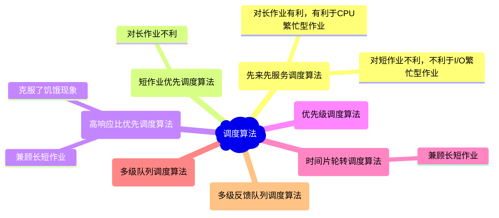
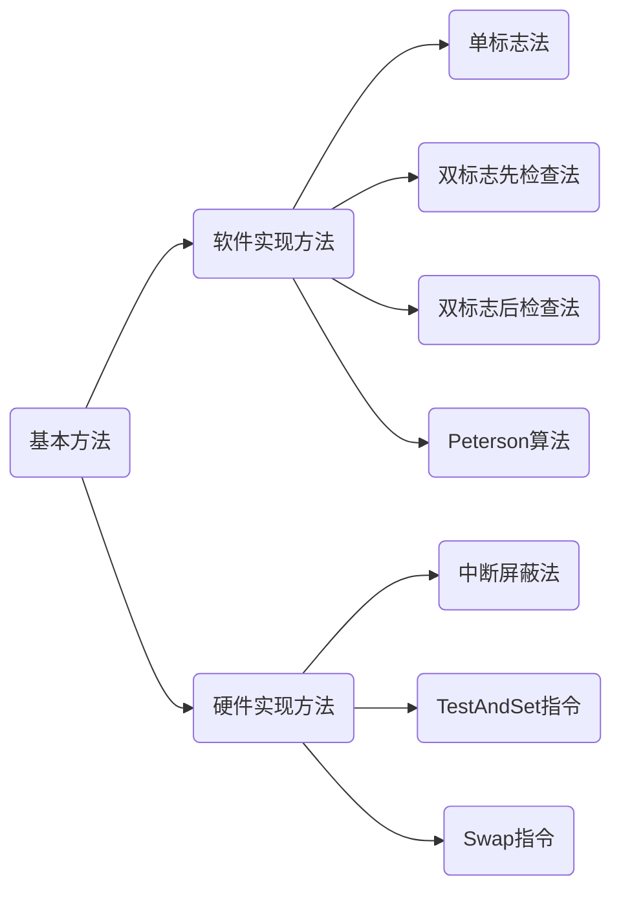
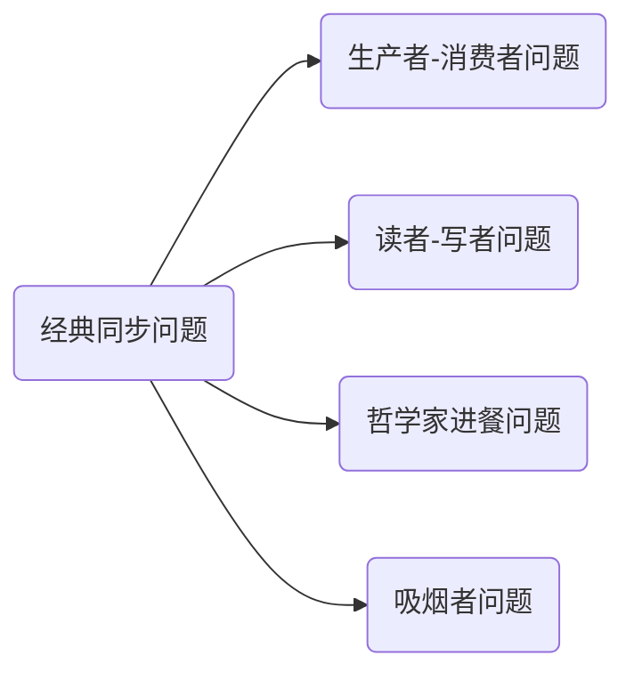

# 进程与线程

## 进程与线程

### 进程的概念和特征

1. 为了使参与并发执行的每个程序都能独立地运行，必须为之配置一个专门的数据结构，称为进程控制块(PCB)

2. 创建进程：创建进程的PCB；撤销进程：撤销进程的PCB

3. 进程是进程实体的运行过程，是系统进行资源分配和调度的一个独立单位

4. 进程是动态的，程序是静态的

5. 进程的基本特征：

   ```mermaid
   graph LR
   	A(进程)
   	B(动态性)
   	C(并发性)
   	D(独立性)
   	E(异步性)
   	F(进程是动态地产生、变化和消亡的)
   	G(多个进程同存于内存中，能在一段时间内同时运行)
   	H(进程是一个能独立运行、独立获得资源和独立接收调度的基本单位)
   	I(由于进程的相互制约，使得进程按各自独立的、不可预知的速度向前推进)
   	A-->B-->F
   	A-->C-->G
   	A-->D-->H
   	A-->E-->I
   ```

### 进程的组成

1. 进程控制块

   - PCB是进程实体的一部分，是进程存在的唯一标志

   - PCB主要包括进程描述信息、进程控制和管理信息、资源分配清单和CPU相关信息。

     | 进程描述信息  | 进程控制和管理信息 | 资源分配清单 | 处理机相关信息 |
     | :-----------: | :----------------: | :----------: | :------------: |
     | 进程标识符PID |    进程当前状态    |  代码段指针  |  通用寄存器值  |
     | 用户标识符UID |     进程优先级     |  数据段指针  |  地址寄存器值  |
     |               |  代码运行入口地址  |  堆栈段指针  |  控制寄存器值  |
     |               |   程序的外存地址   |  文件描述符  |  标志寄存器值  |
     |               |    进入内存时间    |     键盘     |     状态字     |
     |               |    CPU占用时间     |     鼠标     |                |
     |               |     信号量使用     |              |                |

     PID用于标志各个进程，每个进程都有一个唯一的标识号

     UID用于标识所归属的用户，主要用于共享和保护服务

   - 为了方便进程的管理和调度，需要将各个进程的PCB用适当的方法组织起来，常用的组织方式由**链接方式**和**索引方式**两种。

     - 链接方式：将同一状态的PCB链接成一个队列，也可以将处于阻塞态的进程的PCB按照原因的不同，排成多个阻塞队列。
     - 索引方式：将同一状态的进程组织在一个索引表中，索引表的表项指向相应的PCB，不同状态对应不同的索引表。

2. 程序段

   - 能被进程调度程序调度到CPU执行的程序代码段
   - 程序可被多个进程共享

3. 数据段

### 进程的状态和转换

1. 进程的状态

   - 运行态
   - 就绪态
   - 阻塞态
   - 创建态
   - 终止态

2. 进程的转换

   ```mermaid
   graph LR
   	A(创建态)
   	B(就绪态)
   	C(阻塞态)
   	D(运行态)
   	E(终止态)
       A-->|创建|B
       B-->|调度|D
       D-->|退出|E
       D-->|时间到|B
       D-->|事件等待|C-->|事件发生|B
   ```

   - 就绪态$\longrightarrow$运行态：处于就绪态的进程被调度后，获得CPU资源
   - 运行态$\longrightarrow$就绪态：处于运行态的进程在时间片用完后，让出CPU资源
   - 运行态$\longrightarrow$阻塞态：进程请求某一资源的使用和分配或等待某一事件的发生，是主动行为
   - 阻塞态$\longrightarrow$就绪态：进程等待的事件到来，是被动行为


### 进程控制

1. 在操作系统中，一般将进程控制用的程序段称为**原语**，原语的特点是在执行期间不允许中断，它是一个不可分割的基本单位。

2. 进程的创建

   ```mermaid
   graph LR
   	A(进程的创建)
   	B(创建原语)
   	C(引起进程创建的事件)
   	D(申请空白PCB)
   	E(为新进程分配资源)
   	F(初始化PCB)
   	G(将PCB插入就绪队列)
   	H(用户登录)
   	I(作业调度)
   	J(提供服务)
   	K(应用请求)
   	A-->B
   	A-->C
   	B-->D
   	B-->E
   	B-->F
   	B-->G
   	C-->H
   	C-->I
   	C-->J
   	C-->K
   ```

   - 允许一个进程创建另一个进程，此时创建者称为父进程，被创建的进程称为子进程。子进程可以继承父进程所拥有的资源。当子进程被撤销时，应将其从父进程获得的资源归还；在撤销父进程时，通常也会同时撤销其所有的子进程
   - 创建原语
     - 为新进程分配一个唯一的进程标识号，并申请一个空白的PCB(PCB是有限的)，若PCB申请失败，则创建失败
     - 为进程分配其运行所需的资源，如果资源不足，则处于创建态，等待相应资源
     - 初始化PCB，主要包括初始化标志信息，初始化CPU状态信息和初始化CPU控制信息，以及设置进程的优先级等
     - 若进程就绪队列能够接纳新进程，则将新进程插入就绪队列，等待被调度运行

3. 进程的终止

   ```mermaid
   graph LR
   	A(进程的终止)
   	B(终止原语)
   	C(引起进程终止的事件)
   	D(从PCB集合中找到终止进程的PCB)
   	E(若进程正在运行，立即剥夺CPU，将CPU分配给其他进程)
   	F(终止其所有子进程)
   	G(将该进程拥有的所有资源归还给父进程或操作系统)
   	H(删除PCB)
   	I(正常结束)
   	J(异常结束)
   	K(外界干预)
   	A-->B
   	A-->C
   	B-->D
   	B-->E
   	B-->F
   	B-->G
   	B-->H
   	C-->I
   	C-->J
   	C-->K
   ```

   - 引起进程终止的事件主要有：正常结束、异常结束和外界干预
   - 终止原语：
     - 根据被终止进程的标识符，检索出该进程的PCB，从中读出该进程的状态
     - 若被终止进程处于运行状态，立即终止该进程的执行，将CPU资源分配给其他进程
     - 若该进程还有子孙进程，则通常需要将其所有子孙进程终止
     - 将该进程所拥有的全部资源，或归还给其父进程，或归还给操作系统
     - 将该PCB从所在队列中删除

4. 进程的阻塞和唤醒

   ```mermaid
   graph LR
   	A(进程的阻塞和唤醒)
   	B(进程的阻塞)
   	C(进程的唤醒)
   	D(阻塞原语)
   	E(引起进程阻塞的事件)
   	F(唤醒原语)
   	G(引起进程唤醒的事件)
   	H(找到要阻塞的进程对应的PCB)
   	I(保护进程运行现场，将PCB状态信息置为“阻塞态”，暂停进程)
   	J(将PCB插入相应事件的等待队列)
   	K(需要等待系统分配某种资源)
   	L(需要等待相互合作的其他进程完成工作)
   	M(在事件等待队列中找到PCB)
   	N(将PCB从等待队列移除，设置进程为就绪态)
   	O(将PCB插入就绪队列，等待被调度)
   	P(等待事件的发生)
   	A-->B
   	A-->C
   	B-->D
   	B-->E
   	C-->F
   	C-->G
   	D-->H
   	D-->I
   	D-->J
   	E-->K
   	E-->L
   	F-->M
   	F-->N
   	F-->O
   	G-->P
   ```

   - 正在执行的进程，由于期待的某些事件未发生，进程便通过调用阻塞原语，使自己由运行态变为阻塞态
   - 阻塞原语：
     - 找到将要被阻塞的PID对应的PCB
     - 若该进程为运行态，则保护其现场，将其状态转为阻塞态，停止运行
     - 将该PCB插入相应事件的等待队列，将CPU资源调度给其他就绪进程
   - 当被阻塞进程所期待的事件出现时，由相关进程调用唤醒原语，将等待该事件的进程唤醒
   - 唤醒原语：
     - 在该事件的等待队列中找出相应进程的PCB
     - 将其从等待队列中移出，并致其状态为就绪态
     - 将该PCB插入就绪队列，等待调度程序调度

5. 进程的切换

   ```mermaid
   graph LR
   	A(进程的切换)
   	B(切换原语)
   	C(引起进程切换的事件)
   	D(将运行环境信息存入PCB)
   	E(PCB移入相应队列)
   	F(选择另一个进程执行，并更新其PCB)
   	G(根据PCB恢复新进程所需的运行环境)
   	H(当前进程时间片到)
   	I(有更高优先级的进程到达)
   	J(当前进程主动阻塞)
   	K(当前进程终止)
   	A-->B
   	A-->C
   	B-->D
   	B-->E
   	B-->F
   	B-->G
   	C-->H
   	C-->I
   	C-->J
   	C-->K
   ```

### 进程的通信

1. 进程通信是指进程之间的信息交换

2. 高级通信方式是指以较高的效率传输大量数据的通信方式

   ```mermaid
   graph TB
   	A(高级通信方式)
   	B(共享存储)
   	C(消息传递)
   	D(管道通信)
   	A-->B
   	A-->C
   	A-->D
   ```

3. 共享存储：在通信的进程之间存在一块可直接访问的共享空间，通过对这片共享空间进行读/写操作实现进程之间的信息交换

   ```mermaid
   graph LR
   	A(进程A)
   	B(进程B)
   	C((共享空间))
   	A<-->C<-->B
   ```

   - 在对共享空间进行读/写操作时，需要使用同步互斥工具对共享空间的读/写进行控制
   - 共享存储又分为两种：
     - 低级方式的共享是基于数据结构的共享
     - 高级方式的共享是基于存储区的共享

4. 消息传递：利用操作系统提供的消息传递方法实现进程通信

   - 进程间的数据交换以格式化的消息为单位
   - 进程通过操作系统提供的发送消息和接收消息两个原语进行数据交换
   - 消息传递又可分为：
     - 直接通信方式：发送进程直接将消息发送给接收进程，并将它挂在接收进程的消息缓冲队列上，接收进程从消息缓冲队列中取到消息
     - 间接通信方式：发送进程发送到某个中间实体(信箱)，接收进程从中间实体取到消息

5. 管道通信

   - 管道是一个特殊的共享文件，又称pipe文件，数据在管道中是先进先出的，只能实现半双工通信
   - 只要管道不满，写进程就能向管道的一段写入数据；只要管道非空，读进程就能从管道的一段读出数据
   - 管道机制必须提供三方面的协调能力：
     - 互斥：当一个进程对管道进行读写操作是，其他进程必须等待
     - 同步：写进程向管道写入一定数量的数据后，写进程阻塞，直到读进程取走数据后将它唤醒；读进程将管道中的数据取空后，读进程阻塞，直到写进程将数据写入管道后将它唤醒
     - 确定对方的存在
   - 管道只能由创建进程所访问，当父进程创建一个管道后，子进程会继承管道，可用于与父进程通信
   - 一个管道允许多个写进程，一个读进程

### 线程和多线程模型

1. 引入进程的目的：更好地使多道程序并发执行
   引入线程的目的：减少程序在并发执行时所付出的时空开销，提高操作系统的并发性能

2. 线程使程序执行流的最小单元，由线程ID、程序计数器、寄存器集合和堆栈组成

3. 线程是被系统独立调度和分派的基本单位

4. 线程不拥有系统资源，但是同一进程的线程共享所有资源

5. 一个线程可以创建和撤销另一个线程，同一进程的多个线程之间可以并发执行

6. 线程有就绪态、阻塞态和运行态三种基本状态

7. 引入线程后，进程只作为除CPU外的系统资源的分配单元，而线程则作为CPU的分配单元

8. 线程和进程的比较

   - 调度：线程切换的代价远低于进程切换。同一进程中线程切换不会引起进程切换，不同进程间线程切换会引起进程切换
   - 并发性：进程之间可以并发执行，一个进程的线程之间可以并发执行，不同进程之间的线程也可以并发执行
   - 拥有资源：线程不拥有系统资源，但可以访问其隶属进程的系统资源
   - 独立性：每个进程都拥有独立的地址空间和资源，不允许其他进程访问。同一进程的不同线程共享进程的地址空间和资源
   - 系统开销：在创建和撤销过程中，系统都要分配或回收PCB以及其他资源，开销明显大于线程的创建和撤销。进程切换涉及进程上下文的切换，而线程切换只需要保存和设置少量寄存器的内容。由于同一进程的多个线程共享地址空间和资源，因此它们的同步和通信非常容易实现
   - 支持多处理器系统：进程只能运行在一个CPU上，而对于多线程进程，进程可以将线程分配到多个CPU上

9. 线程的特性：

   - 线程不拥有系统资源，但每个线程都拥有一个唯一的标识符和一个线程控制块TCB，TCB记录线程执行的寄存器和栈等现场状态
   - 不同的线程可以执行相同的程序，即同一服务程序被不同的用户调用时，操作系统将他们创建成不同的线程
   - 同一进程中的各个线程共享该进程所拥有的资源
   - 线程是CPU的独立调度单位，多个线程是可以并发执行的
   - 线程在生命周期中会经历阻塞态、就绪态和运行态等各种状态变化

10. 线程的状态与转换

    - 运行态：线程已获得CPU而正在运行
    - 就绪态：线程已具备各种执行条件，只需要再获得CPU便可立即执行
    - 阻塞态：线程在执行中因某事件受阻而处于暂停状态

11. 系统为每个线程配置一个线程控制块TCB，用于记录控制和管理线程的信息

    ```mermaid
    graph LR
    	A(TCB)
    	B(线程标识符)
    	C(一组寄存器)
    	D(线程运行状态)
    	E(优先级)
    	F(线程专有存储区)
    	G(堆栈指针)
    	H(线程切换时用于保存现场)
    	I(用于过程调用时保存局部变量及返回地址等)
    	A-->B
    	A-->C
    	A-->D
    	A-->E
    	A-->F-->H
    	A-->G-->I
    ```

12. 线程的终止

    - 有些线程一旦被建立便会一直运行而不会被终止
    - 线程被终止后不会立即释放它所占有的资源，只有当进程中的其他线程执行了分离函数后，被终止线程才与资源分离，此时资源才能被其他线程利用
    - 被终止但尚未释放资源的线程仍可被其他线程调用，以使被终止线程恢复运行

13. 线程的分类

    ```mermaid
    graph LR
    	A(线程)
    	B(用户级线程ULT)
    	C(内核级线程KLT)
    	A-->B
    	A-->C
    ```

14. 用户级线程

    - 有关线程管理的工作由应用程序在用户空间内完成，无须操作系统干预，内核意识不到线程的存在
    - 应用程序从单线程开始，在该线程中开始运行，在其运行的任何时刻，可以通过调用线程库中的派生例程创建一个在相同进程中运行的新线程
    - 对于设置了用户级线程的系统，其调度依然以进程为单位进行，各个进程轮流执行一个时间片
    - 优点：
      - 线程切换不需要转化到内核空间，节省了开销
      - 调度算法可以是进程专用的，不同的进程可根据自身需求选择不同的线程调度算法
      - 用户级线程的实现与操作系统无关，对线程管理的代码属于用户程序的一部分
    - 缺点：
      - 当线程执行一个系统调用时，不仅该线程被阻塞，进程中所有线程都会被阻塞
      - 不能发挥多CPU的优势，内核每次分配给一个进程一个CPU，因此进程中只有一个线程能执行

15. 内核级线程

    - 操作系统为每个内核级线程设置一个TCB，内核根据该控制块感知某线程的存在，并对其加以控制
    - 优点：
      - 能发挥多CPU的优势，内核能同时调度同一进程中的多个线程并行执行
      - 如果进程中的一个线程被阻塞，内核可以调度该进程中的其他线程占用CPU，也可运行其他进程中的线程
      - 内核支持线程具有很小的数据结构和堆栈，线程切换比较快，开销小
      - 内核本身也可以采用多线程技术，可以提高系统的执行速度和效率
    - 缺点：
      - 同一进程中线程切换需要从用户态转到核心态运行，开销较大

16. 内核支持多个内核级线程的建立、调度和管理，同时允许用户程序建立、调度和管理用户级线程。

17. 一些内核级线程对应多个用户级线程，这是用户级线程通过时分多路复用内核级线程实现

18. 多线程模型

    ```mermaid
    graph LR
    	A(多线程模型)
    	B(多对一模型)
    	C(一对一模型)
    	D(多对多模型)
    	E(将多个用户级线程映射到一个内核级线程)
    	F(将每个用户级线程映射到一个内核级线程)
    	G(将n个用户级线程映射到m个内核级线程，n≥m)
    	A-->B-->E
    	A-->C-->F
    	A-->D-->G
    ```

    - 多对一模型

      - 每个进程只被分配一个内核级线程，线程的调度和管理在用户空间完成。当用户线程需要访问内核时，将其映射到一个内核级线程上，但每次只允许一个线程进行映射

      - 优点：线程管理是在用户空间中进行的，无需切换到核心态，因此效率高
      - 缺点：如果一个线程在访问内核时发生阻塞，则整个线程都会被阻塞；在任何时刻，只有一个线程能够访问内核，多个线程不能同时在多个CPU上运行

    - 一对一模型

      - 每个进程有与用户级线程数量相同的内核级线程，线程切换由内核完成，需要切换到核心态
      - 优点：当一个线程被阻塞后，允许调度另一个线程运行，所以并发能力较强
      - 缺点：每创建一个用户线程，就需要创建一个内核线程，开销较大

    - 多对多模型

      - 既克服了多对一模型并发度不高的缺点，又克服了一对一模型的一个用户进程占用太多内核级线程而开销太大的缺点

### 错题

1. 下列关于并发进程特性的叙述中，正确的是(  )

   A. 进程是一个动态过程，其生命周期是连续的

   B. 并发进程执行完毕后，一定能够得到相同的结果

   C. 并发进程对共享变量的操作结果与执行速度无关

   D. 并发进程的运行结果具有不可再现性

2. 下列选项中，导致创建新进程的操作是(  )

   I. 用户登录

   II. 高级调度发生时

   III. 操作系统响应用户提出的请求

   IV. 用户打开了一个浏览器程序

   A. 仅I和IV

   B. 仅II和IV

   C. I、II和IV

   D. 全部

3. 速度最快的进程通信方式是(  )

   A. 消息传递

   B. Socket

   C. 共享内存

   D. 管道通信

4. 下列几种关于进程的叙述中，(  )最不符合操作系统对进程的理解

   A. 进程是在多程序环境中的完整程序

   B. 进程可以由程序、数据和PCB描述

   C. 线程是一种特殊的进程

   D. 进程是程序在一个数据集合上的运行过程，它是系统进行资源分配和调度的一个独立单元

5. PCB是进程存在的唯一标识，下列(  )不属于PCB

   A. 进程ID

   B. CPU状态

   C. 堆栈指针

   D. 全局变量

6. 在具有通道设备的单处理器系统中实现并发技术后，(  )

   A. 各个进程在某一时刻并发运行，CPU与I/O设备间并行工作

   B. 各个进程在某一时间段内并行运行，CPU与I/O设备间串行工作

   C. 各个进程在某一时间段内并发运行，CPU与I/O设备间并行工作

   D. 各个进程在某一时刻并发运行，CPU与I/O设备间串行工作

7. 在以下描述中，(  )并不是多线程系统的特长
   A. 利用线程并行地执行矩阵乘法运算

   B. Web服务器利用线程响应HTTP请求

   C. 键盘驱动程序为每个正在运行的应用配备一个线程，用以响应该应用的键盘输入

   D. 基于GUI的调试应用用不同的线程分别处理用户输入、计算和跟踪等操作

8. 下列选项中，可能导致用户级线程切换的事件是(  )

   A. 系统调用

   B. I/O请求

   C. 异常处理

   D. 线程同步

9. 下列关于用户级线程的描述中，错误的是(  )

   A. 用户级线程由线程库进行管理

   B. 用户级线程只有在创建和调度时需要内核的干预

   C. 操作系统无法直接调度用户级线程

   D. 线程库中线程的切换不会导致进程切换

10. 下列关于父进程和子进程的叙述中，错误的是(  )

    A. 父进程和子进程可以并发执行

    B. 父进程和子进程共享虚拟地址空间

    C. 父进程和子进程有不同的进程控制块

    D. 父进程和子进程不能同时使用同一临界资源

11. 下列操作完成时，导致CPU从内核态转为用户态的是(  )

    A. 阻塞进程

    B. 执行CPU调度

    C. 唤醒进程

    D. 执行系统调用

## CPU调度

### 调度

1. 一个作业从提交开始到完成，往往需要经历以下三级调度

   ```mermaid
   graph LR
   	A(调度的层次)
   	B(高级调度)
   	C(中级调度)
   	D(低级调度)
   	A-->B
   	A-->C
   	A-->D
   ```

   - 高级调度(作业调度)：内存与外存之间的调度，每个作业只调入一次，调出一次。作业调入时创建PCB，调出时撤销PCB
   - 中级调度：将暂时不能运行的进程调入外存等待，此时进程的状态为**挂起态**。当它们已具备运行条件且内存又稍有空闲时，由中级调度来决定将外存上哪些已具备运行条件的挂起进程再重新调入内存，并修改其状态为就绪态，挂在就绪队列上等待
   - 低级调度(进程调度)：按照某种算法从就绪队列中选取一个进程，将CPU分配给它

   > [!CAUTION]
   >
   > 挂起与阻塞的区别：两种状态都是暂时不能获取CPU服务，但挂起态是将进程映像调到外存，而阻塞态下进程映像还在内存中。

2. 三级调度的联系：

   | 调度类型 |         调度方向          | 发生频率 |                 对进程状态的影响                 |
   | :------: | :-----------------------: | :------: | :----------------------------------------------: |
   | 高级调度 | 外存$\longrightarrow$内存 |   最低   | 无$\longrightarrow$创建态$\longrightarrow$就绪态 |
   | 中级调度 | 外存$\longrightarrow$内存 |   中等   |          挂起态$\longrightarrow$就绪态           |
   | 低级调度 | 内存$\longrightarrow$CPU  |   最高   |          就绪态$\longrightarrow$运行态           |

   - 作业调度为进程活动做准备，进程调度使进程正常活动起来
   - 中级调度将暂时不能运行的进程挂起，中级调度处于作业调度和进程调度之间
   - 作业调度次数少，中级调度次数略多，进程调度频率最高
   - 进程调度是最基本的，不可或缺的

### 调度的实现

1. 用于调度和分配CPU的组件称为调度程序，它通常由三部分组成

   - 排队器：将系统中的所有就绪进程按照一定的策略排成一个或多个队列，以便于调度程序选择。每当有一个进程转变为就绪态时，排队器便将它插入对应的就绪队列
   - 分派器：依据调度程序所选的进程，将其从就绪队列中取出，为其分配CPU
   - 上下文切换器：在对CPU进行切换时，会发生两对上下文的切换操作：将当前进程的上下文保存到其PCB中，再装入分派程序的上下文，以便分派程序运行；移出分派程序的上下文，将新选进程的CPU现场信息装入CPU的各个相应寄存器

2. 进程切换往往在调度完成后立即发生

3. 需要进行进程调度与切换的情况：

   ```mermaid
   graph LR
   	A(情况)
   	B(主动放弃)
   	C(被动放弃)
   	D(进程正常终止)
   	E(运行过程中发生异常而终止)
   	F(进程主动请求阻塞)
   	G(分给进程的时间片用完)
   	H(有更紧急的事需要处理)
   	I(有更高优先级的进程进入就绪队列)
   	A-->B
   	A-->C
   	B-->D
   	B-->E
   	B-->F
   	C-->G
   	C-->H
   	C-->I
   ```

4. 不能进行进程的调度与切换的情况：

   ```mermaid
   graph LR
   	A(情况)
   	B(处理中断的过程中)
   	C(进程在操作系统内核程序临界区中)
   	D(在原子操作过程中)
   	A-->B
   	A-->C
   	A-->D
   ```

   > [!CAUTION]
   >
   > 进程在操作系统内核程序临界区中不能进行调度与切换。(√)
   >
   > 进程处于临界区时不能进行处理机调度。(×)

5. 进程调度方式

   ```mermaid
   graph LR
   	A(进程调度方式)
   	B(非抢占调度方式/非剥夺方式)
   	C(抢占调度方式/剥夺方式)
   	A-->B
   	A-->C
   ```

   - 非剥夺方式：当一个进程正在CPU上执行时，即使有某个更为重要或紧迫的进程进入就绪队列，仍然让正在执行的进程继续执行，直到该进程运行完成或发生某种时间而进入阻塞态时，才将CPU分配给其他进程
   - 剥夺方式：当一个进程正在CPU上执行时，若有某个更为重要或紧迫的进程需要使用CPU，则允许调度程序根据某种原则去暂停正在执行的进程，将CPU分配给这个更为重要或紧迫的进程

6. 在进程切换时，如果系统中没有就绪程序，就会调度**闲逛进程**运行，不需要CPU之外的资源，它不会被阻塞

7. 两种线程的调度

   - 用户级线程的调度：由于内核不知道线程的存在，所以内核会选择一个进程给予时间控制，由进程中的调度程序决定哪个线程运行
   - 内核级线程的调度：内核选择一个特定线程运行，通常不用考虑该线程属于哪个进程。对被选择的线程赋予一个时间片，如果超出了时间片，就会强制挂起该线程

### 调度的目标

1. CPU利用率
   $$
   CPU的利用率=\frac{CPU有效工作时间}{CPU有效工作时间+CPU空闲等待时间}
   $$
   
2. 系统吞吐量：单位时间内CPU完成作业的数量

3. 周转时间：从作业提交到作业完成所经历的时间
   $$
   周转时间=作业完成时间-作业提交时间
   $$

   $$
   平均周转时间=\sum_1^n\frac1n周转时间_{作业 \ i}
   $$

   $$
   带权周转时间=\frac{作业周转时间}{作业实际运行时间}
   $$

   
   $$
   平均带权周转时间=\sum_1^n\frac1n带权周转时间_{作业 \ i}
   $$

4. 等待时间：进程处于等待CPU的时间之和

5. 响应时间：从用户提交请求到系统首次产生响应所用的时间

### 进程切换

1. 上下文切换：切换CPU到另一个进程需要保存当前进程状态并恢复另一个进程的状态
   上下文切换的流程：

   ```mermaid
   graph TB
   	A(挂起一个进程，将CPU上下文保存到PCB)-->B(将进程的PCB移入相应的队列)-->C(选择另一个进程执行，并更新其PCB)-->D(恢复新进程的CPU上下文)-->E(跳转到新进程PCB中程序计数器所指向的位置执行)
   ```

2. 用户态和内核态之间的切换称为**模式切换**

### 典型的调度算法

1. 先来先服务调度算法

   - 既可用于作业调度，又可用于进程调度
   - 在作业调度中，FCFS调度算法每次从后备作业队列中选择最先进入该队列的一个或几个作业将它们调入内存，分配必要的资源，创建进程并放入就绪队列；在进程调度中，FCFS调度算法每次从就绪队列中选择最先进入该队列的进程，将CPU分配给它，使之投入运行，直到运行完成或因某种原因而阻塞时才释放CPU
   - 优点：算法简单，对长作业有利，有利于CPU繁忙型作业
   - 缺点：效率低，对短作业不利，不利于I/O繁忙型作业

2. 短作业优先调度算法

   - 既可用于作业调度，又可用于进程调度
   - SJF调度算法从后备队列中选择一个或几个估计运行时间最短的作业，将它们调入内存运行；SPF调度算法从就绪队列中选择一个估计运行时间最短的进程，将CPU分配给它，使之立即执行，直到完成或发生某事件而阻塞时才释放CPU
   - 缺点：对长作业不利，未考虑作业的紧迫程度，不一定真正做到短作业优先调度
   - 在所有进程集合同时到达时，短作业优先调度算法的平均等待时间、平均周转时间是最优的

   > [!CAUTION]
   >
   > 若未作说明，则默认为非抢占式的。

3. 高响应比有限调度算法

   - 主要用于作业调度

   - 在每次进行作业调度时，先计算后备作业队列中每个作业的相应比，从中选择响应比最高的作业投入运行
     $$
     响应比R_P=\frac{等待时间+要求服务时间}{要求服务时间}
     $$

   - 对长作业而言，作业的响应比随等待时间的增加而提高，克服了“**饥饿**”现象

4. FCFS、SJF/SPF、HRRN调度算法的比较

   |  算法   | 是否可抢占 | 是否考虑到等待<br />时间&运行时间 | 饥饿现象 |
   | :-----: | :--------: | :-------------------------------: | :------: |
   |  FCFS   |     否     |     等待时间√<br />运行时间×      | 不会出现 |
   | SJF/SPF |   默认否   |     等待时间×<br />运行时间√      |  会出现  |
   |  HRRN   |     是     |     等待时间√<br />运行时间√      | 不会出现 |

5. 优先级调度算法

   - 既可用于作业调度，又可用于进程调度
   - 在作业调度中，优先级调度算法每次从后备队列中选择优先级最高的一个或几个作业，将它们调入内存，分配必要的资源，创建进程并放入就绪队列；在进程调度中，优先级调度算法每次从就绪队列中选择优先级最高的进程，将CPU分配给它，使之投入运行
   - 优先级调度算法分类：
     - 非抢占式优先级调度算法
     - 抢占式优先级调度算法
   - 进程优先级的分类：
     - 静态优先级
     - 动态优先级
   - 进程优先级的设置可以参照以下原则：
     - 系统进程＞用户进程
     - 交互型进程＞非交互型进程
     - I/O型进程＞计算型进程

6. 时间片轮转调度算法

   - 系统将所有的就绪进程按FCFS策略排成一个就绪队列。系统可设置每隔一定时间便产生一次时钟中断，激活调度程序进行调度，将CPU分配给就绪队列的队首进程，并令其执行一个时间片
   - 若一个世间片尚未用完当前进程已运行完成，则调度程序会被立即激活；若一个时间片被用完，则产生一个时钟中断，由时钟中断处理程序来激活调度程序

7. 多级队列调度算法

   - 在系统中设置多个就绪队列，将不同类型或性质的进程固定分配到不同的就绪队列。每个队列可实施不同的调度算法。
   - 同一队列中的进程可以设置不同的优先级，不同队列本身也可以设置不同的优先级。
   - 在多CPU系统中，可以很方便为每个CPU设置一个独立的就绪队列，每个CPU可实施各自不同的调度策略，这样就能根据用户需求将多个线程分配到一个或多个CPU上运行

8. 多级反馈队列调度算法

   - 通过动态调整进程优先级和时间片大小，多级反馈队列调度算法可以兼顾多方面系统目标

   - 调度算法实现思想：

     ```mermaid
     graph TB
     	A(设置多个就绪队列，并为每个队列赋予不同的优先级)
     	B(赋予各个队列的进程运行时间片的大小各不相同)
     	C(每个队列都采用FCFS算法)
     	D(按队列优先级调度)
     	A-->B-->C-->D
     ```

9. 优先级调度算法、时间片轮换调度算法、多级反馈队列调度算法的比较

   |         算法         | 是否可抢占 | 饥饿现象 |
   | :------------------: | :--------: | :------: |
   |    优先级调度算法    |   均存在   |  会出现  |
   |  时间片轮换调度算法  |     是     | 不会出现 |
   | 多级反馈队列调度算法 |     是     |  会出现  |

### 小节总结



### 错题

1. 设计调度算法时应该考虑(  )

   I. 公平性

   II. 资源利用率

   III. 互斥性

   IV. 平均周转时间

   A. I、II

   B. I、II、IV

   C. I、III、IV

   D. 全部

2. (  )有利于CPU繁忙型的作业，而不利于I/O繁忙型的作业

   A. 时间片轮转算法

   B. 先来先服务调度算法

   C. 短作业(进程)优先算法

   D. 优先级调度算法

3. 下列调度算法中，(  )调度算法是绝对可抢占的

   A. 先来先服务

   B. 时间片轮转

   C. 优先级

   D. 短进程优先

4. 多级反馈队列调度算法不具备的特性是(  )

   A. 资源利用率高

   B. 响应速度快

   C. 系统开销小

   D. 并行度高

5. 下列选项中，降低进程优先级的合理时机是(  )

   A. 进程时间片用完

   B. 进程刚完成I/O操作，进入就绪队列

   C. 进程长期处于就绪队列

   D. 进程从就绪态转为运行态

6. 假设某计算机系统有四个进程，各进程的预计运行时间和到达就绪队列的时刻见下表。试用时间片轮转调度算法进行调度(时间配额为2)。分别计算各个进程的调度次序及平均周转时间。

   | 进程  | 到达就绪队列时刻 | 预计运行时间 |
   | :---: | :--------------: | :----------: |
   | $P_1$ |        0         |      8       |
   | $P_2$ |        1         |      4       |
   | $P_3$ |        2         |      9       |
   | $P_4$ |        3         |      5       |

## 同步和互斥

### 同步和互斥的基本概念

1. 临界资源：一次仅能允许一个进程使用的资源

2. 临界区：在每个进程中，访问临界资源的那段代码

3. 临界资源的访问过程分为四部分：

   ```mermaid
   graph LR
   	A(访问过程)
   	B(进入区)
   	C(临界区)
   	D(退出区)
   	E(剩余区)
   	A-->B-->F(检查是否能进入临界区，进入后设置标志阻止其他进程进入)
   	A-->C-->G(进程中访问临界资源的代码)
   	A-->D-->H(将正在访问临界区的标志清除)
   	A-->E-->I(代码中剩余部分)
   ```

4. 同步/直接制约关系：为完成某种任务而建立的两个或多个进程，这些进程因为需要协调它们的运行次序而等待、传递信息所产生的制约关系

5. 互斥/间接制约关系：当一个进程进入临界区使用临界资源时，另一个进程必须等待，当占用临界资源的进程退出临界区后，另一进程才允许去访问此临界资源

6. 同步机制应遵循以下准则：

   ```mermaid
   graph LR
   	A(准则)-->B(空闲让进)-->C(临界区空闲时，可以允许一个请求进入临界区的进程立即进入临界区)
   	A-->D(忙则等待)-->E(当已有进程进入临界区时，其他试图进入临界区的进程必须等待)
   	A-->F(有限等待)-->G(对请求访问的进程，应保证能在有限时间内进入临界区)
   	A-->H(让权等待)-->I(当进程不能进入临界区时，应立即释放处理器，防止进程忙等待)
   ```

### 实现临界区互斥的基本方法



1. 单标志法

   - 该算法设置一个公用整型变量turn，指示允许进入临界区的进程编号。当turn=j(j=0, 1)时表示允许进程$P_j$进入临界区。进程退出临界区时，设置turn=(1-j)(j=0, 1)
   - 该算法可以实现只允许一个进程进入临界区，但是两个进程必须交替进入临界区，若某个进程不再进入临界区，则另一个进程也将无法进入临界区

2. 双标志先检查法

   - 该算法设置一个布尔型数组flag[2]，用来标记各个进程想进入临界区的意愿，flag[j]=true(j=0, 1)表示$P_j$想要进入临界区。$P_j$进入临界区之前先检查对方是否想进入临界区，若想，则等待；否则，将flag[j]设为true后再进入临界区，当$P_j$退出临界区时，将flag[j]设置为false
   - 该算法支持进程不用交替进入，可连续使用；但$P_0$和$P_1$可能同时进入临界区

3. 双标志后检查法

   - 先设置自己的表示，再检查对方的标志，若对方的标志为true，则等待；否则，进入临界区
   - 两个进程依此设置自己的标志，并依此检查对方的标志，如果双方都想进入临界区，会出现都无法访问的现象

4. Peterson算法

   - 在每个进程进入临界区之前，先设置自己的flag标志，在设置允许进入的turn标志；之后再同时检测双方的flag和turn表示，以保证双方同时要求进入临界区时，只允许一个进程进入
   - Peterson算法很好地遵循了前三条准则，但是未能遵循“让权等待”准则

5. 中断屏蔽法

   - 当一个进程正在执行它的临界区代码时，防止其他进程进入临界区最简单的方法是关中断
   - 缺点：限制了CPU交替执行程序的能力；只适用于操作系统内核进程，不适用于用户进程；不适用于多处理器操作系统

6. TestAndSet指令

   - 为每个临界资源设置一个共享布尔变量lock(true表示资源正在被占用，false表示资源未被占用，初始值为false)。在进入临界区之前，先用TS指令检查lock值，若为false，则表示没有进程在临界区，可以进入，并将lock置为true；若为true，则表示有进程在临界区，进入循环等待，直到当前访问临界区的进程退出时解锁
   - 该方法适用于多处理器系统，缺点是不能实现“让权等待”

7. Swap指令

   - 在每个进程中设置一个局部布尔变量key，初始值为true。先记录此时临界区是否已加锁，再将锁标志lock置为true，最后检查key，若key为false，则说明没有其他进程对临界区进行访问，于是跳出循环，进入临界区

   ```mermaid
   graph LR
   	A(Swap指令)-->B(优点)-->C(简单、容易验证正确性)
   	B-->D(适用于任意数目的进程)
   	B-->E(支持多处理器系统)
   	B-->F(支持系统中有多个临界区)
   	A-->G(缺点)
   	G-->H(不能实现“让权等待”)
   	G-->I(可能导致饥饿现象)
   ```

### 互斥锁

1. 解决临界区最简单的工具是互斥锁/自旋锁，常用于所处理器系统
2. 互斥锁缺点是不能实现“让权等待”，优点是进程再等待锁期间，没有上下文切换，若上锁的时间较短，则等待代价不高

### 信号量

1. 信号量机制是一种功能较强的机制，只能被两个标准的原语wait()和signal()访问，也可以简写为P()和V()，或者简称P操作和V操作

   ```mermaid
   graph LR
   	A(信号量)-->B(整型信号量)
   	A-->C(记录型信号量)
   ```

2. 整型信号量

   - 一个用于表示资源数目的整型量S，相比于普通型变量，对整形信号量的操作只有三种：初始化、wait操作和signal操作
   - 在wait操作中，只要信号量S ≤ 0，就会不断循环测试，因此不能满足“让权等待”准则

3. 记录型信号量

   - 是一种不存在“忙等”现象的进程同步机制
   - 除了一个表示资源数目的整型变量value外，还增加一个进程链表L，用于链接所有等待该资源的进程
   - 对信号量S进行一次P操作，表示进程请求一个该类资源，因此执行S.value--。当S.value < 0时，表示该类资源已分配完毕，因此应调用block原语进行自我阻塞，主动放弃CPU，并插入该类资源的等待队列S.L
   - 对信号量S进行一次V操作，表示进程释放一个该类资源，因此执行S.value++。若加一后仍S.value ≤ 0，则调用wakeup原语将S.L中的第一个进程唤醒

4. 利用信号量实现进程互斥：

   - 为了使多个进程能互斥地访问某个临界资源，需要为该资源设置一个互斥信号量S，其初始值为1，然后将各个进程访问该资源的临界区置于P(S)与V(S)之间.
   - 每个要访问该资源的进程在进入临界区之前，都要先对S执行P操作，若该资源此刻未被访问，则本次P操作必然成功，进程便可进入自己的临界区。这时，其他进程对该资源执行P操作必然失败，保证了该资源地互斥访问。当访问该资源的进程退出临界区后，要对S执行V操作，以便释放该临界资源

   ```mermaid
   graph LR
   	A(S)-->B(1)-->C(两个进程都未进入临界区)
   	A-->D(0)-->E(有一个进程已进入临界区，另一个不访问临界区)
   	A-->F(－1)-->G(一个进程进入临界区，另一个进程因等待而阻塞)
   ```

### 经典同步问题



1. 生产者-消费者问题
2. 读者-写者问题
3. 哲学家进餐问题
4. 吸烟者问题

### 管程

1. 管程定义了一个数据结构和能为并发进程所执行的一组操作，这组操作能同步进程和改变管程中的数据

2. 管程的组成

   ```mermaid
   graph LR
   	A(管程)-->B(管程的名称)
   	A-->C(局部于管程内部的共享数据结构说明)
   	A-->D(对该数据结构进行操作的一组过程)
   	A-->E(对局部于管程内部的共享数据设置初始值的语句)
   ```

3. 当一个进程进入管程后被阻塞，直到阻塞的原因解除时，在此期间，如果该进程不释放管程，那么其他进程无法进入管程，为此，将阻塞原因定义为条件变量condition

4. 一个进程被阻塞的原因可能有多个，因此在管程中设置了多个条件变量，每个条件变量保存了一个等待队列

5. 对条件变量只能进行两种操作，即wait和signal

6. 条件变量和信号量的比较

   - 条件变量的wait/signal操作类似于信号量的P/V操作，可以实现进程的阻塞/唤醒
   - 条件变量没有值，仅实现排队等待功能；而信号量有值，反映了剩余资源数。在管程中，剩余资源数用共享数据结构记录
   
7. 小节总结

   ```mermaid
   mindmap
   	root(管程)
   		为什么引入管程
   			解决信号量机制编程麻烦、易出错的问题
   		组成
   			名称
   			共享数据结构
   			对数据结构初始化的语句
   			一组用来访问数据结构的过程
   		基本特征
   			各外部进程/线程只能通过管程提供的特定入口访问共享数据
   			每次仅允许一个进程在管程内执行某个内部过程
   		补充
   			各进程必须互斥访问管程的特性是由编译器实现的
   			可在管程中设置条件变量及等待/唤醒操作以解决同步问题
   ```


### 错题

1. 一个进程映像由程序、数据及PCB组成，其中(  )必须用可重入编码编写

   A. PCB

   B. 程序

   C. 数据

   D. 共享程序段

2. 以下关于管程的叙述中，错误的是(  )

   A. 管程是进程同步工具，解决信号量机制大量同步操作分散的问题

   B. 管程每次只允许一个进程进入管程

   C. 管程中signal操作的作用和信号量机制中的V操作相同

   D. 管程是被进程调用的，管程是语法范围，无法创建和撤销

3. 下列关于PV操作的说法中，正确的是(  )

   I. PV操作是一种系统调用命令

   II. PV操作是一种低级进程通信原语

   III. PV操作是由一个不可被中断的过程组成

   IV. PV操作是由两个不可被中断的过程组成

   A. I、III

   B. II、IV

   C. I、II、IV

   D. I、IV

4. 下列关于临界区和临界资源的说法中，正确的是(  )

   I. 银行家算法可以用来解决临界区问题

   II. 临界区是指进程中用于实现进程互斥的那段代码

   III. 共用队列属于临界资源

   IV. 私用数据属于临界资源

   A. I、II

   B. I、IV

   C. 仅III

   D. 以上答案都错误
5. 进程$P_1$和$P_2$均包含并发执行的线程，部分伪代码描述如下所示：

   ```c++
   // 进程P1
   int x = 0;
   
   void Thread1(  ) {
       int a = 1;
       x += 1;
   }
   
   void Thread2(  ) {
       int a = 2;
       x +=2;
   }
   
   // 进程P2
   int x = 0;
   
   void Thread3(  ) {
       int a = x;
       x += 3;
   }
   
   void Thread4(  ) {
       int b = x;
       x += 4;
   }
   ```
   
   下列选项中，需要互斥执行的操作是(  )
   
   A. a = 1 & a = 2
   
   B. a = x & b = x
   
   C. x += 1 & x += 2
   
   D. x += 1 & x += 3

## 死锁

### 死锁的概念

1. 死锁：多个进程因竞争资源而造成的一种僵局，使得各个进程都被阻塞

2. 一组进程处于死锁状态是指组内得每个进程都在等待一个事件，而该事件只可能由该组内的另一个进程产生

3. 饥饿：进程在信号量内无穷等待

4. 产生饥饿的主要原因：当系统中有多个进程同时申请某类资源时，由分配策略确定资源分配给进程的次序，有的分配策略可能是不公平的，即不能保证等待时间上界的存在

5. 死锁与饥饿的共同点都是进程无法顺利向前推进

6. 死锁与饥饿的主要差别：

   - 发生饥饿的主要进程可以只有一个，而发生死锁的进程必然大于等于两个
   - 发生饥饿的进程可能处于就绪态或阻塞态，而发生死锁的进程必定处于阻塞态

7. 产生死锁的原因

   - 系统的竞争：系统中拥有的不可剥夺资源数量不足以满足多个进程运行的需要，使得进程在运行过程中，因争夺资源而陷入僵局
   - 进程推进顺序非法：请求和释放顺序不当，会导致进程死锁；进程间彼此等待对方发来的消息也会使进程无法继续向前推进

8. 产生死锁的必要条件

   - 互斥条件：进程要求对所分配的资源进行排他性使用
   - 不可剥夺条件：进程所获得的资源在未使用完之前不能被其他进程强行夺走
   - 请求并保持条件：进程已经保持了至少一个资源，又申请了一个被其他进程占用的资源
   - 循环等待条件：存在一种进程资源的循环等待链，链中每个进程已获得的资源同时被链中下一进程请求

   资源分配图含圈而系统不一定死锁的原因：同类资源数大于1

   若系统中每类资源都只有一个资源，则资源分配图含圈就变成了系统出现死锁的充分必要条件

9. 死锁的处理策略

   - 死锁预防：设置某些限制条件，破坏产生死锁的必要条件
   - 避免死锁：在资源的动态分配过程中，用某种方法防止系统进入不安全状态
   - 死锁的检测及解除：允许在运行过程中发生死锁，但可以及时检测并采取措施解除死锁

   |                |       资源分配策略       |                  各种可能模式                  |                     主要优点                     |                           主要缺点                           |
   | :------------: | :----------------------: | :--------------------------------------------: | :----------------------------------------------: | :----------------------------------------------------------: |
   | 死锁<br />预防 |    保守，宁可资源闲置    | 一次请求所有资源，资源剥夺，<br />资源按序分配 |    适用于突发式处理的进程<br />不必进行剥夺    | 效率低，初始化时间延长；剥夺<br />次数过多，不变灵活申请新资源 |
   | 死锁<br />避免 | 在运行时判断是否可能死锁 |             寻找可能的安全允许顺序             |                   不必进行剥夺                   | 必须知道将来的请求<br />进程不能被长时间阻塞 |
   | 死锁<br />检测 | 宽松，只要允许就分配资源 |              定期检查死锁是否发生              | 不延长进程初始化时间<br />允许对死锁进行现场处理 | 通过剥夺解锁死锁<br />造成损失 |


###  死锁预防

1. 破坏互斥条件

   - 将只能互斥使用的资源改造为允许共享使用的资源
   - 缺点：有些资源不能同时访问，且为了系统安全，很多时候还必须保护这种互斥性

2. 破坏不可剥夺条件

   - 当一个已经保持了某些不可剥夺资源的进程请求新的资源而得不到满足时，它必须释放已经保持的所有资源，待以后需要时再重新申请。常用于状态易于保存和恢复的资源
   - 缺点：实现起来比较麻烦，反复申请和释放资源既影响进程推进速度，又增加系统开销，进而降低系统吞吐量

3. 破坏请求并保持条件

   - 要求进程在请求资源时不能持有不可剥夺资源，实现方式：

     - 采用预先静态分配方法，即进程在运行前一次申请完它所需要的全部资源。但是可能会造成资源的严重浪费，还会导致饥饿现象
     - 允许进程只获得运行初期所需要的资源后便开始运行。进程在运行过程中再逐步释放已分配给自己且已使用完毕的全部资源后，才能申请新的资源

4. 破环循环等待条件

   - 顺序资源分配法：首先给系统中的各类资源编号，规定每个进程必须按编号递增的顺序请求资源，同类资源一次申请完。已持有大编号资源的进程不可能再逆向申请小编号的资源，因此不会产生循环等待的现象
   - 缺点：编号相对稳定，不利于增加新类型设备；进程实际使用资源的顺序可能和编号次序不一致，造成资源浪费；对编程带来麻烦

### 死锁避免

1. 安全状态：系统能按某种进程推进顺序($P_1,P_2,\dots,P_n$)为每个进程$P_i$分配其所需的资源，直到满足每个进程对资源的最大需求，是每个进程都可顺利进程。此时$P_1,P_2,\dots,P_n$称为安全序列

2. 允许进程动态申请资源，但系统在进行资源分配之前，应先计算此次分配的安全性。若此次分配不会导致系统进入不安全状态，则允许分配，否则让进程等待

3. 银行家算法

   - 进程运行之前先声明对各种资源的最大需求量，其数目不应超过系统的资源总量。当进程在运行中申请资源时，系统必须先确定是否有足够的资源分配给该进程。若有，再进一步试探在将该资源分配给该进程后，是否会使系统处于不安全状态。如果不会，才将资源分配给它，否则让进程等待

   1. 数据结构描述：设系统中有n个进程，m类资源

      - 可利用资源向量Available：Available[j]=K表示系统中有K个$R_j$类资源可用
      - 最大需求矩阵Max(n$\times$m)：Max[i, j]=K表示进程$P_i$需要$R_j$类资源的最大数目为K
      - 分配矩阵Allocation(n$\times$m)：Allocation[i, j]=K表示进程$P_i$当前已分得$R_j$类资源的数目为K
      - 需求矩阵need(n$\times$m)：need[i, j]=K表示进程$P_i$还需要$R_j$类资源的数目为K

      ```math
      Need=Max-Allocation
      ```

   2. 算法描述：设$Request_i$使进程$P_i$的请求向量，$Request_i[j]=K$表示进程$P_i$需要j类资源K个

      1. 若$Reques_i[j]\leqslant Need[i,j]$，则进行下一步，否则认为出错

      2. 若$Request_i[j]\leqslant Available[i.j]$，则进行下一步，否则表示尚无足够资源，$P_i$必须等待

      3. 系统尝试将资源分配给进程$P_i$，并修改下面数据机构中的数值：

         ```math
         Available=Available-Request\\
         Allocation[i,j]=Allocation[i,j]+Requset_i[j]\\
         Need[i,j]=Need[i,j]-Request_i[j]
         ```

      4. 系统执行安全性算法，检查资源分配后系统是否处于安全状态

   3. 安全性算法：设置工作向量Work=Available，表示剩余可用资源数目

      1. 初始化安全序列为空
      2. 从Need矩阵找出符合下面条件的行：改行对应的进程不在安全序列中，而且该行小于或等于Work向量，找到后，将对应的进程加入安全序列；若找不到，则执行步骤四
      3. 进程$P_i$进入安全序列后，可顺利执行，直至完成，并释放分配给它的资源，执行Work+=Allocation[i]，返回步骤二
      4. 若此时安全序列已有所有进程，则系统处于安全状态，否则系统处于不安全状态

### 死锁检测与解除

1. 可用资源分配图来检测系统所处的状态是否为死锁状态。从进程到资源的有向边称为**请求边**，表示该进程申请一个单位的该类资源；从资源到进程的边称为**分配边**，表示该类资源已有一个资源分配给了该进程

2. 死锁检测方法：

   1. 在资源分配图中找出既不阻塞又不孤立的进程$P_i$(找出一条有向边与它相连，且该有向边对应资源的申请数量小于或等于系统中已有的空闲资源数量)。消除它所有的请求边和分配边，使之成为一个孤立的节点
   2. 进程$P_i$所释放的资源，可以唤醒某些因等待这些资源而阻塞的进程，原来的阻塞进程可能变为非阻塞进程。再根据第一步对资源分配图进行简化。

   如果最后能消去图中所有的边，则称该图是可**完全简化**的

3. 死锁解除

   - 资源剥夺法：挂起某些死锁进程，并抢占它的资源，将这些资源分配给其他的死锁进程，但应防止进程出现饥饿现象
   - 撤销进程法：强制撤销部分、设置全部死锁进程并剥夺这些资源的进程的资源
   - 进程回退法：让一个或多个死锁进程回退到足以回避死锁的地步，进程回退时资源释放资源而非被剥夺

4. 小节总结

   ```mermaid
   mindmap
   	root(死锁的检测和解除)
   		如何检测
   			数据结构：资源分配图
   				两种节点
   					进程节点
   					资源节点
   				两种边
   					请求边：进程节点-->资源节点
   					分配边：资源节点-->进程节点
   			死锁检测算法
   				依此消除与不阻塞进程相连的边，直到无边可消
   				若资源分配图是不可完全简化的，说明发生了死锁
   		如何解除
   			资源剥夺法
   			撤销进程法
   			进程回退法
   ```


### 错题

1. 系统死锁的可能原因是(  )

   A. 独占资源分配不当

   B. 系统资源不足

   C. 进程运行太快

   D. CPU内核太多

2. 三个进程共享四个同类资源，这些资源的分配与释放只能一次一个，已知每个进程最多需要两个该类资源，则该系统(  )

   A. 有些进程可能永远得不到该类资源

   B. 必须有死锁

   C. 进程请求该类资源必然能得到

   D. 必然是死锁

3. 下列关于死锁的叙述中，正确的是(  )

   I. 可以通过剥夺进程资源解除死锁

   II. 死锁的预防方法能确保系统不发生死锁

   III. 银行家算法可以判断系统是否处于死锁状态

   IV. 当系统出现死锁时，必然有两个或两个以上的进程处于阻塞态

   A. 仅II、III

   B. 仅I、II、IV

   C. 仅I、II、III

   D. 仅I、III、IV
